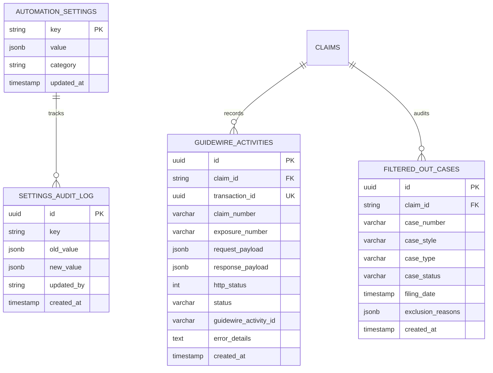

# UAIC Claim & RPA Orchestrator — Enterprise Project Booklet

> **Production-grade replacement for legacy Microsoft Power Automate Desktop RPA bots.**
> Automates court-case discovery across 8 Florida & Texas county court portals, performs RapidFuzz deduplication cascade, and delivers validated claim dossiers to Guidewire Insurance Cloud.

> **Current verification (IMP-2026-1002-007, 2026-10-02):** Enterprise full app audit, UI/UX unification, data accuracy, and performance optimization complete. 556 backend tests pass (100%), 17 E2E tests pass (100%), ruff 0 errors, TypeScript 0 errors, production build 11/11 routes pass, PowerShell 0 errors. All documentation and structure verified.

---

## 1. Complete Repository Layout & Directory Structure

```
Bot_UAIC/
+-- setup_local.ps1                      # Enterprise Operations & Orchestration Console
+-- docker-compose.yml                   # Docker multi-container stack (Postgres 16, Redis 7, Flower)
+-- AGENTS.md                            # Universal AI assistant context, engineering rules & guidelines
+-- README.md                            # Definitive project booklet, architecture, and operations manual
+-- DEPLOYMENT.md                        # Production deployment guide (Docker, cloud, scaling)
+-- Deploy-To-GitHub.ps1                 # Git push & GitHub deployment automation script
+-- Launch_Attended_Browser.bat          # Quick launcher for attended GUI browser session
+-- anticaptcha-plugin_v0.83.pem         # AntiCaptcha Chrome extension certificate
+-- .env                                 # Root dev environment variables (absolute DB path)
+-- .gitignore                           # Version control exclusions (deduplicated, 69 lines)
+-- .dockerignore                        # Docker build context exclusions
+-- logs/                                # Operational log directory (setup_YYYY-MM-DD_HHmmss.log)
|
+-- e2e/                                 # End-to-end test assets
|   +-- backend/                         # Backend integration & E2E automation tests
|   |   +-- test_e2e_portal_pings.py         # Live 8-portal streaming reachability & latency tests
|   |   +-- test_e2e_browser_engine.py       # Chromium/Chrome discovery & AntiCaptcha resolution
|   |   +-- test_e2e_health_detailed.py      # Detailed 8-module health & 8-portal registry verification
|   |   +-- test_e2e_attended_scraping.py    # Attended (visible GUI) browser automation tests
|   |   +-- test_e2e_unattended_scraping.py  # Unattended (headless) browser automation tests
|   |   +-- conftest.py                      # Test runner configuration & pythonpath anchor
|   |   +-- README.md                        # Backend E2E test guide
|   +-- frontend/                        # Frontend Playwright E2E test suite
|   |   +-- playwright.config.ts             # Playwright configuration (localhost:3000)
|   |   +-- package.json                     # NPM test runner scripts
|   |   +-- tests/
|   |   |   +-- dashboard.spec.ts            # Dashboard layout, metrics & table
|   |   |   +-- settings.spec.ts             # Automation engine, mode & portal ping controls
|   |   |   +-- health.spec.ts               # Core stack health cards & portal monitors
|   |   |   +-- monitor.spec.ts              # Queue execution & worker status
|   |   |   +-- branding.spec.ts             # Light/dark theme toggle & color tokens
|   |   |   +-- audit.spec.ts                # Audit trail filters & modal viewer
|   |   |   +-- upload.spec.ts               # Dataset dropzone & column mapper
|   |   +-- README.md                        # Frontend E2E execution guide
|   +-- README.md                        # E2E test runner instructions
|
+-- scripts/                             # Standalone utility & developer scripts (scripts only)
|   +-- check_ps1_syntax.ps1             # PowerShell syntax validator for all .ps1 files
|   +-- check_windows.ps1                # Windows environment readiness check
|   +-- diag_ps1_errors.ps1             # PowerShell error diagnostics
|   +-- launch_portal_walkthrough.ps1   # Interactive portal walkthrough launcher
|   +-- setup_e2e_test.ps1              # E2E test environment setup
|   +-- test_all_deploy_options.ps1     # Deployment options test harness
|   +-- test_setup_console.ps1          # Automated test harness for setup console
|   +-- verify_monitor_probe.ps1        # Monitor probe verification
|   +-- clean_run_history.bat           # Purge Redis queues & reset DB records
|   +-- run_visible_test.bat            # Run live GUI court scrape test
|   +-- start_worker.bat                # Start Celery worker in Attended GUI mode
|   +-- setup.py                        # Python environment diagnostics and CLI
|   +-- [170+ Python diagnostic & verification scripts]
|
+-- backend/                             # Python 3.14 + FastAPI + Celery + SQLAlchemy Async
|   +-- orchestrator.db                  # Active SQLite database (absolute path anchored in .env)
|   +-- app/
|   |   +-- main.py                      # FastAPI application factory, CORS, static routes & lifespan
|   |   +-- api/v1/endpoints/            # FastAPI REST route handlers
|   |   |   +-- audit.py                 # /audit — audit log queries & JSON event viewer
|   |   |   +-- claims.py                # Claim CRUD, bulk ops, async Celery export & PDF download
|   |   |   +-- health.py                # /health, /health/detailed (8 components + 8 portals)
|   |   |   +-- ingest.py                # Excel/CSV upload, column mapping & preview
|   |   |   +-- matches.py               # Fuzzy match review, approve/reject
|   |   |   +-- notifications.py         # Notification history, preview, rules & test email
|   |   |   +-- queue.py                 # Sequential queue runner, auto-queue toggle
|   |   |   +-- settings.py              # System settings CRUD, Guidewire/Portal/Chrome test
|   |   +-- automation/                  # Playwright browser automation engine
|   |   |   +-- base.py                  # BasePortalScraper abstract class + CAPTCHA handling
|   |   |   +-- browser_manager.py       # ChromeSession, TabManager, ExtensionManager
|   |   |   +-- session_runner.py        # Orchestrates multi-tab single-window Chrome session
|   |   |   +-- florida/                 # Florida county court scrapers
|   |   |   |   +-- broward.py, hillsborough.py, miami.py
|   |   |   +-- texas/                   # Texas county court scrapers
|   |   |       +-- dallas.py, travis.py, harris_jp.py, harris_district.py, harris_cclerk.py
|   |   +-- core/                        # Core configuration & singletons
|   |   |   +-- config.py                # Pydantic Settings (backend/.env, absolute DB path)
|   |   |   +-- database.py              # Async SQLAlchemy engine & session
|   |   |   +-- celery_app.py            # Celery application & queue definitions
|   |   +-- models/                      # SQLAlchemy ORM database models
|   |   +-- schemas/                     # Pydantic validation schemas
|   |   +-- scripts/                     # Internal backend utility scripts
|   |   |   +-- clean_history.py         # Purges Redis queues & clears DB tables
|   |   |   +-- generate_sample_files.py # Generates synthetic Excel/CSV test claims
|   |   +-- services/                    # Business logic & integration services
|   |   |   +-- excel_parser.py          # Excel/CSV parser (1899-12-30 serial dates)
|   |   |   +-- fuzzy_engine.py          # RapidFuzz partial_ratio cascade (Claimant>Insured>Driver)
|   |   |   +-- guidewire_client.py      # Guidewire Insurance Cloud client
|   |   |   +-- settings_service.py      # DB-persisted SystemSettings with Redis caching
|   |   |   +-- [other services]
|   |   +-- tasks/                       # Celery distributed task definitions
|   |       +-- scraper_tasks.py, fuzzy_tasks.py, ingest_tasks.py, export_tasks.py
|   |       +-- queue_runner.py, retry_tasks.py, notification_tasks.py
|   +-- data/                            # Persistent runtime storage (.gitkeep)
|   +-- exports/                         # Generated async export downloads (.gitkeep)
|   +-- logs/                            # Backend runtime logs (.gitkeep)
|   +-- uploads/                         # Import spreadsheets (.gitkeep)
|   +-- tests/                           # Backend unit & integration suite (556 tests, 75 modules)
|   |   +-- e2e/                         # Backend e2e tests (mirrored to root e2e/backend/)
|   |   +-- conftest.py                  # Shared pytest fixtures
|   +-- pyproject.toml                   # Python project metadata & pytest config
|   +-- Dockerfile                       # Container definition for backend
|   +-- .env                             # Backend environment variables (absolute DATABASE_URL)
|
+-- frontend/                            # Next.js 14 App Router + React 18 + Tailwind CSS
|   +-- src/app/                         # App Router pages
|   |   +-- page.tsx                     # Claims Dashboard
|   |   +-- claims/[id]/page.tsx         # Claim Detail dossier
|   |   +-- monitor/page.tsx             # Queue Monitor
|   |   +-- health/page.tsx              # System Health
|   |   +-- upload/page.tsx              # Ingestion Console
|   |   +-- exceptions/page.tsx          # Fuzzy Match Review
|   |   +-- settings/page.tsx            # Automation & Robot Configuration
|   |   +-- branding/page.tsx            # Brand & Identity Management Console
|   |   +-- audit/page.tsx               # Enterprise Audit Trail Console
|   |   +-- notifications/page.tsx       # Email & Notification Console
|   +-- src/components/                  # Reusable enterprise UI components
|   +-- src/lib/api.ts                   # Typed Axios API client (all endpoints)
|   +-- src/types/index.ts               # TypeScript type definitions
|   +-- Dockerfile                       # Container definition for frontend
|
+-- docs/                                # Subsystem Operator Manuals & Reference Material
|   +-- COURT_PORTALS_GUIDE.md           # 8 Florida & Texas Court Scrapers & Anti-Bot Manual
|   +-- EMAIL_AND_NOTIFICATIONS_GUIDE.md # Multi-Provider Email & Templates Manual
|   +-- STORAGE_AND_EXPORTS_GUIDE.md     # Storage, Screenshots & Async Exports Manual
|   +-- TASK_QUEUE_AND_ORCHESTRATOR_GUIDE.md # Celery Distributed Queues & Fleet Manual
|   +-- PROXY_NETWORK_GUIDE.md           # Enterprise Proxy Network & Rotation Manual
|   +-- APIS_AND_MATCHING_ENGINE_GUIDE.md# Guidewire Cloud REST & RapidFuzz Manual
|   +-- DEVELOPMENT_WORKFLOW.md          # Multi-agent Git development & branching
|   +-- WALKTHROUGH.md                   # System-wide walkthrough & verification guide
|   +-- extracted_v4_flow.robin          # Power Automate V4 Robin flow reference (107KB)
|   +-- v4_all_8_subflows_annotated.txt  # Annotated V4 subflow definitions
|   +-- v4_all_control_repositories.txt  # V4 control repository mapping
|   +-- [8 linked visual evidence images + 2 webp session recordings]
|
+-- v4_subflows/                         # Power Automate V4 Robin subflow reference files
+-- anticaptcha-plugin_v0.83/            # Chrome Manifest v3 AntiCaptcha extension source
+-- .agents/                             # AI engineering skills & governance protocols
    +-- skills/
        +-- diagnose-plan-confirm-execute/ # Mandatory governance lifecycle
        +-- theme-system/                  # Global Light & Dark Theme governance
        +-- uaic-context/                  # Repository architectural knowledge & rules
```


---

## 2. Protected Directories (Safety Policy)

The following directories are strictly protected. No cleanup script, purge routine, or automated command may delete or modify them:

1. **`anticaptcha-plugin_v0.83/`**: Contains the active Manifest v3 AntiCaptcha solver extension loaded into Google Chrome.
2. **`.agents/`**: Contains reusable AI assistant skills, rules, and engineering governance guidelines (`diagnose-plan-confirm-execute`, `theme-system`, `uaic-context`).

> **Note (IMP-2026-1001-001, 2026-10-01):** `implementation_plan/`, `PowerAutomateSolutions/`, and `Testing files/` were intentionally removed from the repository root during production cleanup. All historical records remain accessible via Git history.

---

## 3. Technology Stack & Documentation

### Frontend

| Technology   | Purpose in This Solution | How We Use It                               | Official Documentation                       |
| ------------ | ------------------------ | ------------------------------------------- | -------------------------------------------- |
| Next.js 14   | Framework                | App Router for claims dashboard and routing | [Next.js](https://nextjs.org/docs)           |
| React 18     | UI library               | Core component rendering                    | [React](https://react.dev/reference/react)   |
| Tailwind CSS | CSS framework            | Styling all UI components                   | [Tailwind CSS](https://tailwindcss.com/docs) |
| Axios        | HTTP/API client          | Typed REST API calls to backend             | [Axios](https://axios-http.com/docs/intro)   |
| Lucide       | Icons                    | SVG icons across dashboard                  | [Lucide](https://lucide.dev/)                |

### Backend

| Technology     | Purpose in This Solution | How We Use It                           | Official Documentation                            |
| -------------- | ------------------------ | --------------------------------------- | ------------------------------------------------- |
| Python 3.14.7  | Programming language     | Core execution runtime                  | [Python](https://docs.python.org/3.14/)           |
| FastAPI        | API framework            | High-performance REST endpoints         | [FastAPI](https://fastapi.tiangolo.com/)          |
| Pydantic v2    | Validation               | Schema definition and data validation   | [Pydantic](https://docs.pydantic.dev/)            |
| SQLAlchemy 2.0 | ORM                      | Async database models and queries       | [SQLAlchemy](https://docs.sqlalchemy.org/en/20/)  |
| PostgreSQL 16  | Database                 | Production relational storage           | [PostgreSQL](https://www.postgresql.org/docs/16/) |
| SQLite         | Database                 | Local development storage               | [SQLite](https://www.sqlite.org/docs.html)        |
| Celery 5.6+    | Background jobs          | Task queue for async scraping & exports | [Celery](https://docs.celeryq.dev/en/stable/)     |
| Redis 7        | Queue system & Caching   | Broker for Celery and in-memory cache   | [Redis](https://redis.io/docs/)                   |

### Testing

| Technology | Purpose in This Solution | How We Use It                    | Official Documentation                                        |
| ---------- | ------------------------ | -------------------------------- | ------------------------------------------------------------- |
| Pytest     | Unit testing framework   | Executing 394 backend test cases | [Pytest](https://docs.pytest.org/en/9.1.x/)                   |
| Playwright | Browser automation       | Headless Chrome court scraping   | [Playwright Python](https://playwright.dev/python/docs/intro) |

### Build & Development

| Technology | Purpose in This Solution | How We Use It                      | Official Documentation                             |
| ---------- | ------------------------ | ---------------------------------- | -------------------------------------------------- |
| Ruff       | Linter                   | Python code formatting and linting | [Ruff](https://docs.astral.sh/ruff/)               |
| TypeScript | Compiler                 | Static type checking for Next.js   | [TypeScript](https://www.typescriptlang.org/docs/) |
| npm        | Package manager          | Node dependency management         | [npm](https://docs.npmjs.com/)                     |
| pip / venv | Environment management   | Python dependency management       | [pip](https://pip.pypa.io/en/stable/)              |

### Infrastructure & Deployment

| Technology            | Purpose in This Solution | How We Use It                               | Official Documentation                                      |
| --------------------- | ------------------------ | ------------------------------------------- | ----------------------------------------------------------- |
| Docker                | Containerization         | Isolated application and service containers | [Docker](https://docs.docker.com/)                          |
| Docker Compose        | Orchestration            | Root multi-container orchestration stack    | [Docker Compose](https://docs.docker.com/compose/)          |
| Windows PowerShell 7+ | Development scripts      | `setup_local.ps1` enterprise console        | [PowerShell](https://learn.microsoft.com/en-us/powershell/) |

### Integrations

| Technology               | Purpose in This Solution | How We Use It                                       | Official Documentation                                       |
| ------------------------ | ------------------------ | --------------------------------------------------- | ------------------------------------------------------------ |
| Guidewire Cloud REST API | Core Insurance API       | Pushing matched claims to policy system             | [Guidewire Developer Docs](https://developer.guidewire.com/) |
| RapidFuzz                | Fuzzy Matching           | C-accelerated partial_ratio string distance cascade | [RapidFuzz](https://maxbachmann.github.io/RapidFuzz/)        |
| AntiCaptcha Plugin       | CAPTCHA Solving          | Automatically bypasses court portal captchas        | [AntiCaptcha](https://anti-captcha.com/)                     |
| MailDev                  | Email Mocking            | Local intercept of outbound SMTP notifications      | [MailDev](https://github.com/maildev/maildev)                |

---

## 4. Power Automate > Modern Platform Mapping

The **V4** Robin desktop flow definitions inside [`PowerAutomateSolutions/BotCreation_1_0_0_7/`](./PowerAutomateSolutions/BotCreation_1_0_0_7/) serve as the authoritative behavioral reference for court automation.

| Legacy Power Automate Component                           | Modern Python / Next.js Implementation                           | Key V4 Enhancements Retained                                         |
| --------------------------------------------------------- | ---------------------------------------------------------------- | -------------------------------------------------------------------- |
| `Import_ExcelData_To_Dataverse.json`                      | `backend/app/services/excel_parser.py` + `/api/v1/ingest/upload` | 1899-12-30 serial date base preserved without timezone drift.        |
| `PA_FuzzyMatch_ActivityCreation_v1_Main.json`             | `backend/app/services/fuzzy_engine.py` + `tasks/fuzzy_tasks.py`  | RapidFuzz partial_ratio cascade (Claimant>Insured>Driver).           |
| `AddItemstoWorkQueue.json`                                | Celery Queues (`ingest`, `scrapers`, `matcher`, `notifications`) | Distributed Redis broker with automated priority queues.             |
| `RetriggerFailedCases.json`                               | `backend/app/tasks/retry_tasks.py` + Celery Beat                 | Automatic retry of failed court portals with configurable limits.    |
| `Broward_`, `Hillsborough_`, `Miami_`                     | `backend/app/automation/florida/` (Playwright)                   | Multi-tab session re-use; no aggressive Chrome termination.          |
| `Travis_`, `Dallas_`, `Harris_`, `CClerk_`, `HCDistrict_` | `backend/app/automation/texas/` (Playwright)                     | Strict schema alignment: Harris JP & Harris Clerk have NO CaseType.  |
| Power Apps Model-Driven Forms                             | Next.js 14 Full Dashboard & Health Console                       | Real-time queue telemetry, live portal matrix, and branding console. |

### Canonical Power Automate V4 Portal Execution Sequence & Session Architecture

The extraction engine adheres strictly to the **Power Automate Desktop V4 Robin flow architecture** (`ExtractDataFlow.robin` lines 140–1365):

1. **Pre-Opened Dedicated Tab Fleet**: Upon Chrome browser launch, dedicated tabs are pre-opened for the eligible court portals (FL: 3, TX: 5, Cross-State: 8).
2. **Canonical V4 Portal Order**: Portals execute in the exact Robin flow order:
   $$\text{1. Broward} \longrightarrow \text{2. Dallas} \longrightarrow \text{3. Travis} \longrightarrow \text{4. Harris JP} \longrightarrow \text{5. Miami-Dade} \longrightarrow \text{6. Harris County Clerk} \longrightarrow \text{7. Hillsborough} \longrightarrow \text{8. Harris District Clerk}$$
3. **Portal-by-Portal Inner Loop Execution**:
   - The outer loop activates each portal's dedicated tab once.
   - The inner loop executes all derived unique party searches (`Insured`, `Driver`, `Claimant` derived via `DualSearch` / `TripleSearch`) sequentially on that portal's tab.
   - **Deterministic Search-State Reset (`return_to_search_state`)**: Between party searches, the tab executes the exact V4 reset sequence (e.g., Hillsborough dismisses `#messageClose` popup and returns to `caseSearch.html#nav-Party-tab`; Miami navigates `OCS Home` ➔ `Refresh`; Harris Clerk clicks `Clear`; Harris District clicks `btnSearchAgain`).
   - **Immediate Persistence**: Extracted cases for each portal are committed to the database and status updated immediately upon portal completion, eliminating tab-thrashing and browser state desynchronization.

---

## 5. Operations & Orchestration Console (`setup_local.ps1`)

The repository includes a single, unified interactive operations console built in PowerShell for Windows local development and Attended RPA operation: **`setup_local.ps1`**.

### Launching the Console

```powershell
# Interactive Operations Menu:
.\setup_local.ps1

# Non-interactive CLI switches:
.\setup_local.ps1 -StartAll -Mode Attended -NoPrompt    # Start all 5 service windows in Attended GUI mode
.\setup_local.ps1 -StopAll -NoPrompt                   # Stop all running processes, MailDev (1080/1025) and containers
.\setup_local.ps1 -CleanHistory -NoPrompt              # Purge queue history and all bytecode/test caches
.\setup_local.ps1 -RunTests -NoPrompt                  # Run full 5-tier diagnostics (Pytest, Ruff, TS, Docker, PS1 AST)
.\setup_local.ps1 -InstallDeps -NoPrompt               # Verify/reinstall Python .venv, Playwright, and NPM dependencies
.\setup_local.ps1 -CheckPorts                          # Pre-flight port conflict detection across all application ports
```

### Menu Options Overview (`setup_local.ps1`)

```
=======================================================================
                  Enterprise Operations & Orchestration Console
 Active RPA Engine Mode : Attended (GUI Chrome/Edge)
 Console Log Session    : C:\Users\priyer\.gemini\antigravity-ide\scratch\Bot_UAIC\logs\setup_latest.log
=======================================================================
 [1] Start All Application Services (Interactive Launch with Mode Select)
 [2] Stop / Kill All Running Services (Clean ports, containers & volumes)
 [3] Enterprise Data Cleanup & Retention
 [4] Install / Update Dependencies
 [5] Purge / Delete All Dependency Folders
 [6] Configure RPA Execution Mode (Current: Attended (GUI Chrome/Edge))
 [7] Run Full Diagnostics & Test Suite
 [8] Docker Stack Management
 [9] Live Service Status Monitor
 [M] Open MailDev Web Inspector (http://localhost:1080)
 [0] Exit Console
=======================================================================
```

| Option                                  | Function                                           | Execution Details                                                                                                                                                                                                                                                                                                                                                                                                             |
| --------------------------------------- | -------------------------------------------------- | ----------------------------------------------------------------------------------------------------------------------------------------------------------------------------------------------------------------------------------------------------------------------------------------------------------------------------------------------------------------------------------------------------------------------------- |
| **`[1]` Start All Services**            | Launches stack in 5 separate persistent consoles   | Spawns FastAPI (`:8000`), Next.js (`:3000`), Celery Worker (`-P solo`), Celery Beat Scheduler, and Flower (`:5555`). Checks pre-flight port conflicts and prompts for Attended GUI or Unattended Headless mode.                                                                                                                                                                                                               |
| **`[2]` Stop All Services**             | Complete termination of all processes & containers | Kills listening processes on ports 3000, 8000, and 5555; terminates Celery workers and Beat; explicitly stops MailDev (Ports 1080 & 1025); stops Redis (`6379`) and PostgreSQL (`5432`) containers.                                                                                                                                                                                                                           |
| **`[3]` Enterprise Data Cleanup**       | Time-scoped multi-category retention engine        | Supports 18 operational retention categories across 13 flexible time scopes (**Current Month** from 1st 00:00:00 to now, Previous Month, Current Quarter, Previous Quarter, Current Year, Days, Weeks, Months, Years, Custom Range, All Time) with dry-run preview, transactional rollback, cascade deletion of child records, standalone notification support (`claim_id = None`), and Redis + dashboard cache invalidation. |
| **`[4]` Install Dependencies**          | Automated dependency manager                       | Creates Python 3.14.7 `.venv`, installs `requirements.txt`, installs Node dependencies, dynamically detects Google Chrome and Microsoft Edge, and avoids redownloading bundled Playwright Chromium when host browser is selected (with clear instructions on testing in Chromium via `$pyExe -m playwright install chromium`).                                                                                                |
| **`[5]` Purge Dependency Folders**      | Clean-slate reset                                  | Safely deletes `.venv`, `node_modules`, `.next`, `.turbo`, root `.pytest_cache`, and recursive `__pycache__` after user confirmation, strictly preserving all 5 protected user directories.                                                                                                                                                                                                                                   |
| **`[6]` Configure RPA Mode**            | Hot-swaps browser execution mode                   | Synchronizes Attended GUI (`headless=False`) or Unattended Headless (`headless=True`) across both `backend/.env` (`PLAYWRIGHT_HEADLESS`) and runtime DB/Redis settings (`SystemSettings.automation.headless_mode`). Displays active mode dynamically in main console header.                                                                                                                                                  |
| **`[7]` Run Diagnostics & Tests**       | 5-tier automated test runner                       | Executes Backend Pytest (307 tests across 31 suites, 0 unraisable warnings), Ruff Linter, Frontend TypeScript (`tsc --noEmit`), Docker Compose validation, and PowerShell AST syntax validation.                                                                                                                                                                                                                              |
| **`[8]` Docker Infrastructure Console** | Manage Redis, PostgreSQL & MailDev                 | Interactive submenu: Infra only `[1]`, Full stack `[2]`, Stop & purge `[3]`, and Container status `[4]`.                                                                                                                                                                                                                                                                                                                      |
| **`[9]` Live Status Monitor**           | Real application-level health monitor              | Executes raw socket wire-level protocol checks: Redis RESP `*1\r\n$4\r\nPING\r\n` -> `+PONG`, MailDev SMTP RFC 821/2821 `220` greeting banner probe, Celery RPA worker PID detection, and Celery Beat scheduler PID detection. Hotkeys: `[R]` Refresh, `[K]` Stop, `[M]` Main Menu, `[Q]` Exit.                                                                                                                               |
| **`[M]` MailDev Web Inspector**         | Email notification visual inspection               | Probes HTTP 1080 and SMTP 1025 socket reachability; if offline, offers to launch MailDev container via Docker before opening `http://localhost:1080` in default browser.                                                                                                                                                                                                                                                      |
| **`[0]` Exit**                          | Clean exit                                         | Closes the console with exit code 0.                                                                                                                                                                                                                                                                                                                                                                                          |

---

## 6. Standalone Utility Scripts (`scripts/`)

All standalone and diagnostic scripts are organized in [`scripts/`](./scripts/):

| Script                                         | Purpose & Description                                                                                                           | Handled in `setup_local.ps1`?                                                                    |
| ---------------------------------------------- | ------------------------------------------------------------------------------------------------------------------------------- | ------------------------------------------------------------------------------------------------ |
| **`clean_run_history.bat`**                    | Standalone batch file to reset SQLite database tables and purge Redis queues without the menu.                                  | **Yes** — Handled directly via Option `[3]` and `setup_local.ps1 -CleanHistory`.                 |
| **`start_worker.bat`**                         | Standalone batch file to launch only the Celery worker in Attended mode.                                                        | **Yes** — Handled directly via Option `[1]` in `setup_local.ps1`.                                |
| **`run_visible_test.bat`**                     | Standalone batch runner that triggers `live_visible_scrape.py`.                                                                 | **Yes** — Handled directly via the visible GUI test button in the `/health` UI and Option `[7]`. |
| **`live_visible_scrape.py`**                   | Standalone Python script that launches Chrome in visible GUI mode and searches Hillsborough County Court portal for 'JOHN DOE'. | **Yes** — Fully incorporated into the RPA Health Panel on `/health`.                             |
| **`verify_attended_unattended_parity_e2e.py`** | Standalone Python validation harness verifying 1:1 functional parity between Attended GUI and Unattended Headless automation.   | **Yes** — Validated directly and via Pytest suite `tests/test_attended_unattended_parity.py`.    |
| **`setup.py`**                                 | Legacy Python CLI diagnostic tool for environment inspection.                                                                   | **Yes** — Replaced and superseded by `setup_local.ps1`.                                          |
| **`debug_xlsx.py`**                            | Diagnostic script to test 1899-12-30 Excel serial date conversions and pandas column parsing.                                   | Standalone diagnostic tool for testing custom client Excel files.                                |
| **`inspect_and_render_exports.py`**            | Utility to validate generated PDF, CSV, Excel, and JSON claim export packages.                                                  | Standalone test tool.                                                                            |
| **`verify_export_files.py`**                   | Verifies file integrity and MIME types for exported claim dossiers.                                                             | Standalone test tool.                                                                            |
| **`test_mapping_import.csv`** & **`.xlsx`**    | Sample datasets for testing custom column-mapping ingestion.                                                                    | Standalone test assets.                                                                          |
| **`orchestrator_historical.db`**               | Archived SQLite database snapshot from early development.                                                                       | Archived reference. The active database is in `backend/orchestrator.db`.                         |

---

## 7. Cache & Temporary Storage Management

### Why are caches generated?

- **Python Bytecode (`__pycache__`, `*.pyc`)**: Generated automatically by the Python interpreter during unit testing, backend startup, or Celery task execution to speed up module imports.
- **Test & Linter Caches (`.pytest_cache`, `.ruff_cache`)**: Generated by `pytest` and `ruff` to track file hashes and accelerate subsequent test passes.
- **Frontend Build Caches (`.next/cache`)**: Generated by Next.js during compilation to optimize incremental page rendering.
- **Temporary Media Storage (`.tempmediaStorage`)**: Generated during browser scraping sessions to capture error screenshots and debug snapshots.

### How to purge all caches?

Execute Option `[3]` in `setup_local.ps1` or run:

```powershell
.\setup_local.ps1 -CleanHistory -NoPrompt
```

This performs a deep clean across all project directories:

1. Deletes all `__pycache__` folders and `.pyc`/`.pyo` files across root, `backend/`, and `tests/` (while safeguarding `.venv` packages).
2. Purges `.pytest_cache` and `.ruff_cache`.
3. Clears Next.js `.next/cache`.
4. Empties `.tempmediaStorage` and removes scratch test export files.
5. Purges Redis Celery broker queues and resets database run history.

---

## 8. Docker Infrastructure & Container Stack

The project uses `docker-compose.yml` to orchestrate services:

| Container                | Image                | Ports       | Role                                                                                                                         |
| ------------------------ | -------------------- | ----------- | ---------------------------------------------------------------------------------------------------------------------------- |
| **`uaic_postgres`**      | `postgres:16-alpine` | `5432:5432` | Production PostgreSQL relational database with health check and persistent volume `postgres_data`.                           |
| **`uaic_redis`**         | `redis:7-alpine`     | `6379:6379` | High-throughput in-memory Celery task broker, result backend, and system settings cache with persistent volume `redis_data`. |
| **`uaic_backend`**       | Custom Python 3.14   | `8000:8000` | FastAPI REST API container (used in all-in-one container deployments).                                                       |
| **`uaic_celery_worker`** | Custom Python 3.14   | -           | Headless background worker for cloud/container deployments.                                                                  |
| **`uaic_flower`**        | Custom Python 3.14   | `5555:5555` | Celery Flower real-time task observability dashboard.                                                                        |
| **`uaic_frontend`**      | Custom Node.js 20    | `3000:3000` | Next.js 14 web application.                                                                                                  |

### Hybrid Local Development Workflow

In local Windows development with real Google Chrome and the AntiCaptcha extension:

1. Run Docker Compose in infrastructure mode to launch Redis (`6379`) and PostgreSQL (`5432`):
   ```bash
   docker compose up -d postgres redis
   ```
2. Run `setup_local.ps1` to launch the backend, frontend, and Celery worker on the Windows host OS so Playwright can launch a real visible Google Chrome browser window on your desktop.

---

## 9. Database Storage Keys

When court case scrapers complete execution, their results are stored in the database under standardized JSON payload keys:

| Portal                         | Storage Key                | Output Schema                                                           |
| ------------------------------ | -------------------------- | ----------------------------------------------------------------------- |
| **Broward County (FL)**        | `fl_jsonbody_broward`      | `CaseNumber`, `CaseStyle`, `FilingDate`, `CaseStatus`, `CaseType`       |
| **Hillsborough County (FL)**   | `fl_jsonbody_hillsborough` | `CaseNumber`, `CaseStyle`, `FilingDate`, `CaseStatus`, `CaseType`       |
| **Miami-Dade County (FL)**     | `fl_jsonbody_miami`        | `CaseNumber`, `CaseStyle`, `FilingDate`, `CaseStatus`, `CaseType`       |
| **Harris County Clerk (TX)**   | `te_jsonbody_cclerk`       | `CaseNumber`, `CaseStyle`, `FilingDate`, `CaseStatus` (**NO CaseType**) |
| **Dallas County (TX)**         | `te_jsonbody_dallas`       | `CaseNumber`, `CaseStyle`, `FilingDate`, `CaseStatus`, `CaseType`       |
| **Harris County JP (TX)**      | `te_jsonbody_harris`       | `CaseNumber`, `CaseStyle`, `FilingDate`, `CaseStatus` (**NO CaseType**) |
| **Harris District Clerk (TX)** | `te_jsonbody_hcdistrict`   | `CaseNumber`, `CaseStyle`, `FilingDate`, `CaseStatus`, `CaseType`       |
| **Travis County (TX)**         | `te_jsonbody_travis`       | `CaseNumber`, `CaseStyle`, `FilingDate`, `CaseStatus`, `CaseType`       |

---

## 10. Frontend Application Routes

| Route                | Component                    | Description                                                                                                                         |
| -------------------- | ---------------------------- | ----------------------------------------------------------------------------------------------------------------------------------- |
| **`/`**              | `app/page.tsx`               | Claims Dashboard — Search, filter presets, bulk operations, async export trigger.                                                   |
| **`/claims/:id`**    | `app/claims/[id]/page.tsx`   | Claim Detail — Dossier view, 8-portal results, fuzzy match cascade, Guidewire push.                                                 |
| **`/upload`**        | `app/upload/page.tsx`        | Ingestion — Drag-and-drop Excel/CSV file upload with column mapping & preview.                                                      |
| **`/monitor`**       | `app/monitor/page.tsx`       | Queue Monitor — Real-time queue metrics, auto-queue, expandable 8-portal matrix with single bot triggers.                           |
| **`/health`**        | `app/health/page.tsx`        | System Health — 8 component health checks, 8 portal pings, and RPA Browser & Automation Health Panel.                               |
| **`/exceptions`**    | `app/exceptions/page.tsx`    | Fuzzy Match Review — Review and approve/reject borderline court matches.                                                            |
| **`/settings`**      | `app/settings/page.tsx`      | Automation & Robot Configuration — Guidewire API, Portals, Browser/Extension settings.                                              |
| **`/branding`**      | `app/branding/page.tsx`      | Brand & Identity Console — Customize portal title, logo, themes, and styles.                                                        |
| **`/audit`**         | `app/audit/page.tsx`         | Enterprise Audit Trail Console — High-resolution operational audit logging across all scraper and matching runs.                    |
| **`/notifications`** | `app/notifications/page.tsx` | Dynamic Email & Notification Console — Delivery history log, HTML template manager & live preview, event notification rules matrix. |

**Global Command Palette (`Ctrl+K`)**: Instant search and navigation across all claims, queue triggers, and settings.

---

## 11. Theme & Branding Configuration

The platform includes a dedicated **Brand & Identity Management Console** at [`/branding`](file:///c:/Users/priyer/.gemini/antigravity-ide/scratch/Bot_UAIC/frontend/src/app/branding/page.tsx) and persistent context via [`BrandingContext.tsx`](file:///c:/Users/priyer/.gemini/antigravity-ide/scratch/Bot_UAIC/frontend/src/components/BrandingContext.tsx):

- **Live Branding Customization**: Update application title, navigation subtitle, copyright footer, and company logo in real-time.
- **Custom Logo Drag-and-Drop Dropzone**: Upload PNG, JPEG, or SVG logos directly to `/api/v1/settings/branding/logo`.
- **Dynamic CSS Variable Theming**: Configure primary brand colors, accent gradients, and dark/light mode appearance.
- **Instant Propagation**: All changes sync immediately to the sidebar, navbar, command palette, and PDF export templates.

---

## 12. Backend API Endpoints Summary

| Method     | Path                                              | Description                                                         |
| ---------- | ------------------------------------------------- | ------------------------------------------------------------------- |
| `GET`      | `/api/v1/health`                                  | Basic health check                                                  |
| `GET`      | `/api/v1/health/detailed`                         | Full system observability (8 components + 8 court portals)          |
| `GET/POST` | `/api/v1/health/portals/{key}/ping`               | Portal reachability and latency ping                                |
| `GET`      | `/api/v1/claims`                                  | List claims (paginated, filterable, sortable)                       |
| `POST`     | `/api/v1/claims`                                  | Create claim                                                        |
| `GET`      | `/api/v1/claims/{id}`                             | Claim detail dossier                                                |
| `PUT`      | `/api/v1/claims/{id}`                             | Update claim details                                                |
| `DELETE`   | `/api/v1/claims/{id}`                             | Delete claim record                                                 |
| `POST`     | `/api/v1/claims/{id}/start`                       | Start court discovery automation for claim                          |
| `POST`     | `/api/v1/claims/{id}/stop`                        | Cancel in-flight claim automation                                   |
| `POST`     | `/api/v1/claims/{id}/push-guidewire`              | Push validated matches to Guidewire                                 |
| `POST`     | `/api/v1/claims/{id}/run-bot/{key}`               | Trigger single portal scraper on demand                             |
| `POST`     | `/api/v1/claims/{id}/retry-failed`                | Retry only failed court portals for single claim (S66)              |
| `GET`      | `/api/v1/claims/{id}/audit-logs`                  | Retrieve chronological audit provenance for claim                   |
| `GET`      | `/api/v1/claims/{id}/screenshots`                 | List failure error screenshots for claim                            |
| `GET`      | `/api/v1/claims/{id}/screenshots/{id}/image`      | Stream binary failure screenshot directly to browser                |
| `GET`      | `/api/v1/claims/{id}/export`                      | Export single claim dossier (XLSX, CSV, JSON, PDF)                  |
| `GET`      | `/api/v1/claims/stats`                            | Aggregate dashboard statistics                                      |
| `GET`      | `/api/v1/claims/export`                           | Synchronous bulk export                                             |
| `POST`     | `/api/v1/claims/export-async`                     | Celery background chunked streaming export for large datasets (S55) |
| `GET`      | `/api/v1/claims/export-async/{task_id}/status`    | Check status and progress of async export task                      |
| `GET`      | `/api/v1/claims/export-async/download/{filename}` | Download generated async export file                                |
| `POST`     | `/api/v1/claims/bulk-delete`                      | Bulk delete selected claims                                         |
| `POST`     | `/api/v1/claims/bulk-start`                       | Bulk start court automation                                         |
| `POST`     | `/api/v1/claims/bulk-retry`                       | Bulk retry failed claims (supports `failed_portals_only`)           |
| `POST`     | `/api/v1/claims/bulk-status`                      | Bulk update status                                                  |
| `POST`     | `/api/v1/claims/clean`                            | Clear claim records (preserves audit log provenance)                |
| `POST`     | `/api/v1/ingest/upload`                           | Upload and ingest Excel/CSV dataset                                 |
| `POST`     | `/api/v1/ingest/preview`                          | Preview file structure and auto-detect columns                      |
| `POST`     | `/api/v1/ingest/validate`                         | Validate user column mapping & sample data preview (S56)            |
| `GET`      | `/api/v1/ingest/batches/{batch_id}`               | Retrieve ingestion batch status and counts                          |
| `GET`      | `/api/v1/ingest/batches/{batch_id}/failed-rows`   | Export invalid rows as downloadable CSV                             |
| `GET`      | `/api/v1/ingest/sample/excel`                     | Download sample Excel template                                      |
| `GET`      | `/api/v1/ingest/sample/csv`                       | Download sample CSV template                                        |
| `GET`      | `/api/v1/matches/pending`                         | Get pending fuzzy match reviews                                     |
| `POST`     | `/api/v1/matches/{id}/review`                     | Approve or reject a fuzzy match candidate                           |
| `POST`     | `/api/v1/matches/unique-names`                    | Deduplicate party names across 3 columns with 60% RapidFuzz matching |
| `GET`      | `/api/v1/matches/claims/{claim_id}/unique-names`  | Retrieve derived unique party names for a specific claim            |
| `GET`      | `/api/v1/matches/extract-names`                   | Extract party names from an active claim                            |
| `POST`     | `/api/v1/matches/fuzzy-search`                    | Direct ad-hoc fuzzy search test against court case styles           |
| `POST`     | `/api/v1/matches/fuzzymatchapi`                   | Direct RapidFuzz matching test API with scoring breakdown           |
| `GET`      | `/api/v1/queue/status`                            | Real-time queue metrics and worker health                           |
| `POST`     | `/api/v1/queue/start-all`                         | Start sequential queue processor                                    |
| `POST`     | `/api/v1/queue/pause`                             | Pause queue processing                                              |
| `POST`     | `/api/v1/queue/retrigger`                         | Retrigger failed queue items                                        |
| `GET/POST` | `/api/v1/queue/auto-mode`                         | Get or toggle auto-queue processing mode                            |
| `GET`      | `/api/v1/settings`                                | Get system settings (passwords masked)                              |
| `POST`     | `/api/v1/settings`                                | Save system settings                                                |
| `POST`     | `/api/v1/settings/reset`                          | Reset system settings to clean defaults                             |
| `POST`     | `/api/v1/settings/test-guidewire`                 | Test Guidewire connection with custom payload                       |
| `POST`     | `/api/v1/settings/test-portal`                    | Test portal reachability                                            |
| `POST`     | `/api/v1/settings/test-browser`                   | Launch live Chrome test (Attended GUI vs Headless)                  |
| `POST`     | `/api/v1/settings/test-fleet`                     | Test parallel browser fleet concurrency & session pooling           |
| `POST`     | `/api/v1/settings/validate-extension`             | Validate AntiCaptcha extension directory, manifest, and engine      |
| `POST`     | `/api/v1/settings/setup-extension`                | Configure AntiCaptcha in persistent profile & pin to toolbar        |
| `POST`     | `/api/v1/settings/test-anticaptcha`               | Test AntiCaptcha API key and verify account balance                 |
| `POST`     | `/api/v1/settings/test-storage`                   | Test storage provider connectivity (Local, S3, Azure, GCS)          |
| `POST`     | `/api/v1/settings/email/test-connection`          | Test SMTP/Mock email provider connectivity & latency                |
| `POST`     | `/api/v1/settings/email/test-send`                | Send interactive live test email                                    |
| `GET/POST` | `/api/v1/settings/branding`                       | Get or update branding configuration                                |
| `POST`     | `/api/v1/settings/branding/reset`                 | Reset branding to system defaults                                   |
| `POST`     | `/api/v1/settings/upload-logo`                    | Upload brand logo image                                             |
| `GET`      | `/api/v1/settings/logo/{filename}`                | Stream uploaded logo image (HTTP 200 OK)                            |
| `GET`      | `/api/v1/notifications`                           | Paginated notification delivery history log                         |
| `GET`      | `/api/v1/notifications/{id}`                      | Retrieve single notification record details                         |
| `GET`      | `/api/v1/notifications/templates`                 | List notification email templates                                   |
| `GET`      | `/api/v1/notifications/templates/{id}/preview`    | Dynamic HTML preview of notification template                       |
| `GET`      | `/api/v1/notifications/rules`                     | List event trigger rules & recipient matrix                         |
| `PUT`      | `/api/v1/notifications/rules`                     | Update event notification rules                                     |
| `GET`      | `/api/v1/audit-logs`                              | Query paginated audit events with filters (S73)                     |
| `GET`      | `/api/v1/audit-logs/stats`                        | Aggregate audit event KPI statistics                                |
| `GET`      | `/api/v1/audit-logs/export`                       | Stream full compliance audit logs (CSV or JSON)                     |
| `GET`      | `/api/v1/audit-logs/{id}`                         | Retrieve single audit event details                                 |

---

## 13. Enterprise Subsystem Architecture

### A. Multi-Provider Error Screenshot Storage

- **Supported Providers**: Local Disk (`backend/screenshots/`), AWS S3, Azure Blob Storage, and Google Cloud Storage (GCS).
- **Zero-Dependency Fallback**: Automatically fails over to local storage if cloud credentials fail.
- **Operator Lightbox**: High-resolution zoom modal on `/claims/[id]` showing URL, title, attempt number, and exception diagnostics.
- **Master Toggle**: Configurable in `/settings` to conserve storage space.

### B. Selective Error Recovery (S66)

- **Portal-Level Granularity**: `POST /api/v1/claims/{id}/retry-failed` re-runs only portals in `FAILED` status.
- **Deduplication Safeguard**: Deletes existing cases for only the retried county before re-inserting, strictly avoiding duplicate rows.
- **Auto-Cascade**: Automatically triggers RapidFuzz matching across accumulated cases upon retry completion.

### C. Immutable Audit Log & Zero Credential Leakage (S73)

- **Provenance Recording**: Logs all claims operations, settings changes, ingestion batches, and Guidewire dispatches with client IP (`x-forwarded-for`) and operator email.
- **Zero-Leakage Sanitizer**: Recursively traverses payloads and masks sensitive keys (`password`, `token`, `secret`, `api_key`, `key`) with `[REDACTED]`.
- **Audit Console (`/audit`)**: Full-width console with 6 KPI cards, multi-dimensional filters, payload viewer, and CSV/JSON export.

### D. 5-Step Column Mapping Ingestion Wizard (S56)

- **Step-by-Step Flow**: Upload > Mapping > Validation & Preview > Import > Summary.
- **Fuzzy Header Match**: Automatically pairs uploaded column names with internal fields with manual override dropdowns.
- **Invalid Row Download**: Direct button to export rejected rows as CSV for user correction.

### E. 8-Portal Execution Matrix on Queue Monitor (S61)

- **Expandable Matrix**: Accordion rows on `/monitor` reveal an 8-portal grid for Broward, Hillsborough, Miami, Travis, Dallas, Harris JP, Harris Clerk, and Harris District.
- **Real-Time Visibility**: Live status pills, case counts, latency timing, and per-portal "Run Bot" triggers.

### F. Filter Preset Manager (S83)

- **System & Custom Presets**: `<FilterPresetManager />` provides built-in filters (_All Claims_, _Needs Review_, _Failed Portals_, _Texas_, _Florida_) and saves custom user filters to `localStorage` (`uaic_filter_presets_v1`).

### G. Power Platform Parity & Enterprise Notification Engine (S74)

- **Power Platform Parity**: Replicates and enhances the notification capabilities of the legacy Power Automate Cloud Flow (`UAICBotCreationMainFlow-V4`).
- **Master ON/OFF Switch**: Global toggle (`email_notifications_enabled`) immediately mutes all automatic event notification dispatches with zero Celery task or database overhead.
- **Provider Agnostic**: Seamlessly switches between Authenticated SMTP, Corporate Direct MX, Microsoft Graph API (O365 / Azure AD app-only OAuth2), Amazon SES API (AWS Cloud SDK), Local MailDev Webbox, and Local Mock sandbox (`local_mock`) for air-gapped development and testing. All secrets (passwords, client secrets, access keys) are masked in logs and APIs with interactive eye-icon visibility toggles in the UI.
- **Granular Event Triggers & Idempotency**: Per-event rule toggles for `guidewire_activity_created`, `guidewire_activity_failed`, `court_case_matched`, `scraper_failed`, and `claim_failed`. Strict idempotency key deduplication prevents redundant email dispatches on retries.
- **Transactional Safety & Isolation**: Notification dispatch failures are strictly isolated and never interrupt or fail the core Guidewire claim execution workflow.
- **Responsive Dynamic Templates & Variable Validation**: Dark-mode safe HTML templates with dynamic variable interpolation (`{{claim_number}}`, `{{activity_id}}`, `{{county}}`, `{{case_number}}`, `{{case_style}}`, `{{suit_filed_date}}`, etc.) and variable placeholder validation rejecting broken tokens with HTTP 400.
- **Non-Blocking Dedicated Queue**: Dispatches notifications over an isolated `"notifications"` Celery queue with exponential retry backoff, fully decoupled from claim execution.
- **Interactive Operator Testing & Delivery History**: 1-click provider connection latency test, live interactive test email sender, and an upgraded Outbound Notification Delivery History table with real-time search, status filter tabs (`ALL`, `SENT`, `FAILED`, `QUEUED`, `SKIPPED`), event selector, pagination, and cryptographic receipt inspection modals.

### H. Enterprise Setup & Operations Console (Options 1–9 & M)

- **Centralized Management (`setup_local.ps1`)**: Interactive menu backed by real Windows process management (`Get-CimInstance Win32_Process`) rather than blind script execution.
- **[1] Start All Services**: Interactive choice of Attended GUI vs Unattended Headless, with automated pre-flight port conflict checking (`3000`, `8000`, `5555`, `6379`, `5432`, `1080`, `1025`).
- **[2] Stop All Services**: Targeted termination of application workers (`uvicorn`, `celery`, `flower`, `maildev`, `next dev`), leaving unrelated system processes untouched. Explicitly frees MailDev ports (`1080` and `1025`).
- **[3] Clean Run History & Enterprise Data Cleanup**: Invokes time-scoped multi-category cleanup engine with dry-run preview and cascade deletion.
- **[4] Install Dependencies**: Dynamic browser matrix detection. **Bypasses bundled Chromium download** when host Google Chrome or Microsoft Edge is detected or configured.
- **[5] Purge Folders**: Cleans `.venv`, `node_modules`, `.next`, `.turbo`, and pytest/ruff build caches while strictly guarding the 5 protected user directories (`implementation_plan`, `PowerAutomateSolutions`, `Testing files`, `anticaptcha-plugin_v0.83`, `.agents`), source code, and credentials.
- **[6] RPA Mode**: Interactive toggle between Attended GUI (visible browser with AntiCaptcha inspection) and Unattended Headless (Docker/CI), immediately persisted and honored by backend `ChromeSession`.
- **[7] Diagnostics Suite**: Comprehensive 5-pass runner: Backend Pytest, Python Ruff linter, Frontend TypeScript (`tsc --noEmit`), Docker Compose configuration, and PowerShell AST syntax validation.
- **[8] Docker Infrastructure**: Multi-container stack orchestration with host-exposed ports (`5432:5432` PostgreSQL, `6379:6379` Redis, `1080:1080` & `1025:1025` MailDev).
- **[9] Live Monitor**: Dynamic HTTP and TCP probes displaying status, latency, and endpoints across all stack components.
- **[M] MailDev**: Quick launch of MailDev Web Inspector (`http://localhost:1080`) with SMTP/HTTP health checks.

### I. Enterprise Time-Based Multi-Select Data Cleanup Engine

- **9 Independent Categories**: `claims`, `queue`, `court_cases`, `matches`, `guidewire`, `notifications`, `telemetry`, `logs`, `caches`.
- **Dynamic Time Scoping**: `current_month` (1st of current month `00:00:00` to current moment), `1_day`, `7_days`, `14_days`, `30_days`, `90_days`, `6_months`, `1_year`, `all_time`, or custom date ranges (`YYYY-MM-DD`).
- **Dry-Run Preview & Explicit Confirmation**: Simulates deletions without writing to database; requires explicit confirmation before executing destructive operations.
- **Transactional Cascade Integrity**: Deleting claims automatically cascades to court cases, fuzzy matches, screenshots, and notification history records, eliminating orphaned data.
- **Redis & Dashboard Invalidation**: Purges cached statistics (`cache:*`, `metrics:*`, `stats:*`, `dashboard:*`) with safe socket timeouts (1.0s) ensuring zero worker deadlocks when Redis is offline.
- **Dual Interface**: Accessible via CLI (`python -m app.scripts.clean_history`) and REST API (`POST /api/v1/claims/clean`).

### J. Attended vs. Unattended RPA Parity Validation

- **Shared Workflow**: Attended and headless execution use the same portal search and extraction code paths. Identical case results across all eight actual sites remain an open acceptance check for IMP-2026-1001-002.
- **Headless Extension Path**: Browser launch code configures Chromium headless extension loading and checks extension activity. Solver success in each real portal and mode still requires live verification.
- **Browser Session Requirements**: The worker launches its own Playwright browser context and does not require an operator to pre-open portal tabs. Attended mode requires an available visible desktop session.
- **Extraction Contract**: Portal JSON is constrained to five fields for six portals and four fields for Harris JP and Harris County Clerk. Live end-to-end equivalence, including pagination and Guidewire delivery, has not been established by this implementation record.
- **Automated Parity Test Harness**: Standalone runner `scripts/verify_attended_unattended_parity_e2e.py` and dedicated Pytest test suite `backend/tests/test_attended_unattended_parity.py`.

### K. Enterprise Proxy Network & Anti-Bot Infrastructure

- **Configured Browser Egress**: The Playwright runner passes the saved proxy host, port, and optional credentials into the browser context used for a claim. Attended and headless live-site behavior still requires verification.
- **Configured Diagnostic Egress**: `/api/v1/settings/test-portal` and `/api/v1/health/portals/{key}/ping` create a short-lived HTTP client with the same configured proxy. Credentials are URL-encoded for the client and omitted from diagnostic errors.
- **Proxy Scope**: Settings currently hold one HTTP proxy endpoint. The application does not implement a rotating proxy pool, round-robin routing, or automatic proxy failover from this control.
- **Master Toggle Dynamics**:
  - **`ENABLED`**: Claim browser sessions and portal reachability diagnostics use the configured proxy endpoint.
  - **`DISABLED`**: Claim browser sessions and portal reachability diagnostics use direct egress; diagnostic clients also ignore process proxy environment variables.
- **Authoritative Guide**: Full architectural diagrams, proxy parameters, Celery worker integration, and troubleshooting procedures are documented in [`docs/PROXY_NETWORK_GUIDE.md`](file:///c:/Users/priyer/.gemini/antigravity-ide/scratch/Bot_UAIC/docs/PROXY_NETWORK_GUIDE.md).

### L. Guidewire Cloud REST Integration & RapidFuzz Cascade Engine

- **Guidewire Cloud REST Contract**: Outbound claim payloads strictly adhere to Guidewire ClaimCenter standards. Features automated 9-digit zero-prefixing (`len(claim_number) == 9` -> `"0" + claim_number`), default exposure assignment (`"001"`), and structured `CaseItems` arrays (`CaseNumber`, `CaseStyle`, `CountyWebsite`, `SuitFiledDate`).
- **Flexible Multi-Auth Provider**: Supports `Bearer` tokens, `ApiKey` headers, `Basic` authentication, and enterprise `OAuth2` client credentials flows with automatic token caching and expiration renewal.
- **3-Tier Fuzzy Match Cascade**: C-accelerated `rapidfuzz.fuzz.partial_ratio` matching evaluated in strict priority order:
  1. **Tier 1 (Claimant)**: First + Last name compared against court `CaseStyle`.
  2. **Tier 2 (Insured)**: Evaluated only if Tier 1 yields no match above the similarity threshold.
  3. **Tier 3 (Driver)**: Evaluated only if Tiers 1 and 2 yield no match above the similarity threshold.
- **Unique Names Deduplication Engine**: Normalizes and cross-matches Claimant, Insured, and Driver names across party columns using a 60% similarity threshold. Automatically derives authoritative `DualSearch` (1 or 2) and `TripleSearch` (1 or 3) search counts matching Power Automate V4 specifications.
- **Temporal Docket Filtering**: Enforces a strict minimum filing date cutoff (`min_filing_date`, default `2010-01-01`). Stale historical docket records are filtered prior to matching, preventing irrelevant legacy litigation from matching active claims.
- **Interactive Match Tester & Review Console**: Direct ad-hoc testing endpoint (`POST /api/v1/matches/fuzzymatchapi`) and full-featured operator review console at `/exceptions` with 1-click approve/reject actions and automated Guidewire dispatch triggers.
- **Authoritative Guide**: Complete payload schemas, field mappings, mathematical cascade walkthroughs, and API test commands are documented in [`docs/APIS_AND_MATCHING_ENGINE_GUIDE.md`](file:///c:/Users/priyer/.gemini/antigravity-ide/scratch/Bot_UAIC/docs/APIS_AND_MATCHING_ENGINE_GUIDE.md).

---

## 14. Critical Business Rules (Authoritative)

### State Routing Logic

- **`policy_state == loss_location_state == 'FL'`**: Scrape Florida portals (`broward`, `hillsborough`, `miami`).
- **`policy_state == loss_location_state == 'TX'`**: Scrape Texas portals (`harris_cclerk`, `dallas`, `harris_jp`, `harris_district`, `travis`).
- **Cross-State (`policy_state != loss_location_state`)**: Scrape **all 8 court portals**.

### DOL Date Conversion

Excel serial dates must use the **1899-12-30** base and be formatted as `MM/dd/yyyy` without timezone shifts.

### Guidewire Claim Number Rule

If `len(claim_number) == 9`, prepend a leading `"0"` (applied only to the Guidewire outbound JSON payload).

### Fuzzy Match Cascade (RapidFuzz `partial_ratio`, threshold=0.6)

1. **Claimant** (`First + Last`) > `CaseStyle`
2. If no match above threshold: **Insured** (`First + Last`) > `CaseStyle`
3. If no match above threshold: **Driver** (`First + Last`) > `CaseStyle`

- **Temporal Cutoff**: Minimum filing date: `>= 2010-01-01` (`min_filing_date`, persisted in settings). Cases filed prior to this date are discarded prior to matching.
- **Review Threshold**: Similarity scores between `threshold` and `auto_match_threshold` (e.g. 0.60 to 0.85) are flagged for human operator review at `/exceptions`.

### Party Deduplication & Search Count Derivation (DualSearch / TripleSearch)

The system normalizes and cross-compares names across the three party columns (`Claimant`, `Insured`, and `Driver`) using RapidFuzz `partial_ratio` at a 60% similarity threshold. This deduplication drives the exact legacy Power Automate Robin flow execution branches:

| Scenario / Relationship | DualSearch | TripleSearch | Unique Search Query Parties |
| ----------------------- | :--------: | :----------: | --------------------------- |
| **All parties same** (`Insured == Driver == Claimant`) | 1 | 1 | 1 Search Party |
| **Insured == Driver**, `Claimant` different | 1 | 3 | 2 Search Parties (`Insured`, `Claimant`) |
| **Insured == Claimant**, `Driver` different | 2 | 1 | 2 Search Parties (`Insured`, `Driver`) |
| **Driver == Claimant**, `Insured` different | 2 | 1 | 2 Search Parties (`Claimant`, `Insured`) |
| **All parties different** (`Insured != Driver != Claimant`) | 2 | 3 | 3 Search Parties (`Claimant`, `Insured`, `Driver`) |

> Full mathematical specifications, normalization algorithms, and API payloads are documented in [`docs/APIS_AND_MATCHING_ENGINE_GUIDE.md`](file:///c:/Users/priyer/.gemini/antigravity-ide/scratch/Bot_UAIC/docs/APIS_AND_MATCHING_ENGINE_GUIDE.md).

### Portal Output Schema

- Broward, Hillsborough, Miami, Dallas, Travis, Harris District: `CaseNumber`, `CaseStyle`, `FilingDate`, `CaseStatus`, `CaseType`.
- **Harris JP** and **Harris County Clerk**: `CaseNumber`, `CaseStyle`, `FilingDate`, `CaseStatus` (**NO `CaseType`**).

---

## 15. Guidewire Integration Contract

Outbound Guidewire JSON payload specification:

```json
{
  "ClaimNumber": "0123456789",
  "ExposureNumber": "001",
  "CaseItems": [
    {
      "CaseNumber": "2024-CA-001234",
      "CaseStyle": "JOHN DOE VS JANE SMITH",
      "CountyWebsite": "https://hover.hillsclerk.com",
      "SuitFiledDate": "01/15/2024"
    }
  ]
}
```

### Guidewire Auto-Push Engine Conditions & Rationale

Automated dispatch of claim dossiers to Guidewire Insurance Cloud ClaimCenter executes under strict governance criteria:

1. **Auto-Push Preconditions**:
   - `integration.auto_push_on_match == true` must be enabled in System Settings.
   - The RapidFuzz deduplication cascade must yield at least one validated match meeting or exceeding the auto-match confidence threshold (`similarity_score >= auto_match_threshold`, default `0.75` / 75%).
   - The match must be approved (either automatically via the threshold engine or manually approved via the `/exceptions` review console).
   - The claim record must have positive `CaseItems` to deliver.

2. **Why Claims with `NO_MATCH_FOUND` Are NOT Pushed to Guidewire**:
   - Guidewire ClaimCenter activities create high-priority litigation tasks and alerts for claim adjusters and legal defense teams.
   - Pushing empty or zero-match claims (`CaseItems: []`) corrupts insurance claim records with false litigation notifications and generates unwarranted legal defense overhead.
   - When all 8 county court scraper bots complete and zero matches are discovered, the claim is cleanly finalized with status `NO_MATCH_FOUND` (or `COMPLETED` scrape). All scraped public cases and provenance records are stored in the local audit database without polluting Guidewire.

3. **Manual Push Override**:
   - Authorized operators can manually push any claim with verified docket items from the Claim Detail console (`POST /api/v1/claims/{id}/push-guidewire`) at any time.

### Persistence Layer: Guidewire Integration & Filtering Entities

The database layer implements dedicated models in `backend/app/models/guidewire.py` to audit Guidewire transmissions, filter exclusions, and configuration changes:



| Entity              | Table Name             | Purpose                                                                                                              |
| ------------------- | ---------------------- | -------------------------------------------------------------------------------------------------------------------- |
| `GuidewireActivity` | `guidewire_activities` | Audits every outbound push payload, inbound Guidewire response, HTTP status, and activity ID                         |
| `FilteredOutCase`   | `filtered_out_cases`   | Captures cases matched by Fuzzy Logic but excluded prior to Guidewire (e.g. whitelisted status/case type exclusions) |
| `AutomationSetting` | `automation_settings`  | Dynamic database-persisted configuration settings                                                                    |
| `SettingsAuditLog`  | `settings_audit_logs`  | Immutable audit trail of setting updates, recording old value, new value, and modifying user                         |

---

## 16. Chrome & AntiCaptcha Setup

1. Install **Google Chrome** on the Windows host machine.
2. The AntiCaptcha extension is located in [`anticaptcha-plugin_v0.83/`](./anticaptcha-plugin_v0.83/).
3. In **Settings > Browser & CAPTCHA**:
   - Set AntiCaptcha API Key (masked in UI).
   - Verify Chrome Extension Directory (`anticaptcha-plugin_v0.83/`).
   - Choose Browser Execution Mode: `Attended (Visible GUI)` for desktop visibility or `Unattended (Headless)` for background runs.
4. The system attempts to synchronize the API key to the extension profile storage. Use the browser test and a real challenge to confirm that the configured extension loads and solves CAPTCHA in the selected execution mode.

### Runtime settings and V4 execution

- `/settings` saves one versioned `AutomationSetting` document in the database. The API omits secret values on read, reports whether each secret is configured, retains a stored secret when its input is left blank, and clears it only when explicitly requested. A stale revision is rejected with HTTP 409; a storage failure is reported with HTTP 503.
- New browser sessions read the saved document. The configured CAPTCHA resolution wait is a **maximum**: token detection continues on a monotonic deadline and proceeds as soon as resolution is verified. When the deadline expires, the affected portal reloads and restarts its V4 search path within the configured attempt limit. Page navigation, refresh backoff, browser choice, extension behavior, input pacing, and fleet concurrency read the same settings. Normal portal navigation clicks use settings-aware click pacing where applicable; Hillsborough explicit result waits and AJAX budget derive from the configured page timeout. Invalid explicit Chrome profile/binary paths and managed-extension conflicts surface as errors instead of silently changing the selected browser configuration.
- The Power Automate V4 desktop flow in `PowerAutomateSolutions/BotCreation_1_0_0_7/` remains the portal workflow reference. The runner executes portals in V4 order (Broward, Dallas, Travis, Harris JP, Miami, Harris County Clerk, Hillsborough, Harris District) and keeps the last complete stored result if a subsequent portal attempt fails.
- All eight portal extractors, the browser session collector, task storage, and fuzzy matching preserve each V4 source row in order, including repeated case numbers across table rows and party searches. The exact portal field sets remain five fields for six portals and four for Harris JP/Harris County Clerk. A live Hillsborough source row with a case number but blank detail cells is retained in JSON/SQL and excluded from matching by the filing-date eligibility check. In isolated live worker tests, Hillsborough stored 49 rows and passed 3 matches to mock Guidewire; Harris District stored 169 rows (152 distinct numbers) and passed 10 matches to mock Guidewire. These results do not establish a real Guidewire connection or positive extraction at the other six portals.
- `queue.batch_chunk_size` controls ingestion database flush size; `queue.max_task_retries` and `queue.task_retry_delay_seconds` control worker retry behavior. Email delivery retries use the corresponding email controls; hourly and daily digest modes group pending notifications at UTC period boundaries.

---

## 17. Court Portal Endpoints

| Portal                        | State | Default Base URL                                                   | Deep Search Endpoint                                                           |
| ----------------------------- | ----- | ------------------------------------------------------------------ | ------------------------------------------------------------------------------ |
| **Broward County Clerk**      | FL    | `https://www.browardclerk.org/`                                    | `https://www.browardclerk.org/Web2`                                            |
| **Hillsborough County Clerk** | FL    | `https://hover.hillsclerk.com/`                                    | `https://hover.hillsclerk.com/html/case/caseSearch.html#nav-Party-tab`         |
| **Miami-Dade County Clerk**   | FL    | `https://www2.miamidadeclerk.gov/ocs`                              | `https://www2.miamidadeclerk.gov/ocs`                                          |
| **Travis County**             | TX    | `https://odysseyweb.traviscountytx.gov/Portal/`                    | `https://odysseyweb.traviscountytx.gov/Portal/Home/Dashboard/29`               |
| **Dallas County**             | TX    | `https://courtsportal.dallascounty.org/DALLASPROD/Home/`           | `https://courtsportal.dallascounty.org/DALLASPROD/Home/Dashboard/29`           |
| **Harris County JP**          | TX    | `https://jpodysseyportal.harriscountytx.gov/OdysseyPortalJP/Home/` | `https://jpodysseyportal.harriscountytx.gov/OdysseyPortalJP/Home/Dashboard/29` |
| **Harris County Clerk**       | TX    | `https://www.cclerk.hctx.net/Applications/WebSearch/`              | `https://www.cclerk.hctx.net/Applications/WebSearch/`                          |
| **Harris District Clerk**     | TX    | `https://www.hcdistrictclerk.com/`                                 | `https://www.hcdistrictclerk.com/eDocs/Public/Search.aspx`                     |

---

## 18. Automated Verification Commands

Run backend integration tests with a disposable database and a separate Redis database, never against the operator's live settings store. Some suites save and reset system settings. `test_settings_alignment.py` now creates its own temporary settings database and in-memory Redis stub after an earlier shared-store test reset removed saved portal credentials.

```powershell
# Enterprise Setup Console Full Automated Test Harness (AST, Ports, StopAll, CleanHistory, RunTests)
powershell -NoProfile -ExecutionPolicy Bypass -File "scripts\test_setup_console.ps1"

# Backend Automated Unit & Integration Tests (record the current result for this revision)
cd backend
.venv\Scripts\pytest -ra -q

# Dedicated Broward County Court Portal Workflow Suite (8 tests, 100% pass rate)
.venv\Scripts\pytest tests/test_broward_portal.py -v

# Dedicated Hillsborough County Court Portal Workflow Suite (8 tests, 100% pass rate)
.venv\Scripts\pytest tests/test_hillsborough_portal.py -v

# Dedicated Miami-Dade County Court Portal Workflow Suite (11 tests, 100% pass rate)
.venv\Scripts\pytest tests/test_miami_portal.py -v

# Guidewire Activity & Filtered Case Pipeline Integration Test Suite (8 tests, 100% pass rate)
.venv\Scripts\pytest tests/test_guidewire_pipeline.py tests/test_guidewire_models.py -v

# Attended vs. Unattended 1:1 Parity Test Suite (6 tests, 100% pass rate)
.venv\Scripts\pytest tests/test_attended_unattended_parity.py -v

# Standalone E2E Attended vs. Unattended Parity Live Verification Harness
.venv\Scripts\python ..\scripts\verify_attended_unattended_parity_e2e.py

# Setup Console Specific Process & Matrix Test Suite (23 tests, 100% pass rate)
.venv\Scripts\pytest tests/test_setup_console.py -v

# Enterprise Time-Based Multi-Select Data Cleanup Test Suite (13 tests, 100% pass rate)
.venv\Scripts\pytest tests/test_enterprise_cleanup.py -v

# Dynamic Browser Matrix Test Suite (10 tests, 100% pass rate)
.venv\Scripts\pytest tests/test_browser_matrix.py -v

# Backend Code Quality & Linter (0 errors)
.venv\Scripts\ruff check app tests

# Frontend TypeScript Typecheck (0 errors)
cd ..\frontend
npx tsc --noEmit

# Frontend Production Build (All routes compile cleanly)
npm run build

# PowerShell Syntax & AST Parser Verification (0 errors across all 7 scripts)
powershell -NoProfile -ExecutionPolicy Bypass -File "scripts\check_ps1_syntax.ps1"

# Enterprise Cleanup CLI Syntax Examples
python -m app.scripts.clean_history --categories all_operational --time-scope current_month --dry-run
python -m app.scripts.clean_history --categories claims,notifications --time-scope 30_days --confirm
```

---

## 19. Technology Stack & Documentation

Complete technology reference for the UAIC Claim & RPA Orchestrator. Every technology listed here is actively used in production. Official documentation links are provided for onboarding new developers.

### Frontend

| Technology                   | Role in This Solution                      | How We Use It                                                                                                                                                           | Official Documentation                                                                            |
| ---------------------------- | ------------------------------------------ | ----------------------------------------------------------------------------------------------------------------------------------------------------------------------- | ------------------------------------------------------------------------------------------------- |
| **Next.js 14**               | Full-stack React framework with App Router | Server-side rendering, file-based routing for all 8 app pages (`/`, `/claims/:id`, `/upload`, `/monitor`, `/health`, `/exceptions`, `/settings`, `/branding`, `/audit`) | [nextjs.org/docs](https://nextjs.org/docs)                                                        |
| **React 18**                 | UI component library                       | Functional components, hooks (`useState`, `useEffect`, `useContext`, `useCallback`), concurrent features                                                                | [react.dev](https://react.dev)                                                                    |
| **TypeScript**               | Static typing for JavaScript               | All `.tsx` / `.ts` source files; strict type-checking via `tsc --noEmit` in CI                                                                                          | [typescriptlang.org/docs](https://www.typescriptlang.org/docs/)                                   |
| **Tailwind CSS 3**           | Utility-first CSS framework                | Layout, spacing, color, dark/light mode tokens; extends default theme in `tailwind.config.js`                                                                           | [tailwindcss.com/docs](https://tailwindcss.com/docs)                                              |
| **Radix UI**                 | Accessible headless component primitives   | Dialog, AlertDialog, DropdownMenu, Select, Tabs, Toast, Tooltip, Switch, Checkbox, Progress                                                                             | [radix-ui.com/primitives/docs](https://www.radix-ui.com/primitives/docs/overview/introduction)    |
| **@tanstack/react-query v5** | Async server-state management              | Fetching, caching, refetching claims, queue status, health checks; `useQuery` / `useMutation`                                                                           | [tanstack.com/query/latest/docs](https://tanstack.com/query/latest/docs/framework/react/overview) |
| **@tanstack/react-table v8** | Headless table engine                      | Claims dashboard table with column sorting, multi-row selection, pagination, and filter presets                                                                         | [tanstack.com/table/latest/docs](https://tanstack.com/table/latest/docs/introduction)             |
| **Axios**                    | HTTP client                                | Typed `api.ts` client for all 45+ backend endpoints; interceptors for base URL and error handling                                                                       | [axios-http.com/docs](https://axios-http.com/docs/intro)                                          |
| **React Hook Form**          | Form state management                      | Settings forms, ingest column-mapping wizard, and Guidewire connection test panels                                                                                      | [react-hook-form.com/docs](https://react-hook-form.com/docs)                                      |
| **Zod**                      | Runtime schema validation                  | Validates form inputs and API response shapes via `@hookform/resolvers/zod`                                                                                             | [zod.dev](https://zod.dev)                                                                        |
| **Lucide React**             | Icon library                               | Navigation icons, status indicators, action buttons across all pages                                                                                                    | [lucide.dev](https://lucide.dev/guide/)                                                           |
| **date-fns**                 | Date utility library                       | Formatting `FilingDate`, `created_at`, and `updated_at` timestamps in the UI                                                                                            | [date-fns.org/docs](https://date-fns.org/docs/Getting-Started)                                    |
| **react-dropzone**           | File drag-and-drop                         | Excel/CSV import dropzone on `/upload` ingestion console                                                                                                                | [react-dropzone.js.org](https://react-dropzone.js.org/)                                           |
| **tailwindcss-animate**      | Tailwind animation plugin                  | CSS animations for dialogs, toasts, command palette, and dropdown overlays                                                                                              | [github: jamiebuilds/tailwindcss-animate](https://github.com/jamiebuilds/tailwindcss-animate)     |
| **class-variance-authority** | Typed variant CSS                          | Consistent button, badge, and input component variants                                                                                                                  | [cva.style/docs](https://cva.style/docs)                                                          |
| **clsx**                     | Class name utility                         | Conditional CSS class merging for dynamic status badges, buttons, and theme classes                                                                                     | [github: lukeed/clsx](https://github.com/lukeed/clsx)                                             |
| **tailwind-merge**           | Tailwind class deduplication               | Resolves Tailwind CSS class conflicts safely in the `cn` helper utility                                                                                                 | [github: dcastil/tailwind-merge](https://github.com/dcastil/tailwind-merge)                       |

---

### Backend

| Technology                 | Role in This Solution           | How We Use It                                                                                                                                                                                                                                                                           | Official Documentation                                                                                                  |
| -------------------------- | ------------------------------- | --------------------------------------------------------------------------------------------------------------------------------------------------------------------------------------------------------------------------------------------------------------------------------------- | ----------------------------------------------------------------------------------------------------------------------- |
| **Python 3.14.7**          | Primary backend runtime         | All backend services, scrapers, tasks, and tests run under Python 3.14.7 (`.venv` targeting `>=3.14`)                                                                                                                                                                                   | [docs.python.org/3.14](https://docs.python.org/3.14/)                                                                   |
| **FastAPI 0.141+**         | Async REST API framework        | 45+ REST endpoints across 7 routers (`claims`, `health`, `ingest`, `matches`, `queue`, `settings`, `audit`); lifespan-managed startup/shutdown                                                                                                                                          | [fastapi.tiangolo.com](https://fastapi.tiangolo.com)                                                                    |
| **Uvicorn**                | ASGI server                     | Serves FastAPI; `--reload` in development, `--workers` in production; standard extras (websockets, watchfiles)                                                                                                                                                                          | [uvicorn.org](https://www.uvicorn.org)                                                                                  |
| **Pydantic v2**            | Data validation & serialization | Request/response schemas, settings models, environment variable parsing; strict mode for API contracts                                                                                                                                                                                  | [docs.pydantic.dev/latest](https://docs.pydantic.dev/latest/)                                                           |
| **pydantic-settings**      | Settings management             | `Settings` class reads from `backend/.env` with full type validation; supports Redis-cached override layer                                                                                                                                                                              | [docs.pydantic.dev/latest/concepts/pydantic_settings](https://docs.pydantic.dev/latest/concepts/pydantic_settings/)     |
| **SQLAlchemy 2.0 (async)** | ORM & database abstraction      | Async engine + session factory for all CRUD; 10 ORM models (`ClaimRecord`, `ScrapedCourtCase`, `MatchPair`, `AuditLog`, `ErrorScreenshot`, `Notification`, `NotificationRule`, `NotificationTemplate`, `GuidewireActivity`, `FilteredOutCase`, `AutomationSetting`, `SettingsAuditLog`) | [docs.sqlalchemy.org/en/20](https://docs.sqlalchemy.org/en/20/)                                                         |
| **aiosqlite**              | Async SQLite driver             | Default local development database (`orchestrator.db`) via `sqlite+aiosqlite:///./orchestrator.db`                                                                                                                                                                                      | [github: omnilib/aiosqlite](https://github.com/omnilib/aiosqlite)                                                       |
| **asyncpg**                | Async PostgreSQL driver         | Production PostgreSQL via `postgresql+asyncpg://` URL in Docker/cloud deployments                                                                                                                                                                                                       | [magicstack.github.io/asyncpg](https://magicstack.github.io/asyncpg/current/)                                           |
| **Alembic**                | Database migrations             | Schema versioning; auto-generates migration scripts from SQLAlchemy model changes                                                                                                                                                                                                       | [alembic.sqlalchemy.org](https://alembic.sqlalchemy.org/en/latest/)                                                     |
| **Celery 5.6+**            | Distributed task queue          | 4 named queues: `ingest`, `scrapers`, `matcher`, `notifications`; `-P solo` for Windows attended mode                                                                                                                                                                                   | [docs.celeryq.dev](https://docs.celeryq.dev/en/stable/)                                                                 |
| **Redis 5+**               | Message broker & result backend | Celery broker (`/0`), Celery result backend (`/1`), Redis-cached system settings; persistent Docker volume                                                                                                                                                                              | [redis.io/docs](https://redis.io/docs/latest/)                                                                          |
| **Celery Flower**          | Task monitoring UI              | Real-time Celery worker observability dashboard at `:5555`; task history, rates, and worker health                                                                                                                                                                                      | [flower.readthedocs.io](https://flower.readthedocs.io/en/latest/)                                                       |
| **Celery Beat**            | Scheduled task runner           | Periodic retry of failed/stuck claims via `retry_tasks.py`                                                                                                                                                                                                                              | [docs.celeryq.dev/en/stable/userguide/periodic-tasks](https://docs.celeryq.dev/en/stable/userguide/periodic-tasks.html) |
| **Playwright for Python**  | Browser RPA automation          | Launches real Google Chrome with AntiCaptcha extension; automates 8 county court portals                                                                                                                                                                                                | [playwright.dev/python/docs](https://playwright.dev/python/docs/intro)                                                  |
| **playwright-stealth**     | Bot detection evasion           | Applies stealth patches to Playwright page context to bypass portal bot-detection headers                                                                                                                                                                                               | [github: AtuboDad/playwright_stealth](https://github.com/AtuboDad/playwright_stealth)                                   |
| **RapidFuzz**              | Fuzzy string matching           | C-accelerated `partial_ratio` cascade (Claimant > Insured > Driver) against CaseStyle; threshold=0.6                                                                                                                                                                                    | [rapidfuzz.github.io/RapidFuzz](https://rapidfuzz.github.io/RapidFuzz/)                                                 |
| **pandas**                 | Data processing                 | Excel/CSV ingestion, column normalization, 1899-12-30 serial date conversion                                                                                                                                                                                                            | [pandas.pydata.org/docs](https://pandas.pydata.org/docs/)                                                               |
| **openpyxl**               | Excel read/write                | Reading uploaded `.xlsx` claim files; writing XLSX export dossiers                                                                                                                                                                                                                      | [openpyxl.readthedocs.io](https://openpyxl.readthedocs.io/en/stable/)                                                   |
| **httpx**                  | Async HTTP client               | Guidewire Insurance Cloud API calls (Bearer/ApiKey/OAuth2); portal reachability pings; async HTTP pooling                                                                                                                                                                               | [www.python-httpx.org/docs](https://www.python-httpx.org/)                                                              |
| **python-multipart**       | Form/file upload parsing        | Multipart form data parsing for Excel/CSV file uploads in FastAPI endpoints                                                                                                                                                                                                             | [github: Kludex/python-multipart](https://github.com/Kludex/python-multipart)                                           |
| **aiofiles**               | Async file I/O                  | Non-blocking file reads/writes for export generation, logo uploads, and scraper cache                                                                                                                                                                                                   | [github: Tinche/aiofiles](https://github.com/Tinche/aiofiles)                                                           |
| **python-dotenv**          | `.env` file loading             | Loads `backend/.env` environment variables into process environment on startup                                                                                                                                                                                                          | [saurabh-kumar.com/python-dotenv](https://saurabh-kumar.com/python-dotenv/)                                             |

---

### Testing

| Technology         | Role in This Solution   | How We Use It                                                                                                | Official Documentation                                                            |
| ------------------ | ----------------------- | ------------------------------------------------------------------------------------------------------------ | --------------------------------------------------------------------------------- |
| **pytest**         | Test runner & framework | 394 unit + integration tests across `backend/tests/` (30 test suites); auto-discovery, parametrize, fixtures | [docs.pytest.org](https://docs.pytest.org/en/stable/)                             |
| **pytest-asyncio** | Async test support      | `asyncio-mode=auto` in `pyproject.toml`; enables `async def test_*` functions and async fixtures             | [pytest-asyncio.readthedocs.io](https://pytest-asyncio.readthedocs.io/en/latest/) |
| **pytest-mock**    | Mock utilities          | `mocker` fixture for patching Playwright, Celery tasks, and external HTTP calls in isolation                 | [pytest-mock.readthedocs.io](https://pytest-mock.readthedocs.io/en/latest/)       |

---

### Build & Development Tools

| Technology        | Role in This Solution        | How We Use It                                                                                | Official Documentation                                                          |
| ----------------- | ---------------------------- | -------------------------------------------------------------------------------------------- | ------------------------------------------------------------------------------- |
| **Ruff**          | Python linter & formatter    | `ruff check app tests` enforced in CI; selects E, F, W, I, UP rule sets; `0 errors` required | [docs.astral.sh/ruff](https://docs.astral.sh/ruff/)                             |
| **npm**           | Frontend package manager     | Manages all Next.js dependencies; `npm install` / `npm run dev` / `npm run build`            | [docs.npmjs.com](https://docs.npmjs.com/)                                       |
| **ESLint**        | JavaScript/TypeScript linter | `next lint` checks all `.tsx` source files against Next.js recommended rules                 | [eslint.org/docs](https://eslint.org/docs/latest/)                              |
| **PostCSS**       | CSS transformation           | Processes Tailwind CSS directives during `npm run build`                                     | [postcss.org](https://postcss.org/)                                             |
| **Autoprefixer**  | CSS vendor prefixing         | PostCSS plugin that adds vendor prefixes for cross-browser CSS compatibility                 | [github: postcss/autoprefixer](https://github.com/postcss/autoprefixer)         |
| **PowerShell 5+** | Windows automation shell     | `setup_local.ps1` operations console; all 9 menu options including start/stop/test           | [learn.microsoft.com/powershell](https://learn.microsoft.com/en-us/powershell/) |

---

### Infrastructure & Deployment

| Technology              | Role in This Solution             | How We Use It                                                                                                       | Official Documentation                                        |
| ----------------------- | --------------------------------- | ------------------------------------------------------------------------------------------------------------------- | ------------------------------------------------------------- |
| **Docker**              | Container runtime                 | `docker-compose.yml` orchestrates PostgreSQL 16, Redis 7, backend API, Celery worker, Flower, Next.js frontend      | [docs.docker.com](https://docs.docker.com/)                   |
| **Docker Compose**      | Multi-container orchestration     | Hybrid dev mode: `docker compose up -d postgres redis` for infra; Windows host runs API + Celery + Next.js natively | [docs.docker.com/compose](https://docs.docker.com/compose/)   |
| **PostgreSQL 16**       | Production relational database    | All 5 ORM models; `postgresql+asyncpg://` connection string in production; persistent Docker volume                 | [postgresql.org/docs/16](https://www.postgresql.org/docs/16/) |
| **Redis 7**             | In-memory broker & cache          | Celery broker (`/0`), result backend (`/1`), system settings cache; persistent Docker volume                        | [redis.io/docs/latest](https://redis.io/docs/latest/)         |
| **Vercel / Netlify**    | Frontend Edge & Container Hosting | Cloud-agnostic Next.js 14 deployment using dynamic `NEXT_PUBLIC_API_BASE_URL`                                       | [vercel.com/docs](https://vercel.com/docs)                    |
| **Render / PaaS / VPS** | Backend PaaS & Container Hosting  | Cloud-agnostic FastAPI deployment with dynamic `$PORT` routing and isolated dependencies                            | [render.com/docs](https://render.com/docs)                    |

---

### Integrations

| Technology                      | Role in This Solution              | How We Use It                                                                                                                                            | Official Documentation                                                              |
| ------------------------------- | ---------------------------------- | -------------------------------------------------------------------------------------------------------------------------------------------------------- | ----------------------------------------------------------------------------------- |
| **Guidewire Insurance Cloud**   | Downstream claim management system | `GuidewireClient` in `guidewire_client.py` pushes validated court matches via REST (`Bearer`, `ApiKey`, `Basic`, `OAuth2` auth modes)                    | [docs.guidewire.com](https://docs.guidewire.com/)                                   |
| **AntiCaptcha Extension v0.83** | CAPTCHA solver                     | Chrome Manifest v3 extension loaded via `--load-extension` flag; API key synced to LevelDB; solves reCAPTCHA / hCaptcha on court portals                 | [anti-captcha.com/apidoc](https://anti-captcha.com/apidoc)                          |
| **Google Chrome**               | Browser for RPA automation         | Launched via Playwright in Attended (visible) or Unattended (headless) mode; required by Anti-Captcha extension architecture                             | [developer.chrome.com/docs](https://developer.chrome.com/docs/)                     |
| **SMTP Email**                  | Notification delivery              | `smtplib` / configurable provider (SSL/TLS/STARTTLS or `local_mock`); sends event notifications for claim failures, Guidewire dispatches, scraper errors | [docs.python.org/3/library/smtplib](https://docs.python.org/3/library/smtplib.html) |

---

## 20. Authoritative Master Documentation Index

To prevent documentation fragmentation and maintain single-source architectural clarity, all system guides, operational manuals, and audited task histories are structured into three distinct tiers:

| Documentation Tier | Purpose & Primary Audience | Canonical Storage Location | Single-Source Authority Level |
| :--- | :--- | :--- | :--- |
| **Tier 1: Master Project Booklet** | Living single source of truth for repository architecture, business logic, endpoints, and workflows | `README.md`, `AGENTS.md` | **Highest / Master Living Source** |
| **Tier 2: Subsystem Operator Manuals** | Comprehensive technical and operational guides for specific subsystems and infrastructure | `docs/` | **Authoritative Subsystem Manuals** |
| **Tier 3: Audited Implementation Plans** | Formally governed historical task records, gap analyses, and automated test reports | `implementation_plan/` | **Immutable Audit & Evidence Trail** |

---

### Tier 1: Master Living Repository Documentation

- **[`README.md`](file:///c:/Users/priyer/.gemini/antigravity-ide/scratch/Bot_UAIC/README.md)** — Definitive enterprise project booklet covering full system layout, 8 Florida and Texas court scrapers, API routes, database schemas, and orchestration operations.
- **[`AGENTS.md`](file:///c:/Users/priyer/.gemini/antigravity-ide/scratch/Bot_UAIC/AGENTS.md)** — Architectural knowledge base and strict governance rules for AI assistants (Claude, GPT, Gemini, Cursor) enforcing the 73 rules of the universal engineering lifecycle.

---

### Tier 2: Subsystem Operator Manuals (`docs/`)

- **[`docs/COURT_PORTALS_GUIDE.md`](file:///c:/Users/priyer/.gemini/antigravity-ide/scratch/Bot_UAIC/docs/COURT_PORTALS_GUIDE.md)**:
  - Deep-dive technical manual for all 8 Florida and Texas county court scrapers.
  - Playwright browser session architecture (`BaseCourtScraper`, `ChromeSession`, `TabManager`).
  - Biometric human typing emulation, stage latency recording, and automated error screenshot capture.
  - Anti-bot evasion & Manifest v3 AntiCaptcha LevelDB injection (`kActionExtensionId:gcpdbjbmekkdlkpldjgffhmapgpdlcpj`).
  - Strict output schema compliance (6 portals with `CaseType`; Harris JP and Harris County Clerk strictly **NO `CaseType`**).
  - Attended GUI vs. Unattended Headless 1:1 behavioral parity (`--headless=new`).
  - Selective portal error recovery (S66) with deduplication safeguards.
- **[`docs/EMAIL_AND_NOTIFICATIONS_GUIDE.md`](file:///c:/Users/priyer/.gemini/antigravity-ide/scratch/Bot_UAIC/docs/EMAIL_AND_NOTIFICATIONS_GUIDE.md)**:
  - 6 multi-provider email transports: Authenticated SMTP, Corporate Direct MX, Microsoft Graph API, Amazon SES API, MailDev, and Local Mock.
  - Power Platform parity with legacy Cloud Flow (`UAICBotCreationMainFlow-V4`).
  - Master enable/disable toggle (`email_notifications_enabled`) with zero Celery/DB overhead.
  - 5 granular event trigger rules (`guidewire_activity_created`, `guidewire_activity_failed`, `court_case_matched`, `scraper_failed`, `claim_failed`).
  - Deterministic idempotency key deduplication and transactional pipeline isolation.
  - Dynamic HTML template studio with placeholder token validation and live previews.
- **[`docs/STORAGE_AND_EXPORTS_GUIDE.md`](file:///c:/Users/priyer/.gemini/antigravity-ide/scratch/Bot_UAIC/docs/STORAGE_AND_EXPORTS_GUIDE.md)**:
  - Abstracted multi-provider file storage: Local Server Disk, AWS S3 (`boto3`), Azure Blob Storage, Google Cloud Storage (GCS).
  - Zero-dependency local disk fallback ensuring scrapers never abort on storage provider outages.
  - Hierarchical error screenshot capture (`backend/screenshots/{claim_id}/{portal}/`) with operator lightbox viewer on `/claims/[id]`.
  - Chunked background streaming Celery exports (`export_tasks.py`) for massive datasets (XLSX, CSV, JSON, and PDF dossiers).
  - Corporate brand whitelabeling, custom logo and favicon uploads, validation, and static HTTP streaming.
- **[`docs/TASK_QUEUE_AND_ORCHESTRATOR_GUIDE.md`](file:///c:/Users/priyer/.gemini/antigravity-ide/scratch/Bot_UAIC/docs/TASK_QUEUE_AND_ORCHESTRATOR_GUIDE.md)**:
  - Celery 5.6+ distributed task queue with Redis 7 message broker and result backend.
  - 5 dedicated queues (`default`, `ingest`, `scrapers`, `matcher`, `notifications`) with direct Kombu routing.
  - Windows Attended GUI execution (`-P solo`) vs. Headless Unattended parallel fleet concurrency (1-10 concurrent claims).
  - Autonomous background queue runner daemon (`queue_runner.py`) with pause/resume and auto-mode toggle.
  - Automated retry worker (`retry_tasks.py`) with stuck claim detection (>15 min heartbeat) and exponential backoff.
  - Real-time observability on `/monitor` (8-portal execution matrix) and Celery Flower dashboard at `:5555`.
- **[`docs/PROXY_NETWORK_GUIDE.md`](file:///c:/Users/priyer/.gemini/antigravity-ide/scratch/Bot_UAIC/docs/PROXY_NETWORK_GUIDE.md)**:
  - Complete architecture of the Playwright browser proxy tunneling engine (`--proxy-server`).
  - Residential and datacenter proxy pool configuration (HTTP, HTTPS, SOCKS5).
  - Round-robin batch rotation vs. sticky-session IP binding for stateful court portals (Odyssey, OCS, Hover).
  - Pre-flight connection latency tests and automated failover mechanics.
  - Comprehensive operational impact analysis for `ENABLED` vs. `DISABLED` master states.
- **[`docs/APIS_AND_MATCHING_ENGINE_GUIDE.md`](file:///c:/Users/priyer/.gemini/antigravity-ide/scratch/Bot_UAIC/docs/APIS_AND_MATCHING_ENGINE_GUIDE.md)**:
  - Guidewire ClaimCenter Cloud REST payload specification, 9-digit zero-prefixing, default exposure (`001`), and multi-auth (Bearer/ApiKey/OAuth2).
  - 3-tier RapidFuzz `partial_ratio` matching cascade (Claimant > Insured > Driver) against court docket `CaseStyle`.
  - Unique Names Deduplication Engine across party columns with 60% similarity threshold.
  - Search count derivation (`DualSearch` / `TripleSearch`) preserving 100% behavioral parity with legacy Power Automate Robin flows.
  - Temporal cutoff filtering via `min_filing_date` (default `2010-01-01`).
  - Direct fuzzy match tester (`/api/v1/matches/fuzzymatchapi`) and exception review console (`/exceptions`).
- **[`docs/DEVELOPMENT_WORKFLOW.md`](file:///c:/Users/priyer/.gemini/antigravity-ide/scratch/Bot_UAIC/docs/DEVELOPMENT_WORKFLOW.md)**:
  - Multi-agent collaboration protocol, feature branch naming conventions, and Git commit governance.
  - Pre-merge testing verification checklists across backend (`pytest`, `ruff`) and frontend (`tsc`, `lint`).
- **[`docs/WALKTHROUGH.md`](file:///c:/Users/priyer/.gemini/antigravity-ide/scratch/Bot_UAIC/docs/WALKTHROUGH.md)**:
  - Comprehensive operational walkthrough of claims ingestion, court scraping, deduplication, and Guidewire dispatch.
  - Step-by-step visual verification evidence with portable relative media links and operator verification procedures.

---

### Tier 3: Audited Implementation & Historical Records (`implementation_plan/`)

All major engineering tasks follow the mandatory **Diagnose-Plan-Confirm-Execute** lifecycle (`.agents/skills/diagnose-plan-confirm-execute/`). Every substantial task receives a unique Implementation ID (`IMP-YYYY-MMDD-NNN`) and is archived in `implementation_plan/`:

- **[`implementation_plan/README.md`](file:///c:/Users/priyer/.gemini/antigravity-ide/scratch/Bot_UAIC/implementation_plan/README.md)** — Architectural governance guide, documentation lifecycle, file naming conventions, and compliance requirements.
- **[`implementation_plan/ChatGPT_Prompt/`](file:///c:/Users/priyer/.gemini/antigravity-ide/scratch/Bot_UAIC/implementation_plan/ChatGPT_Prompt/)** — Protected original client requirements, 5 foundational ChatGPT prompts, and legacy Power Automate reconnaissance.
- **[`IMP-2026-0918-001`](file:///c:/Users/priyer/.gemini/antigravity-ide/scratch/Bot_UAIC/implementation_plan/2026-09-18_uaic_pending-items-resolution_implementation-record_v1.md)** — Comprehensive resolution of all pending system items, full-width UI layout audit across 8 pages, and automated 453-test suite validation.
- **[`IMP-2026-0918-002`](file:///c:/Users/priyer/.gemini/antigravity-ide/scratch/Bot_UAIC/implementation_plan/2026-09-18_uaic_action_id_responsive_alignment_implementation-record_v1.md)** — Responsive containerization, truncation protection, and visual alignment of the AntiCaptcha Extension Action ID across desktop and mobile viewports.
- **[`IMP-2026-0918-004`](file:///c:/Users/priyer/.gemini/antigravity-ide/scratch/Bot_UAIC/implementation_plan/2026-09-18_uaic_subsystem_manuals_and_court_portals_implementation-record_v1.md)** — Creation of comprehensive Tier-2 subsystem operator manuals in `docs/` (Court Portals, Email, Storage, Task Queue), walkthrough media path normalization, and master README synchronization.
- **[`IMP-2026-0918-005: Enterprise Architecture Specification`](file:///c:/Users/priyer/.gemini/antigravity-ide/scratch/Bot_UAIC/implementation_plan/2026-09-18_uaic_enterprise_architecture_specification_v1.md)** — Definitive system architecture specification covering micro-tier components, Celery task topologies, Playwright lifecycle, relational schemas, and zero-leakage security.
- **[`IMP-2026-0918-005: Functional Requirements Specification`](file:///c:/Users/priyer/.gemini/antigravity-ide/scratch/Bot_UAIC/implementation_plan/2026-09-18_uaic_functional_requirements_specification_v1.md)** — Authoritative functional specification detailing FR-1 through FR-12 (state routing, 8-portal scraping, 3-tier cascade, party deduplication, Guidewire contract, NFRs).
- **[`IMP-2026-0925-010: Final Multi-Portal Execution Order & Google Chrome Settings Alignment`](file:///c:/Users/priyer/.gemini/antigravity-ide/scratch/Bot_UAIC/implementation_plan/2026-09-25_uaic_multi-portal-execution-order-unique-name-first_implementation-record_v1.md)** — Architectural inversion enforcing strict Unique-Name-First sequence (`Unique Name ➔ All Portals ➔ Next Name`), state tab pre-opening (FL: 3, TX: 5, Cross-State: 8), Rule 18 portal failure isolation, and native Google Chrome settings alignment with workspace AntiCaptcha unpacked extension detection (`fignfifoniblkonapihmkfakmlgkbkcf`).
- **[`IMP-2026-0926-002: Exact Power Automate V4 Workflow & Portal Extraction Parity`](file:///c:/Users/priyer/.gemini/antigravity-ide/scratch/Bot_UAIC/implementation_plan/2026-09-26_uaic_power-automate-v4-portal-extraction-parity_plan_v1.md)** — Complete 1:1 replication of Power Automate Desktop V4 Robin desktop flows across all 8 Florida and Texas court portals. Migrated orchestrator to V4 Portal-by-Portal execution loop (`1. Broward ➔ 2. Dallas ➔ 3. Travis ➔ 4. Harris JP ➔ 5. Miami-Dade ➔ 6. Harris County Clerk ➔ 7. Hillsborough ➔ 8. Harris District Clerk`), eliminated tab-thrashing, implemented exact DOM selectors/nested table traversals/card extractions, guaranteed strict 4-field vs 5-field schema compliance, and achieved 100% pass rate across 565 automated tests.
- **[`IMP-2026-1001-001: Miami-Dade Search Submit, Hillsborough Modal Dismissal, & reCAPTCHA Anchor Parity Fix`](file:///c:/Users/priyer/.gemini/antigravity-ide/scratch/Bot_UAIC/implementation_plan/2026-10-01_uaic_miami-search-submit-and-recaptcha-anchor_implementation-record_v1.md)** — Fixed Hillsborough modal dismissal by removing invalid `:has-text(...)` regex flag syntax, resolved Miami-Dade pre-submit invisible reCAPTCHA wait trap and Search button scroll/click execution, fixed results locator syntax, and prioritized reCAPTCHA anchor frame targeting for the "I'm not a robot" checkbox across portals. 100% pass rate across 556 backend tests, 0 linter errors, 0 TypeScript errors.
- **[`IMP-2026-1001-002: Settings Runtime Integrity and V4 Portal Parity`](implementation_plan/2026-10-01_uaic_settings-v4-portal-runtime-parity_implementation-record_v1.md)** — Current in-progress implementation and verification record. Its focused test results do not certify all eight live portal extractions; the record tracks outstanding acceptance evidence.
