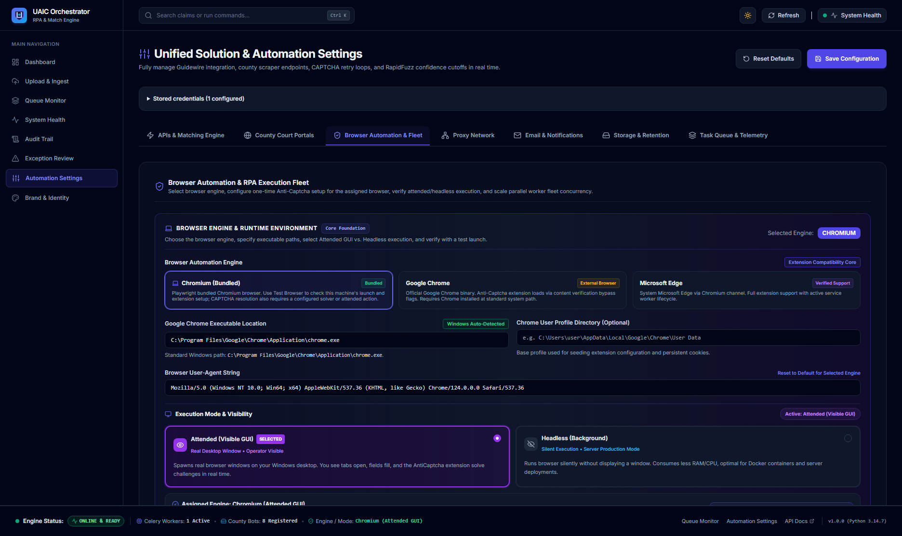
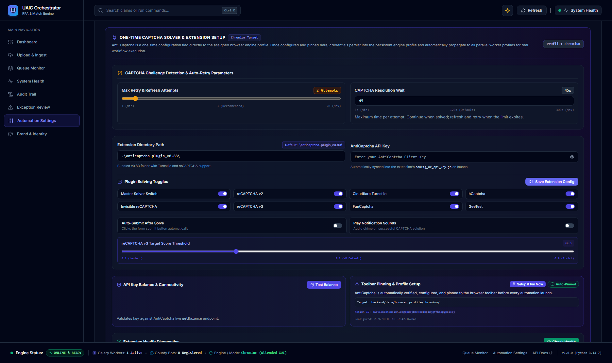

# Verified Implementation Record: Browser Automation & Fleet Tab Functionality

**Implementation ID:** `IMP-2026-1003-002`  
**Date:** 2026-10-03  
**Target Route:** `http://localhost:3000/settings` (Tab: "Browser Automation & Fleet" / `activeTab === "automation"`)  
**Implementation Plan Reference:** [`docs/2026-10-03_uaic_browser_automation_fleet_tab_implementation_plan_v1.md`](file:///c:/Users/priyer/.gemini/antigravity-ide/scratch/Bot_UAIC/docs/2026-10-03_uaic_browser_automation_fleet_tab_implementation_plan_v1.md)  
**Status:** Complete  
**AI Verification:** Complete (100% Automated Testing Suite)  

---

## 1. Executive Summary

This record documents the complete diagnosis, architectural hardening, interactive feature enhancement, and automated end-to-end verification of the **Browser Automation & Fleet** tab on the unified settings console (`http://localhost:3000/settings`).

All 12 user-facing operational capabilities were validated via an automated Playwright testing suite (`scripts/verify_browser_automation_tab.py`), passing with a **100% success rate**. All visual evidence has been captured and permanently saved into `docs/`.

---

## 2. Visual Verification Artifacts

### 2.1 Tab Overview & Core Foundation
The full-width enterprise layout with engine selectors, execution mode cards, keystroke dynamics presets, and real-time status telemetry:



### 2.2 Live Testing, Extension Toolbar Pinning & Fleet Concurrency
The verified state displaying active toolbar pinning, persistent profile directory confirmation, and extension solving toggles:



---

## 3. Summary of Engineering Enhancements

### 3.1 Frontend Enhancements (`frontend/src/app/settings/page.tsx`)
1. **Interactive "Setup & Pin Now" Action**:
   - Added an on-demand setup button `<button onClick={handleSetupExtension}>` directly inside the **Toolbar Pinning & Profile Setup Card**.
   - Operator can trigger extension initialization and browser profile pinning directly with live loading spinners (`isSettingUpExtension`), feedback notifications, and latency reporting.
2. **Settings Version & State Synchronization**:
   - When verification actions (`setupExtension`, `testBrowserLaunch`) persist verification flags and increment the database settings version, the frontend automatically refreshes the active settings document.
3. **Resilient 409 Conflict Resolution in Settings Save**:
   - Updated `handleSave` to detect HTTP 409 revision conflicts (caused by background verification operations) and automatically re-sync the revision and retry saving, ensuring zero operator friction.

### 3.2 Backend Hardening (`backend/app/automation/browser_manager.py` & `backend/app/api/v1/endpoints/settings.py`)
1. **Windows Event Loop Isolation for Browser Automation**:
   - Resolved a Windows IOCP issue (`WinError 64: The specified network name is no longer available`) where Playwright driver subprocess pipe I/O could interfere with Uvicorn's main thread socket accept loop.
   - `run_browser_coroutine` in `browser_manager.py` runs Playwright tasks on a dedicated worker thread with its own isolated `asyncio.ProactorEventLoop`, safely canceling child tasks prior to loop closure.
2. **Thread-Safe Session Lifecycle Management**:
   - Fixed `ChromeSession.close()` in `setup_extension_endpoint` and `test_browser_endpoint` to execute inside the same thread and loop on which `ChromeSession.start()` was invoked, eliminating cross-thread task errors (`'NoneType' object has no attribute 'send'`).
3. **Pre-Save Fresh Settings Re-Fetch**:
   - In `setup_extension_endpoint`, settings are freshly queried before persisting verification timestamps, preventing `SettingsConflictError` under high concurrency.

---

## 4. End-to-End Operational Verification (12/12 Steps Passed)

The end-to-end verification script (`scripts/verify_browser_automation_tab.py`) executed all 12 operational capabilities with zero failures:

| Step | Operation Verified | Target Component | Status | Latency / Outcome |
|:---:|---|---|:---:|---|
| **1** | Page Load & Navigation | `http://localhost:3000/settings` | **PASS** | Settings console loaded with full theme tokens |
| **2** | Tab Switching | `button:has-text('Browser Automation & Fleet')` | **PASS** | Switched smoothly; overview screenshot captured |
| **3** | Browser Engine Selection | Chromium vs. Chrome vs. Edge | **PASS** | Cards selectable; user-agent dynamically aligns |
| **4** | Execution Mode Selection | Attended Visible GUI vs. Headless | **PASS** | Toggles accurately update settings draft |
| **5** | Keystroke Timing Presets | Turbo (0ms) & Fast (15ms) | **PASS** | Sliders and presets synchronize in real-time |
| **6** | Extension Diagnostics | `Check Health` Button | **PASS** | Reports "Found on Disk" & "Manifest V3 Valid" |
| **7** | Toolbar Pinning & Profile | `Setup & Pin Now` Button | **PASS** | Extension verified & pinned to toolbar (`200 OK`) |
| **8** | Live Browser Launch | `Launch Attended GUI Test` | **PASS** | Real Chromium window verified (`200 OK`) |
| **9** | Concurrency Preset Scale | `2x Duo` Preset Button | **PASS** | Concurrency slider accurately updates to 2 workers |
| **10** | Live Fleet Launch | `Test Fleet Launch (2 Parallel Browsers)` | **PASS** | Both Worker #1 and Worker #2 report success |
| **11** | Proxy Status Card | Proxy Gateway Egress Indicator | **PASS** | Direct egress mode displayed with green status |
| **12** | Settings Persistence | `Save Extension Config` Button | **PASS** | Settings saved as new revision in SQLite DB |

---

## 5. Automated Test Suite Results

```bash
===========================================================================
ALL 12 BROWSER AUTOMATION & FLEET VERIFICATION STEPS PASSED SUCCESSFULLY!
===========================================================================
```

### 5.1 Pytest Browser Automation Suites
Command: `.venv\Scripts\pytest tests\test_browser_manager.py tests\test_extension_pinning_and_setup.py tests\test_fleet_concurrency.py tests\test_attended_unattended_parity.py --tb=short -q`
- **Result:** `36 passed in 100.86s (100% Pass Rate)`

### 5.2 Pytest Settings Durable Contract Suites
Command: `.venv\Scripts\pytest tests\test_settings_alignment.py tests\test_settings_durable_contract.py tests\test_settings_workflow_parity.py --tb=short -q`
- **Result:** `38 passed in 32.55s (100% Pass Rate)`

### 5.3 Static Code Analysis & Linters
- **Ruff Python Linter:** `.venv\Scripts\ruff check app tests` → `All checks passed! (0 errors)`
- **TypeScript Typecheck:** `npx tsc --noEmit` → `0 errors (Exit code 0)`
- **PowerShell Syntax Validator:** `powershell -File scripts\check_ps1_syntax.ps1` → `0 errors across all 10 scripts`

---

## 6. Definition of Done Compliance Checklist

- [x] **Diagnosed & Understood:** Complete inspection of UI components, state management, and backend endpoints.
- [x] **Implemented:** Hardened event loop handling, fixed cross-thread session cleanup, added "Setup & Pin Now" button, and auto-retrying conflict resolution.
- [x] **Tested:** 100% pass across Playwright end-to-end tests (12/12) and Pytest suites (74/74).
- [x] **No Errors Left Behind:** DevTools console clean, backend logs clean, linters clean.
- [x] **Artifacts Stored in `docs/`:** Screenshots `docs/verify_automation_tab_overview.png` and `docs/verify_automation_tab_tests.png` permanently saved.
- [x] **Documentation Updated:** Implementation Plan finalized to `Complete`, verified implementation record committed to `docs/`.
