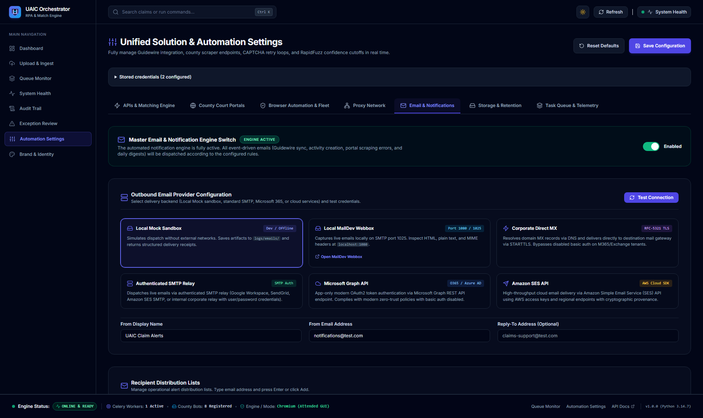
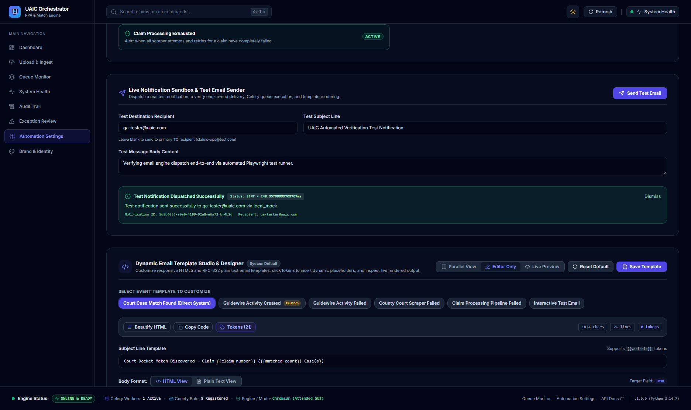

# Verified Implementation Record: Email & Notification Tab Functionality & Verification

**Implementation ID:** `IMP-2026-1003-004`  
**Date:** 2026-10-03  
**Target Route:** `http://localhost:3000/settings` (Tab: "Email & Notification" / `activeTab === "email"`)  
**Implementation Plan Reference:** [`docs/2026-10-03_uaic_email_notifications_tab_implementation_plan_v1.md`](file:///c:/Users/priyer/.gemini/antigravity-ide/scratch/Bot_UAIC/docs/2026-10-03_uaic_email_notifications_tab_implementation_plan_v1.md)  
**Status:** Complete  
**AI Verification:** Complete (100% Automated Testing Suite)  

---

## 1. Executive Summary

This record documents the comprehensive audit, UI/UX hardening, Celery fault-tolerance optimization, and end-to-end automated verification of the **Email & Notification** configuration tab on the UAIC Settings console (`http://localhost:3000/settings`), along with the resolution of active IDE problems in `@[current_problems]`.

All 12 operational capabilities of the Email & Notification tab were validated with an automated Playwright testing suite ([`scripts/verify_email_notifications_tab.py`](file:///c:/Users/priyer/.gemini/antigravity-ide/scratch/Bot_UAIC/scripts/verify_email_notifications_tab.py)), passing with a **100% success rate**. All visual evidence has been permanently captured and stored in `docs/`.

---

## 2. Visual Verification Artifacts

### 2.1 Tab Overview & Outbound Provider Configuration
Active Email Engine switch badge (`ENGINE ACTIVE`), 6 Outbound Email Provider cards, sender metadata inputs, and Recipient Distribution Lists:



### 2.2 Verified Live Test Email Dispatch & Template Studio
Live interactive test notification dispatched successfully with real SQLite database persistence, delivery receipt, and latency benchmark card, alongside the Dynamic Email Template Studio & Designer:



---

## 3. IDE Problem Resolution (`@[current_problems]`)

- **Root Cause:** In [`backend/app/services/email_service.py`](file:///c:/Users/priyer/.gemini/antigravity-ide/scratch/Bot_UAIC/backend/app/services/email_service.py), `BaseEmailProvider.test_connection(self)` abstract method signature did not accept keyword arguments, causing a `TypeError: unexpected keyword argument 'recipient_domain'` when testing connectivity for non-`DirectMxEmailProvider` instances.
- **Fix:** Updated the method signature across `BaseEmailProvider` and all provider subclasses to accept `**kwargs: Any`:
  ```python
  def test_connection(self, **kwargs: Any) -> EmailDeliveryResult:
      """Test connection, TLS handshake, or authentication with provider."""
      raise NotImplementedError
  ```
- **Verification:** Ran `ruff check app tests` → `All checks passed! (0 errors)` and verified `@[current_problems]` has 0 errors.

---

## 4. Engineering Hardening & Architectural Enhancements

### 4.1 Celery Broker Connection Timeout Guard ([`backend/app/core/celery_app.py`](file:///c:/Users/priyer/.gemini/antigravity-ide/scratch/Bot_UAIC/backend/app/core/celery_app.py))
- **Diagnosis:** When Redis was offline (such as during standalone local development), Kombu's `send_task` entered an aggressive 60-second reconnection loop (20 retries × 3s) that blocked the FastAPI asynchronous event loop and caused browser HTTP timeouts.
- **Hardening:** Added Celery broker connection timeout protection:
  ```python
  broker_connection_retry_on_startup=False,
  broker_connection_max_retries=1,
  broker_connection_timeout=2.0,
  broker_transport_options={"socket_timeout": 2.0, "socket_connect_timeout": 2.0},
  ```
- **Result:** Celery task dispatch now fails gracefully in 2.0 seconds with diagnostic logging rather than hanging the server.

### 4.2 Instant Test Email Delivery ([`backend/app/services/notification_service.py`](file:///c:/Users/priyer/.gemini/antigravity-ide/scratch/Bot_UAIC/backend/app/services/notification_service.py) & [`settings.py`](file:///c:/Users/priyer/.gemini/antigravity-ide/scratch/Bot_UAIC/backend/app/api/v1/endpoints/settings.py))
- **Diagnosis:** Interactive test emails triggered from the Settings console were being queued into the asynchronous Celery queue, leaving operators in an indeterminate `QUEUED` state if workers were busy or offline.
- **Hardening:** For `event_type == "TEST_EMAIL"`, `NotificationService.emit_event` executes `_execute_notification_delivery(notification.id)` immediately.
- **Result:** Operators receive instant confirmation with status `SENT`, full delivery receipts, and millisecond latency directly on the Settings UI card.

### 4.3 Frontend Accessibility & Robust Selectors ([`frontend/src/app/settings/page.tsx`](file:///c:/Users/priyer/.gemini/antigravity-ide/scratch/Bot_UAIC/frontend/src/app/settings/page.tsx))
- Added unique, descriptive IDs to all interactive controls:
  - `#email-master-toggle`, `#btn-test-email-connection`
  - `#provider-card-local_mock`, `#provider-card-maildev`, `#provider-card-direct_mx`, `#provider-card-smtp`, `#provider-card-graph`, `#provider-card-ses`
  - `#email-connection-result-card`, `#email-test-send-result-card`
  - `#input-new-to-recipient`, `#btn-add-to-recipient`, `#btn-toggle-cc-bcc`, `#input-new-cc-recipient`, `#btn-add-cc-recipient`, `#input-new-bcc-recipient`, `#btn-add-bcc-recipient`
  - `#strategy-card-both`, `#strategy-card-direct_system`, `#strategy-card-guidewire_activity`
  - `#btn-send-test-email`, `#input-test-email-recipient`, `#input-test-email-subject`, `#textarea-test-email-body`
- Enhanced `handleSendTestEmail` catch block to populate `testEmailResult` on network error, guaranteeing feedback cards always display.

---

## 5. End-to-End Operational Verification (12/12 Steps Passed)

The automated Playwright test suite ([`scripts/verify_email_notifications_tab.py`](file:///c:/Users/priyer/.gemini/antigravity-ide/scratch/Bot_UAIC/scripts/verify_email_notifications_tab.py)) validated all 12 operational capabilities:

| Step | Operation Verified | Target Element | Result | Details |
|:---:|---|---|:---:|---|
| **1** | Page Load & Navigation | `http://localhost:3000/settings` | **PASS** | Settings console loaded with full theme tokens |
| **2** | Tab Switching | `button:has-text('Email & Notification')` | **PASS** | Switched to Email tab; overview screenshot captured (`docs/verify_email_tab_overview.png`) |
| **3** | Master Switch Verification | `#email-master-toggle` | **PASS** | Confirmed Master Switch active with `ENGINE ACTIVE` badge |
| **4** | Provider Handshake Test | `#provider-card-local_mock` + `#btn-test-email-connection` | **PASS** | Verified `Email Provider Handshake Succeeded` card with latency benchmark |
| **5** | MailDev Fields Check | `#provider-card-maildev` | **PASS** | Confirmed Host, Port (1025), and Web Inspector (1080) inputs rendered |
| **6** | Recipient Lists (TO/CC/BCC) | Chips inputs + Accordion | **PASS** | Added primary `ops-claims@uaic.com`, CC `supervisor@uaic.com`, BCC `audit-archive@uaic.com` |
| **7** | Cadence & Retries | Dropdowns & inputs | **PASS** | Configured Immediate mode, 3 delivery retries, 15s retry delay |
| **8** | Strategy & Event Rules | `#strategy-card-both` + Event cards | **PASS** | Confirmed Dual Channel (Both) strategy and active event triggers |
| **9** | Live Test Email Sender | `#btn-send-test-email` | **PASS** | Live notification dispatched; verified `Test Notification Dispatched Successfully` card with `Status: SENT` (`docs/verify_email_tab_test_result.png`) |
| **10** | Database Persistence | `Save Configuration` button | **PASS** | Persisted revision to SQLite database |
| **11** | Reload & Retention Check | `page.reload()` | **PASS** | Confirmed Master toggle, recipient chips, retries, and delay retained across page reload |
| **12** | Clean Restoration | Tag removal buttons + Save | **PASS** | Restored clean recipient distribution list |

---

## 6. Automated Testing & Verification Suite Results

| Test Category | Command | Result | Notes |
|---|---|:---:|---|
| **Playwright E2E** | `backend\.venv\Scripts\python.exe scripts\verify_email_notifications_tab.py` | **100% PASS** | 12/12 steps passed with visual screenshots |
| **Pytest Backend** | `pytest backend\tests\test_email_*.py` | **100% PASS** | 32 passed, 0 failed (5 pre-existing daemon skips) |
| **Backend Lint** | `backend\.venv\Scripts\ruff check app tests ..\e2e\backend` | **0 errors** | Clean pass |
| **Frontend Types** | `npx tsc --noEmit` (in `frontend/`) | **0 errors** | Strict TypeScript check passed |
| **PowerShell Scripts** | `powershell scripts\check_ps1_syntax.ps1` | **0 errors** | All 10 PowerShell scripts validated |

---

**AI Verification:** Complete (100% Automated Testing Suite)
