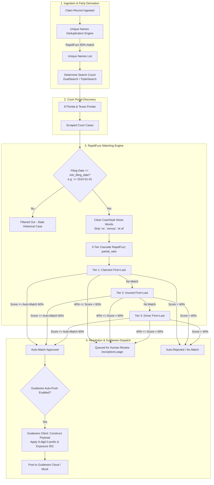

# UAIC Claim & RPA Orchestrator — APIs & Matching Engine Guide

## 1. Executive Overview & Purpose

The **APIs & Matching Engine** (located in **Settings → APIs & Matching Engine**, Tab 1) is the analytical core of the UAIC Orchestrator. It bridges court automation with enterprise insurance adjudication by solving three mission-critical problems:

1. **Party Deduplication & Search Optimization:** Deduplicates `Claimant`, `Insured`, and `Driver` parties into a minimal set of `unique_names` to prevent redundant portal queries (reducing robot runtimes by 33% to 66%).
2. **RapidFuzz Case Matching & Noise Cleaning:** Runs an authoritative 3-tier cascade algorithm with string normalization and date filtering to match unstructured court docket strings (`CaseStyle`) against insurance parties.
3. **Guidewire ClaimCenter Integration:** Packages validated court dockets into strictly compliant JSON payloads and dispatches them to Guidewire Cloud with automated authentication and mock simulation support.

---

## 2. End-to-End Architectural Pipeline



---

## 3. Subsystem 1: Guidewire ClaimCenter Integration API

### Purpose & Payload Contract
Guidewire ClaimCenter requires court-suit notifications when an insured, claimant, or driver is involved in litigation related to a loss.

#### Non-Negotiable Contract Rules:
- **Claim Number Normalization:** If `len(claim_number) == 9`, it MUST be prefixed with `"0"` (e.g., `123456789` → `0123456789`).
- **Exposure Number:** Fixed at `"001"`.
- **Case Items Schema:** Exactly four fields: `CaseNumber`, `CaseStyle`, `CountyWebsite`, and `SuitFiledDate`.

```json
{
  "ClaimNumber": "0123456789",
  "ExposureNumber": "001",
  "CaseItems": [
    {
      "CaseNumber": "2024-CA-001234",
      "CaseStyle": "JOHN DOE VS JANE SMITH",
      "CountyWebsite": "https://www.browardclerk.org",
      "SuitFiledDate": "2024-03-15"
    }
  ]
}
```

### Configuration Parameters:

| Parameter | Type | Default | Description |
|---|---|---|---|
| **Endpoint URL** | String (URL) | Guidewire Cloud Prod/Dev URL | Target REST API endpoint URL for downstream case updates. |
| **Authentication Type** | Dropdown | `Bearer` | Options: `Bearer`, `ApiKey`, `Basic`, `OAuth2`, or `None`. |
| **API Key / Secret Token** | Password | `""` | Secret token injected into `Authorization: Bearer <token>` or `X-API-Key: <key>`. Masked in logs and UI. |
| **Basic Client ID / Secret** | String | `""` | Username & password for standard HTTP Basic Authentication. |
| **Timeout Seconds** | Integer | `30` (5–120s) | Maximum HTTP timeout before aborting and triggering Celery task retry. |
| **Mock Simulation Mode** | Switch | `true` | When **ON**, requests are simulated locally with synthetic 200 OK responses, tracking latency without altering live production claims. When **OFF**, live HTTP requests are sent to Guidewire. |
| **Automatic Downstream Dispatch** | Switch | `true` | When **ON**, matches meeting or exceeding the Auto-Match Threshold are pushed to Guidewire immediately without manual review. |

### Live Interactive Tester & Response Explorer:
The UI embeds a real-time Swagger/Postman-style console allowing engineers to edit request payloads, execute live requests, view HTTP status codes, latency in milliseconds, and raw response JSON.

---

## 4. Subsystem 2: Unique Names Deduplication Engine

### Purpose & Optimization Value
Claims frequently involve duplicate names across roles (e.g., an Insured driver where `Insured == Driver`, or a single-vehicle loss). Querying court portals for the same party multiple times exhausts portal rate limits and wastes bot execution cycles.

The Unique Names Engine (`/api/v1/matches/unique-names`) accepts lists of Claimants, Insureds, and Drivers, strips corporate noise suffixes, and runs RapidFuzz fuzzy clustering to merge duplicates.

### Deduplication Scenarios & Search Count Derivation:

| Scenario | Relationship | DualSearch | TripleSearch | Unique Targets Searched |
|---|---|---|---|---|
| **Record 1: All Same** | Insured == Driver == Claimant | 1 | 1 | **1** (e.g., John Doe) |
| **Record 2: Insured = Driver** | Insured == Driver, Claimant ≠ | 1 | 3 | **2** (Insured + Claimant) |
| **Record 3: All Different** | Claimant ≠ Insured ≠ Driver | 2 | 3 | **3** (All parties distinct) |

### Configuration Parameters:
- **Deduplication Threshold:** Slider from `50%` to `100%` (default: `60%` / `0.60`). Names with similarity &ge; threshold are merged into a single unique target.
- **Corporate & Business Noise Patterns:** Tag-based exclusion list stripped prior to matching (e.g., `D/B/A`, `LLC`, `INC`, `CORP`, `P.A.`, `CO`).

---

## 5. Subsystem 3: RapidFuzz Case Matching & Guidewire Filter Engine

### The 3-Tier Matching Cascade
County court case captions (`CaseStyle`) often look like:  
`"STATE FARM MUTUAL AUTO INS CO ASO JOHN DOE VS JANE SMITH ET AL"`

The engine executes an authoritative, ordered cascade:
1. **Tier 1 (Claimant):** Compare Claimant (`first_name + " " + last_name`) against cleaned `CaseStyle`. If match score &ge; threshold, record match and stop.
2. **Tier 2 (Insured):** If Claimant does not match, compare Insured against cleaned `CaseStyle`. If match score &ge; threshold, record match and stop.
3. **Tier 3 (Driver):** If Insured does not match, compare Driver against cleaned `CaseStyle`. If match score &ge; threshold, record match and stop.

### RapidFuzz String Scoring:
- **Scorer:** RapidFuzz `partial_ratio` (default), `token_set_ratio`, or `ratio`.
- **Case Cleaning:** Pre-processes `CaseStyle` by stripping punctuation and removing configured noise words (`vs`, `versus`, `et al`, `in re`, `state of`, `dept of`).

### Threshold Decision Matrix:

```text
Score:  0% ------------ 40% ------------------------ 60% ------------ 100%
Zone:      [ No Match ]       [ Manual Review Queue ]     [ Auto-Approved ]
Action:     Discarded           Sent to /exceptions       Guidewire Push
```

- **Auto-Match Approval Threshold (default: 60% / 0.60):** Matches with scores &ge; 60% are marked as `Auto-Approved` and qualify for instant Guidewire dispatch.
- **Manual Review Lower Threshold (default: 40% / 0.40):** Matches scoring between 40% and 59% are flagged for adjuster review on the `/exceptions` review queue.
- **Below Lower Threshold (< 40%):** Automatically discarded as false positives.

---

## 6. Subsystem 4: Minimum Case Filing Date Filter

### Purpose & Protection
Litigation discovery is intended to capture suits arising from recent claims. Historical cases from decades past involving similar names must not be pushed to modern Guidewire claim files.

### Filter Dynamics:
- **Parameter:** `min_filing_date` (Date picker / ISO string, default: `2010-01-01`).
- **What Happens on Match Evaluation:**
  - When court scrapers extract a docket date (`SuitFiledDate` or `FilingDate`), the engine compares:
    $$\text{SuitFiledDate} \ge \text{min\_filing\_date}$$
  - If a scraped case was filed **before** the cutoff (e.g., `1998-04-12`), it is immediately tagged `status: "filtered_by_date"` and disqualified from Guidewire push, even if the party name is a 100% exact match.
  - The live tester UI displays an explicit amber warning badge whenever a match is disqualified solely due to filing date cutoff.

---

## 7. Subsystem 5: Interactive Direct Fuzzy Match API Tester

Located at the bottom of Tab 1, the **Direct Fuzzy Match API Tester** interfaces with `/api/v1/matches/test-fuzzy-match`:
- **Live Payload Editor:** Modify party names, county dockets, filing dates, and threshold overrides on the fly.
- **Pre-Built Presets:**
  - **Exact Match:** Demonstrates 100% match score and auto-approval qualification.
  - **High Confidence (Typo):** Demonstrates RapidFuzz tolerance for character transposition (e.g., `Jonathon` vs `Jonathan`).
  - **Below Cutoff:** Demonstrates non-matching party names falling below the threshold.
  - **Date Filtered:** Demonstrates an exact 100% name match that is disqualified because `SuitFiledDate` is older than `min_filing_date`.
- **Visual Result Card:** Displays the winning party, match score bar, cascade level (Claimant, Insured, or Driver), and Guidewire eligibility banner.

---

## 8. Summary of Settings & Operational Defaults

| Setting Key | Default Value | Recommended Range | Purpose |
|---|---|---|---|
| `guidewire_api_url` | Guidewire CaseUpdate URL | Valid HTTPS endpoint | Target Guidewire REST endpoint |
| `guidewire_auth_type` | `"Bearer"` | Bearer, ApiKey, Basic, OAuth2 | Authentication scheme |
| `guidewire_mock_mode` | `true` (Dev) / `false` (Prod) | Boolean | Protects production Guidewire from synthetic tests |
| `auto_push_on_match` | `true` | Boolean | Automatic dispatch on high confidence |
| `unique_names_threshold` | `0.60` (60%) | `0.50` – `0.80` | Cross-party deduplication sensitivity |
| `auto_match_threshold` | `0.60` (60%) | `0.55` – `0.75` | Minimum score for automatic approval |
| `manual_review_threshold`| `0.40` (40%) | `0.30` – `0.50` | Lower bound for human adjuster review |
| `min_filing_date` | `"2010-01-01"` | `YYYY-MM-DD` | Excludes stale historical court cases |
| `fuzz_algorithm` | `"partial_ratio"` | partial_ratio, token_set_ratio | Substring match algorithm |
