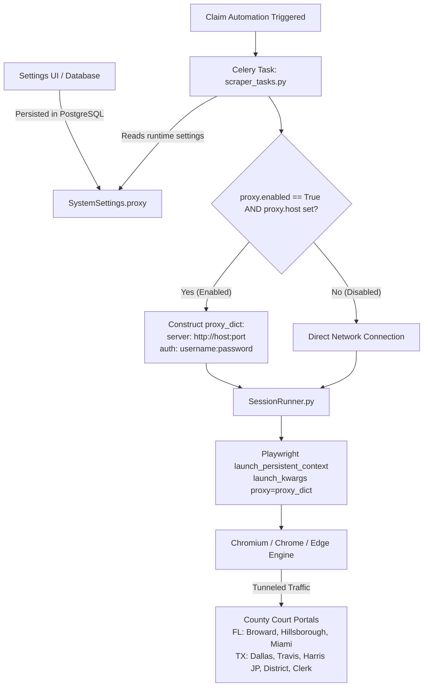

# UAIC Claim & RPA Orchestrator — Proxy Network & Proxy Pool Guide

## 1. Overview & Purpose

The **Proxy Network** (located under **Unified Solution & Automation Settings → Proxy Network**) provides an enterprise-grade forward proxy tunneling mechanism for the court-scraping automation fleet.

When UAIC automated RPA bots perform court-case discovery across the **8 Florida and Texas county court portals**:
- **Rate-Limiting & IP Ban Prevention:** County court portals (such as Miami-Dade, Broward, Dallas, Travis, Harris) monitor inbound web traffic. Processing dozens of claims concurrently or sequentially from a single static IP address can trigger government web application firewalls (WAFs), Cloudflare, Akamai, or CAPTCHA loops, leading to temporary or permanent IP blacklisting.
- **Enterprise Network & Domain Policy Compliance:** In corporate networks (such as Damco enterprise infrastructure), direct outbound web scraping may be restricted. Routing traffic through an authorized proxy gateway allows court automation to run compliantly.
- **IP Rotation & Obfuscation:** By connecting to a forward proxy server or a rotating proxy pool (e.g., BrightData, Oxylabs, Squid), each scraper request can originate from distinct IP addresses, making scraping indistinguishable from standard user traffic.

---

## 2. End-to-End Architecture & Request Flow

The proxy configuration integrates directly into the Celery task runner and the Playwright browser automation engine:



### Technical Implementation Details:
- **Database Schema:** Defined in `backend/app/schemas/settings.py` via `ProxySettings`:
  ```python
  class ProxySettings(BaseModel):
      enabled: bool = Field(default=False, description="Route Playwright traffic through dedicated proxy pool")
      host: str = Field(default="", description="Proxy server IP or hostname (e.g., 10.0.0.5)")
      port: int = Field(default=8080, description="Proxy server port (e.g., 8080 or 3128)")
      username: str = Field(default="", description="Proxy authentication username")
      password: str = Field(default="", description="Proxy authentication password")
  ```
- **Task Pipeline:** In `backend/app/tasks/scraper_tasks.py`, Celery workers inspect `runtime_settings.proxy`. If enabled, they construct `proxy_server = f"http://{proxy_cfg.host}:{proxy_cfg.port}"` with optional credentials.
- **Browser Launch:** In `backend/app/automation/session_runner.py`, Playwright's `launch_persistent_context()` applies `launch_kwargs["proxy"] = proxy_dict`. All network traffic—including HTTP/HTTPS, WebSockets, DNS lookups, images, and scripts—is strictly tunneled through the proxy.

---

## 3. What Happens on Enable vs. Disable?

| State | Scraper Behavior | Latency & Performance | When to Use |
|---|---|---|---|
| **Disabled** *(Default)* | • **Direct Connection:** Browsers launch using your machine / host server's local network adapter and public IP.<br>• Court portals see your local or corporate gateway IP address. | • Lowest latency (0ms proxy hop).<br>• Zero external dependency. | • Local development & testing.<br>• Routine, low-volume claim processing.<br>• When your host network has stable, unblocked portal access. |
| **Enabled** *(Checked)* | • **Tunneled Connection:** Unfolds configuration fields in Settings UI. All Playwright browser instances route traffic through `http://<host>:<port>`.<br>• Court portals only see the proxy server's IP address. | • Adds latency based on proxy server distance.<br>• Reliably prevents local IP exposure and blocks. | • Production high-volume batch processing.<br>• Overcoming `403 Forbidden`, `429 Too Many Requests`, or IP-based CAPTCHA blocks.<br>• Running outside the United States where county court portals block foreign IPs. |

---

## 4. Configuration Parameters

When **Enable Proxy Server** is checked in the Settings UI, the following parameters become active:

| Parameter | Type | Required | Default | Description |
|---|---|---|---|---|
| **Enable Proxy Server** | Checkbox | Yes | `false` | Master toggle to enable or disable proxy routing across all workers. |
| **Proxy Host / IP** | String | Yes (when enabled) | `""` | IP address or hostname of the proxy (e.g., `192.168.1.50`, `proxy.corporate.net`, or rotating proxy gateway). |
| **Port** | Integer | Yes (when enabled) | `8080` | Port number the proxy server listens on (e.g., `8080`, `3128` for Squid, `8888`). |
| **Username** | String | Optional | `""` | Username for proxies requiring HTTP Basic / Digest authentication. |
| **Password** | String | Optional | `""` | Password for authenticated proxies (masked in UI and API logs). |

---

## 5. Practical Guidelines & Best Practices

1. **Keep Disabled for Local Testing:** If all 8 county court portals connect and scrape successfully, leave proxy routing disabled to maintain maximum speed.
2. **Use When Portals Block IP (Geo-Blocking & Rate-Limiting):** Several Florida and Texas court portals implement strict geo-blocking against non-US IP addresses. If the orchestrator is deployed on a non-US server or cloud provider (e.g., AWS/GCP regions outside the US), enabling a US-based forward proxy is mandatory.
3. **Rotating vs. Dedicated Proxies:**
   - **Dedicated Proxy:** Best for predictable latency and whitelist-based portal access.
   - **Rotating Proxy Pool:** Best for massive parallel fleets (concurrency 5–10) where each concurrent worker uses an independent residential or datacenter IP.
4. **Proxy Authentication:** If using credentials, ensure the proxy server supports standard HTTP Basic/Digest proxy authentication supported by Chromium/Playwright.

---

## 6. Verification & Health Testing

To verify proxy connectivity:
1. Navigate to **Unified Solution & Automation Settings → Proxy Network**.
2. Check **Enable Proxy Server**, enter your proxy credentials, and click **Save Configuration**.
3. Switch to **Browser Automation & Fleet** and click **Test Launch (Attended GUI)**.
4. Verify that the browser opens, connects to the test page through the proxy, and successfully resolves external court portals.
