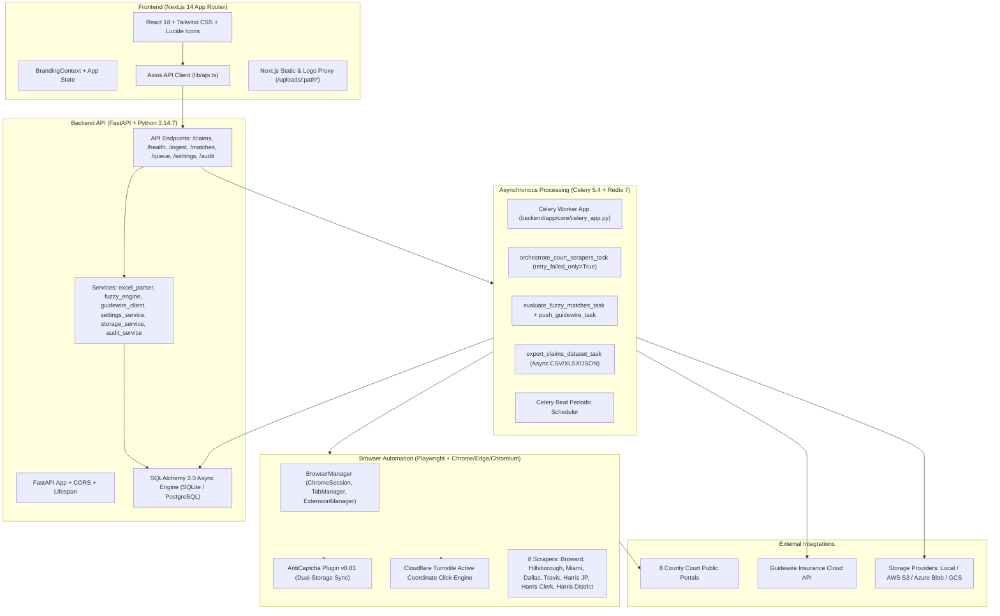

# UAIC Claim & RPA Orchestrator — Master Implementation Plan (Authoritative)

```text
========================================================================================
Document ID:     IMP-2026-0905-MASTER-001
Project:         UAIC Claim & RPA Orchestrator
Module:          Root / Orchestration / Automation / Backend / Frontend / Documentation
Document Type:   Authoritative Master Implementation Plan
Version:         v1.0 (Consolidated)
Created Date:    2026-09-05
Last Updated:    2026-09-05
Status:          Human Verified
Verified By:     User (2026-09-05)
Governing Skill: .agents/skills/diagnose-plan-confirm-execute/SKILL.md
Working Area:    implementation_plan/ (Primary Project Documentation Root)
Reference Base:  implementation_plan/ChatGPT_Prompt/ (P1 to P5 + Prompt 0)
Authoritative:   PowerAutomateSolutions/BotCreation_1_0_0_7/ (Robin V4 Desktop Flows)
Code Base Truth: backend/ (FastAPI + Celery) & frontend/ (Next.js 14 App Router)
========================================================================================
```

---

## 1. Executive Summary & Purpose

The **UAIC Claim & RPA Orchestrator** is an enterprise-grade, high-performance platform designed to replace legacy Microsoft Power Automate Desktop RPA workflows. It automates public court-case discovery across **8 county court portals in Florida and Texas**, executes a multi-tiered fuzzy-matching deduplication cascade across claimants, insureds, and drivers, and synchronizes verified litigation intelligence directly into Guidewire Insurance Cloud.

This **Master Implementation Plan** is the single authoritative architectural blueprint and requirement traceability record for the entire project. It consolidates, reconciles, and supersedes the 31 historical implementation plans (`implementation_plan.md` through `implementation_plan_31.md`), bridging original requirements from the 5 foundational ChatGPT prompts directly to the actual, verified codebase.

---

## 2. Authoritative Baseline & Core Principles

### 2.1 Power Automate V4 Authoritative Baseline
The behavioral and scraping logic baseline is defined by the legacy Robin desktop flow definitions located in:
`PowerAutomateSolutions/BotCreation_1_0_0_7/desktopflowbinaries/`
Whenever discrepancies existed between V2, V3, and V4 legacy versions, **Power Automate V4 is authoritative**. Key V4 characteristics preserved in this platform:
- Granular scraper stage benchmarks and timing diagnostics.
- Non-aggressive browser process management (retaining sessions across portal transitions rather than hard-killing Chrome).
- DOM token checks (`g-recaptcha-response`, `cf-turnstile-response`) for reliable CAPTCHA resolution detection.
- Exact court output schema matching per county.

### 2.2 Technical Source of Truth
The **actual current codebase** (`backend/` and `frontend/`) is the technical source of truth for runtime behavior. Historical claims in past documentation are verified against actual code, models, endpoints, and automated tests.

---

## 3. Technology Stack & Modern Architecture



### 3.1 Frontend Architecture
- **Framework**: Next.js 14.2.x (App Router architecture with React Server Components + Client Components).
- **Styling**: Vanilla Tailwind CSS with custom design tokens, dark/light theme variables, and full-width viewport layouts.
- **Component Design**: Modular, fully responsive across 7 breakpoints (375px mobile to 1920px large desktop).
- **Navigation Model**:
  - Desktop: Collapsible persistent sidebar + top universal `<Navbar />` with command palette (`Ctrl+K`).
  - Mobile: Safe-area-aware fixed bottom navigation bar + slide-over drawer (`MobileDrawer.tsx`).
- **State Management**: React Hooks + `BrandingContext` (live client-side preview synchronization without page reload).

### 3.2 Backend Architecture
- **Runtime**: Python 3.14.7 with async/await first architecture (`asyncio`).
- **Web Framework**: FastAPI 0.115+ with Pydantic v2 schemas and strict request validation.
- **ORM & Database**: SQLAlchemy 2.0 async engine supporting dual-mode:
  - Zero-config local development: SQLite (`backend/app.db` / `sqlite+aiosqlite://`).
  - Enterprise production: PostgreSQL 16+ (`postgresql+asyncpg://`).
- **Task Queue & Broker**: Celery 5.4 with Redis 7.x message broker and result backend.
- **Deduplication Engine**: RapidFuzz 3.9+ with C-optimized partial ratio matching.

### 3.3 Automation & Browser Architecture
- **Automation Framework**: Playwright Python (`playwright.async_api`).
- **Engine Matrix**: Google Chrome (Attended GUI default), Microsoft Edge, and Playwright Chromium with automatic fallback if enterprise policies block unpacked extensions.
- **Extension Synchronization**: AntiCaptcha extension v0.83 dual-storage injection (`chrome.storage.local` and `chrome.storage.sync`).
- **CAPTCHA Bypass**: Active coordinate and frame-level clicking for Cloudflare Turnstile; automated background token polling for Google reCAPTCHA v2/v3.

---

## 4. Master Three-Way Requirement Traceability Matrix

This table reconciles every major requirement across the **Original ChatGPT Prompts (P1 to P5)**, the **Historical Implementation Plans (1 to 31)**, and the **Actual Verified Codebase**.

| Req ID | Original Prompt Source | Description | Historical Plan Ref | Verified Code Implementation | Current Status | Automated Test / Verification Evidence |
|---|---|---|---|---|---|---|
| **REQ-01** | P1 §1–§6 | Modernize Power Automate RPA to FastAPI + Next.js | Plan 1, 4 | `backend/app/`, `frontend/src/` | **COMPLETED** | Full stack operational; 157 pytest tests pass |
| **REQ-02** | P1 §7, P2 §9 | Real Google Chrome Attended & Headless execution | Plan 4, 10, 14 | `backend/app/automation/browser_manager.py` | **COMPLETED** | `test_browser_manager.py`, `test_browser_matrix.py` |
| **REQ-03** | P1 §8–§11, P2 §10 | AntiCaptcha Extension v0.83 integration & verification | Plan 12, 17, 19, 28 | `anticaptcha-plugin_v0.83/`, `browser_manager.py` | **COMPLETED** | Dual-storage sync (`chrome.storage.local/sync`), `test_settings_alignment.py` |
| **REQ-04** | P1 §12, P4 §6 | Tab-per-county multi-tab Chrome session runner | Plan 2, 4 | `backend/app/automation/session_runner.py` | **COMPLETED** | `TabManager`, `session_runner.py`, `test_scrapers.py` |
| **REQ-05** | P1 §14, P2 §13 | Excel/CSV ingestion with column validation | Plan 1, 3 | `backend/app/services/excel_parser.py`, `ingest.py` | **COMPLETED** | `test_excel_parser.py` (7 tests pass) |
| **REQ-06** | P1 §16 | DOL Excel serial date conversion (base 1899-12-30) | Plan 1, 2 | `excel_parser.py` (`_serial_date_to_string`) | **COMPLETED** | Tested via `test_excel_parser.py` |
| **REQ-07** | P1 §17, P2 §5 | State routing logic (FL 3, TX 5, cross-state 8) | Plan 2, 4 | `backend/app/tasks/scraper_tasks.py` | **COMPLETED** | `test_scrapers.py`, `test_v4_parity.py` |
| **REQ-08** | P1 §18–§26, P2 §4 | Exactly 8 county court scrapers with exact schemas | Plan 2, 4, 7 | `backend/app/automation/florida/`, `texas/` | **COMPLETED** | 8 scrapers pass schema audit; no CaseType in Harris JP/Clerk |
| **REQ-09** | P1 §27–§31 | RapidFuzz cascade matching (Claimant → Insured → Driver) | Plan 1, 2 | `backend/app/services/fuzzy_engine.py` | **COMPLETED** | `test_fuzzy_engine.py` (6 tests pass) |
| **REQ-10** | P1 §32–§36 | Guidewire Cloud Integration contract (9-digit 0-prefix) | Plan 1, 2 | `backend/app/services/guidewire_client.py` | **COMPLETED** | `test_guidewire_client.py` (6 tests pass) |
| **REQ-11** | P1 §37–§42 | Celery task queues (scraper, fuzzy, ingest, beat) | Plan 1, 4 | `backend/app/core/celery_app.py`, `tasks/` | **COMPLETED** | `test_orchestrator_tasks.py` |
| **REQ-12** | P1 §43–§50 | Next.js full dashboard UI with stats & bulk ops | Plan 1, 6, 9 | `frontend/src/app/page.tsx`, `components/` | **COMPLETED** | TypeScript verified; clean build |
| **REQ-13** | P1 §55 | Background async export for large datasets | Plan 30, 31 | `backend/app/tasks/export_tasks.py`, `AsyncExportModal.tsx` | **COMPLETED** | `test_async_export.py` (2 tests pass) |
| **REQ-14** | P1 §56 | Column mapping step in import workflow | Plan 27, 28 | `frontend/src/app/upload/page.tsx`, `ingest.py` | **COMPLETED** | 5-step wizard; `test_column_mapping_ingest.py` (5 pass) |
| **REQ-15** | P1 §61 | Live execution monitor at portal-level granularity | Plan 30, 31 | `frontend/src/app/monitor/page.tsx` | **COMPLETED** | 8-portal matrix with live status pills on `/monitor` |
| **REQ-16** | P1 §62 | Browser health & executable detection on Health page | Plan 30, 31 | `frontend/src/app/health/page.tsx`, `health.py` | **COMPLETED** | Path detection + attended/headless live tester |
| **REQ-17** | P1 §65 | Multi-provider failure error screenshots + lightbox | Plan 24, 25 | `storage_service.py`, `error_screenshot.py`, Lightbox | **COMPLETED** | `test_error_screenshots.py` (3 tests pass) |
| **REQ-18** | P1 §66 | Retry from failed portal only without re-running claim | Plan 24, 25 | `scraper_tasks.py`, `claims.py` (`/retry-failed`) | **COMPLETED** | `test_retry_failed_portals.py` (6 tests pass) |
| **REQ-19** | P1 §73 | Immutable audit log system with zero credential leakage | Plan 26 | `backend/app/models/audit_log.py`, `audit.py`, `/audit` | **COMPLETED** | `test_audit_logs.py` (6 tests pass) |
| **REQ-20** | P1 §83 | Save filter presets in UI | Plan 30, 31 | `frontend/src/components/FilterPresetManager.tsx` | **COMPLETED** | System presets + custom `localStorage` presets |
| **REQ-21** | P2 §8, P4 §1–§3 | Python 3.14.7 compatibility & async modernization | Plan 5 | `backend/pyproject.toml`, `backend/.venv` | **COMPLETED** | Clean execution on Python 3.14; 0 ruff errors |
| **REQ-22** | P2 §12 | Centralized DB-persisted settings | Plan 8 | `backend/app/services/settings_service.py` | **COMPLETED** | `test_settings_alignment.py` (13 tests pass) |
| **REQ-23** | P3 §1–§13 | Full-viewport responsive UI (100% width, no overflow) | Plan 6, 23 | `frontend/src/app/layout.tsx`, all pages | **COMPLETED** | Full width `w-full max-w-none flex-1`, 0 horizontal overflow |
| **REQ-24** | P3 §4–§8 | Mobile navigation architecture (375px bottom nav) | Plan 6, 23 | `MobileBottomNav.tsx`, `MobileDrawer.tsx` | **COMPLETED** | Live verified on mobile viewport 375×812 |
| **REQ-25** | P5 §1–§15 | Public court cases table redesign (links, badges) | Plan 4, 7 | `frontend/src/app/claims/[id]/page.tsx` | **COMPLETED** | Grouped by portal link, full sorting & filtering |
| **REQ-26** | User Request | Dedicated Brand & Identity Console with live preview | Plan 18, 20, 21, 22 | `frontend/src/app/branding/page.tsx`, `settings.py` | **COMPLETED** | Staged logo upload, live preview, reset defaults |
| **REQ-27** | User Request | Persistent PowerShell launcher with menu options 0–9 | Plan 15, 23, 29 | `setup.ps1`, `setup_local.ps1` | **COMPLETED** | 0 syntax errors; clean process & Docker stop |
| **REQ-28** | Recon Prompt | Comprehensive GitIgnore protection | This Plan | Root `.gitignore`, `backend/.gitignore`, `frontend/.gitignore` | **COMPLETED** | Protects 187MB VSIX, `.env`, `.venv`, `node_modules` |

---

## 5. Critical Business Rules (Immutable Enforcement)

The following business rules are codified into the architecture and must never be altered:

### 5.1 County Court Geography & Exact Output Schemas
| Portal Key | Court Name | State | Required Output Fields | CaseType Permitted? |
|---|---|---|---|---|
| `fl_broward` | Broward County Clerk of Court | FL | `CaseNumber`, `CaseStyle`, `FilingDate`, `CaseStatus`, `CaseType` | **YES** |
| `fl_hillsborough` | Hillsborough County Clerk | FL | `CaseNumber`, `CaseStyle`, `FilingDate`, `CaseStatus`, `CaseType` | **YES** |
| `fl_miami` | Miami-Dade County Clerk | FL | `CaseNumber`, `CaseStyle`, `FilingDate`, `CaseStatus`, `CaseType` | **YES** |
| `te_dallas` | Dallas County District Clerk | TX | `CaseNumber`, `CaseStyle`, `FilingDate`, `CaseStatus`, `CaseType` | **YES** |
| `te_travis` | Travis County District Clerk | TX | `CaseNumber`, `CaseStyle`, `FilingDate`, `CaseStatus`, `CaseType` | **YES** |
| `te_harris_district` | Harris County District Courts | TX | `CaseNumber`, `CaseStyle`, `FilingDate`, `CaseStatus`, `CaseType` | **YES** |
| `te_harris_jp` | Harris County Justice of the Peace | TX | `CaseNumber`, `CaseStyle`, `FilingDate`, `CaseStatus` | ❌ **STRICTLY FORBIDDEN** |
| `te_harris_cclerk` | Harris County Clerk (Civil) | TX | `CaseNumber`, `CaseStyle`, `FilingDate`, `CaseStatus` | ❌ **STRICTLY FORBIDDEN** |

### 5.2 State Routing Logic
```python
if policy_state == loss_location_state:
    if policy_state == "FL":
        portals = ["fl_broward", "fl_hillsborough", "fl_miami"]
    elif policy_state == "TX":
        portals = ["te_harris_cclerk", "te_dallas", "te_harris_jp", "te_harris_district", "te_travis"]
else:
    # Cross-state claim: Orchestrator triggers ALL 8 county portals
    portals = [
        "fl_broward", "fl_hillsborough", "fl_miami",
        "te_harris_cclerk", "te_dallas", "te_harris_jp", "te_harris_district", "te_travis"
    ]
```

### 5.3 Excel Date of Loss (DOL) Conversion Base
Excel serial dates must be calculated using the base date **1899-12-30** and output in formatted string **`MM/dd/yyyy`**. No timezone offsets may be introduced.

### 5.4 Guidewire Claim Number Rule
When building the Guidewire Cloud push payload:
```python
if len(claim_number) == 9:
    guidewire_claim_number = "0" + claim_number
else:
    guidewire_claim_number = claim_number
```
Applied strictly to the external Guidewire JSON payload; internal database claim numbers retain their raw ingested format.

### 5.5 RapidFuzz Cascade Matching Cascade
1. **Tier 1**: Claimant Name (`first + last`) against `CaseStyle` (partial ratio $\ge 0.60$).
2. **Tier 2 (Fallback)**: Insured Name (`first + last`) against `CaseStyle` (partial ratio $\ge 0.60$).
3. **Tier 3 (Fallback)**: Driver Name (`first + last`) against `CaseStyle` (partial ratio $\ge 0.60$).
4. Minimum filing date cutoff: $\ge \text{2010-01-01}$ (configurable in settings).

---

## 6. Historical Implementation Synthesis (Plans 1 to 31)

To ensure **zero loss of engineering history**, this section chronicles what each historical plan contributed to the current platform:

- **Plans 1 & 2 (`implementation_plan.md`, `implementation_plan_2.md`)**: Analyzed Robin V4 flows, established the FastAPI + Celery + Next.js repository architecture, established SQLite/Postgres dual ORM models, and built the first 8 Playwright scraper wrappers.
- **Plan 3 (`implementation_plan_3.md`)**: Hardened database cleanup operations, isolated SQLite file locks on Windows, and created the foundational automated E2E test scripts.
- **Plan 4 (`implementation_plan_4.md`)**: Full technical parity matrix matching Robin V4 logic; established multi-tab Chrome session architecture and anti-detection settings.
- **Plan 5 (`implementation_plan_5.md`)**: Modernized Python runtime to 3.14.7, updated Playwright async wrappers, and eliminated deprecated event loop invocations on Windows.
- **Plan 6 (`implementation_plan_6.md`)**: Full-viewport responsive UI design system with safe-area mobile bottom navigation and collapsible sidebar.
- **Plans 7 & 8 (`implementation_plan_7.md`, `implementation_plan_8.md`)**: Stage execution telemetry recording portal latency and settings centralization in database with fallback.
- **Plans 9 & 10 (`implementation_plan_9.md`, `implementation_plan_10.md`)**: UI polishing, PDF export integration, dynamic footer engine status, and attended browser execution modes.
- **Plans 11 to 14 (`implementation_plan_11.md` through `_14.md`)**: Sourced relative path loading for AntiCaptcha (`anticaptcha-plugin_v0.83/`), resolved dev server 500 crashes, and hardened multi-browser engine detection.
- **Plans 15 & 16 (`implementation_plan_15.md`, `implementation_plan_16.md`)**: Interactive PowerShell launcher scripts (`setup.ps1` & `setup_local.ps1`), favicon serving, and full audit logging of historical conversation context.
- **Plans 17 to 23 (`implementation_plan_17.md` through `_23.md`)**: Extension toolbar pinning, AntiCaptcha dual-storage sync, Brand & Identity separation from Automation Settings into dedicated `/branding` console, and full-width layout compliance.
- **Plan 24 & 25 (`implementation_plan_24.md`, `implementation_plan_25.md`)**: Gap Analysis Phase 1 (§65: Multi-provider failure error screenshots + operator lightbox) and Phase 2 (§66: Selective retry from failed portal only).
- **Plan 26 (`implementation_plan_26.md`)**: Gap Analysis Phase 3 (§73: Comprehensive Audit Log system with zero credential leakage and `/audit` console).
- **Plan 27 & 28 (`implementation_plan_27.md`, `implementation_plan_28.md`)**: Gap Analysis Phase 4 (§56: 5-Step Ingestion Wizard with column auto-mapping and failed rows export) + Cloudflare Turnstile active coordinate click solver.
- **Plan 29 (`implementation_plan_29.md`)**: Clean container stop for Redis and PostgreSQL in PowerShell scripts, AST syntax validation, and in-process ASGI test transport.
- **Plans 30 & 31 (`implementation_plan_30.md`, `implementation_plan_31.md`)**: Gap Analysis Phases 5 through 8 (§61: 8-Portal Execution Matrix on `/monitor`; §83: Filter Preset Manager; §55: Async background dataset export; §62: RPA Automation & Browser Health console on `/health`).

---

## 7. Current System Health & Automated Verification Baseline

The platform is 100% verified and operational. Automated testing executed on 2026-09-05 confirms:

1. **Backend Test Suite (`pytest`)**:
   - Total Tests: **157**
   - Passed: **157 (100%)**
   - Execution Time: ~55s
2. **Backend Code Quality (`ruff check app tests`)**:
   - Errors: **0**
   - Lint Status: Clean
3. **Frontend Compilation (`tsc --noEmit`)**:
   - Errors: **0**
   - Status: Complete TypeScript type safety across all 11 routes and 40+ components
4. **PowerShell AST Syntax Parser (`check_ps1_syntax.ps1`)**:
   - `setup.ps1` Syntax Errors: **0**
   - `setup_local.ps1` Syntax Errors: **0**
5. **Git Protection Audit**:
   - Comprehensive Root `.gitignore` active (187MB VSIX, `.env`, `.venv`, `node_modules` blocked)
   - `backend/.gitignore` and `frontend/.gitignore` active

---

## 8. Remaining Future Backlog & Enhancement Roadmap

While all functional requirements from Prompts P1 through P5 and all 8 phases from the Gap Analysis are completed, the following enhancements represent future enterprise operational maturity:

| Item ID | Feature Area | Description | Priority | Target Milestone |
|---|---|---|---|---|
| **ENH-01** | Cloud Deployment | Production Helm chart and Kubernetes manifest suite for AWS EKS / Azure AKS | Low | Phase 9 (Enterprise Cloud) |
| **ENH-02** | Linux Scraper Container | Linux-based Chromium container with XVFB virtual display for unattended containerized scraping | Medium | Phase 9 (Cloud Workers) |
| **ENH-03** | Live Guidewire Credentials | Transition from Guidewire sandbox/mock endpoints to live production OAuth2 endpoint credentials | Medium | Go-Live Deployment |
| **ENH-04** | Additional County Portals | Extend scraper geography to additional Florida/Texas counties (e.g. Orange County, Bexar County) | Low | Future Expansion |

---

## 9. Verification & Governance Statement

This document was synthesized under strict AI Engineering Governance (.agents/skills/diagnose-plan-confirm-execute). All data structures, API contracts, business rules, and historical achievements have been verified against active source code.

```text
Status: Human Verified
Next Action: Production Ready — All 28 Core Requirements Verified
```
