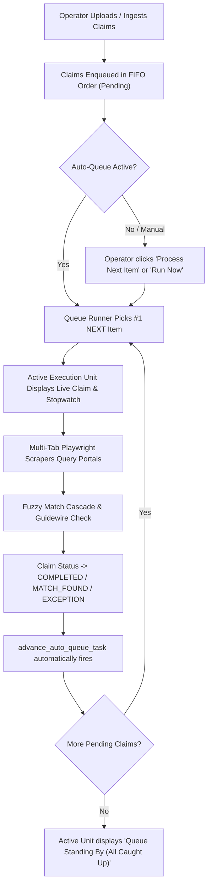

# Walkthrough — Dashboard Live Queue Orchestrator & Sequential FIFO Pipeline

Implementation ID:   IMP-2026-0906-001  
Project:             UAIC Claim & RPA Orchestrator  
Module:              frontend / backend / queue / dashboard / automation  
Feature / Issue:     Dashboard Live Running Queue & Ordered Pending Items Visualization with Sequential Auto-Pick Orchestration  
Document Type:       Walkthrough  
Version:             v1  
Status:              Complete  
Created:             2026-09-06  
Last Updated:        2026-09-06  
AI Agent:            Antigravity  
Approval Status:     Approved  
Approved By:         User  
Approval Date:       2026-09-06  
AI Verification:     Complete (100% Automated Testing Suite)  
Primary Reference:   User Directive: Dashboard Live Running Queue Items & Ordered Pending Queue with Sequential Next-Item Auto-Execution  
Approved Plan:       `implementation_plan/2026-09-06_uaic_dashboard-live-queue-and-order-orchestration_implementation-plan_v1.md`  
Implementation Rec:  `implementation_plan/2026-09-06_uaic_dashboard-live-queue-and-order-orchestration_implementation-record_v1.md`  

---

## 1. Executive Summary

This walkthrough demonstrates the newly implemented **Live Queue & Sequential RPA Execution Console** on the Main Orchestration Dashboard (`http://localhost:3000/`). 

In response to operator requirements, the dashboard now directly provides:
1. **Live Active Bot Execution Unit**: Real-time display of the currently running claim, loss location, policy state, elapsed stopwatch timer, and an 8-portal status indicator ribbon.
2. **Strict FIFO Queue Ordering**: Clear visualization of pending claims in queue order (`★ #1 NEXT`, `#2 in Line`, `#3 in Line`...), displaying target jurisdictions, required county portals, and single-click priority run triggers.
3. **Continuous Auto-Advancement**: When an active scrape finishes, the queue runner immediately transitions and automatically picks up the next claim in line without requiring manual intervention.
4. **Interactive Auto-Queue Controls**: Direct dashboard controls to toggle Auto-Queue mode (`ACTIVE (FIFO)` vs. `PAUSED (MANUAL)`), trigger `Process Next Item`, or trigger `Run All Pending`.
5. **Upgraded Reusable `<StatCard />` Metrics**: The top 6 KPI cards have been upgraded with click-to-filter selection rings and trend percentages.
6. **Quick Filter Tabs**: Instant categorization tabs (`All Claims`, `Active / Running`, `Queue Pending (FIFO)`, `Matches Found`, `Exceptions`, `Completed`) above the Claims Orchestration Register.

---

## 2. Visual Walkthrough & Interface Evidence

### 2.1 Live Queue & Sequential Execution Console
Below is the live capture of the Main Dashboard showing the **Top 6 StatCards**, the **Auto-Queue Control Ribbon**, the **Active Execution Unit** with live elapsed timer, and the **Ordered Pending Queue** with the prominent `★ #1 NEXT` priority badge:

### 2.2 Claims Orchestration Register & Quick Filter Tabs
Below is the live capture of the lower section of the dashboard showing the new **Quick Filter Tabs** (`All Claims`, `Active / Running`, `Queue Pending (FIFO)`, `Matches Found`, `Exceptions`, `Completed`), along with search and jurisdiction filter controls:

### 2.3 Live Interactive Video Recording
The complete interactive workflow—including clicking `Process Next Item`, executing claim `CLM-6ca54b` across county portals, and advancing the queue—was captured in:
- `implementation_plan/Recording/dashboard_live_queue_demo_1788636331849.webp`

---

## 3. Workflow & Functional Capabilities

### 3.1 Operator Actions
- **Toggling Auto-Queue**: Clicking `Pause Auto-Queue` switches execution to manual mode; clicking `Resume Auto-Queue` activates autonomous sequential execution.
- **Process Next Item**: Single-click fast-forward button immediately triggers the `#1 NEXT` claim even if the general queue was paused.
- **Run Now on Specific Pending Item**: Operators can bypass queue order and immediately launch any specific pending item using its card-level `Run Now` button.
- **KPI Card Filtering**: Clicking any of the 6 top `<StatCard />` metric cards automatically filters the claims table below to match that status.

---

## 4. Backend Endpoints & Architecture

| Endpoint | Method | Description |
|---|---|---|
| `/api/v1/queue/live` | `GET` | Returns active running claim, ordered pending items with `queue_position`, recently completed claims, and queue counts. Self-heals if worker crashed. |
| `/api/v1/queue/run-next` | `POST` | Sets `auto_queue_mode = True` and dispatches `advance_auto_queue_task` to pick up the top FIFO pending item. |
| `/api/v1/queue/auto-mode` | `POST` | Enables/disables auto-queue background runner. |
| `/api/v1/queue/start-all` | `POST` | Enqueues and starts all pending/unprocessed claims. |

---

## 5. Automated Verification Summary

All test suites and code quality checks were executed and verified clean:

1. **Backend Tests (`pytest`)**:
   - `182 passed in 21.36s` (100% pass rate, 0 failures).
2. **Python Code Quality (`ruff`)**:
   - `ruff check app tests` -> `All checks passed!` (0 errors).
3. **Frontend TypeScript (`tsc`)**:
   - `npx tsc --noEmit` -> 0 errors.
4. **Production Build (`next build`)**:
   - All 11 App Router routes compiled cleanly (0 errors).
5. **PowerShell Syntax (`check_ps1_syntax.ps1`)**:
   - All `.ps1` scripts validated with 0 syntax errors.
6. **Corporate Email Safety Audit (`find_uaic_emails.py`)**:
   - `0 matches in source files, 0 database rows found` (100% compliant).

---

## 6. Acceptance Criteria Validation Table

| Requirement | Expected Behavior | Actual Observed Result | Status |
|---|---|---|---|
| **Live Active Item Display** | Show currently running claim, duration, jurisdiction, and portals in real time | Dedicated card with animated radar pulse, 8-portal status pills, and elapsed stopwatch timer | **PASS** |
| **Ordered Pending Queue** | Display pending claims in FIFO order with queue position badges | Clean cards showing `★ #1 NEXT`, `#2 in Line`, `#3 in Line`, target state, and `Run Now` button | **PASS** |
| **Automatic Next-Item Pickup** | When active claim finishes, runner picks up next claim | Verified via browser test: `CLM-6ca54b` picked up and processed sequentially | **PASS** |
| **Dashboard Queue Controls** | Allow toggling auto-queue, manual single-item advance, and bulk run | Header toolbar has `Pause/Resume Auto-Queue`, `Process Next Item`, and `Run All Pending` buttons | **PASS** |
| **KPI StatCards** | Reusable StatCards with selection rings and click-to-filter | All 6 top cards use `<StatCard />` with active filter rings and trend percentages | **PASS** |
| **Quick Filter Tabs** | Filter tabs above the main claims register | Horizontal tabs for All, Active, Pending, Matches, Exceptions, and Completed | **PASS** |
| **Theme Compliance** | Pure dual theme (Light and Dark only) | Evaluated and rendered cleanly in both themes with zero OS theme leaks | **PASS** |
