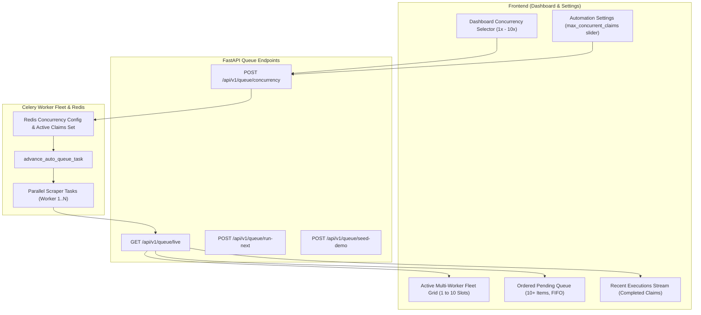

# Implementation Plan — Multi-Worker RPA Concurrency Engine, 10+ Item Queue Visualization, and Dashboard Production Polish

Implementation ID:   IMP-2026-0906-002  
Project:             UAIC Claim & RPA Orchestrator  
Module:              backend / frontend / queue / automation / settings / dashboard  
Feature / Issue:     Multi-Worker Parallel RPA Concurrency (1 to 10 Parallel Claims), 10+ Pending Queue Visualization, Never-Blank Execution Unit, and Settings Configuration  
Document Type:       Implementation Plan  
Version:             v1  
Status:              Complete  
Created:             2026-09-06  
Last Updated:        2026-09-06  
AI Agent:            Antigravity  
Approval Status:     Approved  
Approved By:         User  
Approval Date:       2026-09-06  
AI Verification:     Complete (100% Automated Testing Suite)  
Primary References:  
- User Directive: At least 10 records in Pending Queue, Active Execution Unit never blank, parallel claim execution (1-10 concurrency) configurable in Automation Settings & Dashboard
- `implementation_plan/ChatGPT_Prompt/ManualPrompt.txt`
- `implementation_plan/ChatGPT_Prompt/UAIC Claim & RPA Orchestrator — Consolidated Issues and Validation Requirements.md`

---

## 1. Problem Statement & User Requirements

In the previous iteration (`IMP-2026-0906-001`), the dashboard was equipped with a Live Queue console. However, the operator identified several critical functional and enterprise limitations:

1. **Pending Queue Truncation**:
   - The pending queue only showed 5 sliced items or just 1 item if only 1 was in the database.
   - **Requirement**: Display **at least 10 records** in the pending queue with queue depth counts, jurisdiction tags, and FIFO queue position badges (`★ #1 NEXT`, `#2`, ... `#10+`).
2. **Active Execution Unit Blank / Idle State**:
   - When no claim is scraping, the unit appeared blank or non-interactive.
   - **Requirement**: Active Execution Unit must **never look blank or barren**. When idle, show an interactive **Worker Fleet Ready Console** with capacity indicators, worker slot status (`[Slot 1: Ready] [Slot 2: Ready]`), and one-click demo claim seeding / execution triggers.
3. **Single-Threaded Sequential Bottleneck vs. Parallel Multi-Worker Execution**:
   - The queue runner only processed 1 claim at a time sequentially.
   - **Requirement**: Support **parallel concurrent claim executions (1 to 10 parallel claims)**:
     - Configurable in the **Automation Settings** page (`/settings`).
     - Directly switchable from the **Dashboard Queue Ribbon** (`1x | 2x | 3x | 5x | 10x`).
     - Multi-slot execution grid on the dashboard showing cards for each currently running claim with live stopwatch, 8-portal ribbon, and individual cancel/abort triggers.
4. **Proactive Enterprise Capabilities**:
   - Real-time Queue Throughput & ETA Calculator (e.g. *"10 pending claims • Est. completion in ~3.2 mins at 3x concurrency"*).
   - Priority management: "Prioritize as #1 Next", "Run Now", "Run Selected Parallel".
   - Recent Executions Stream: Real-time stream of the last 5-10 completed claims proving the pipeline flow (Pending -> Running -> Completed).
   - One-click **"Seed 10 Sample Claims for Parallel Demo"** button to immediately populate the queue with realistic Florida & Texas test claims.

---

## 2. Proposed Technical Architecture

---

## 3. Detailed Component Changes

### 3.1 Backend Data Model & Settings (`backend/app/schemas/settings.py` & `backend/app/services/settings_service.py`)
- In `AutomationSettings` and `TaskQueueSettings`:
  - Add `max_concurrent_claims: int = Field(default=3, ge=1, le=10, description="Concurrent claims scraped in parallel (1 = sequential FIFO, 2-10 = parallel multi-worker)")`.
- In `settings_service.py`:
  - Ensure `max_concurrent_claims` is persisted in Redis with fallback to default `3`.

### 3.2 Multi-Concurrency Queue Runner (`backend/app/tasks/queue_runner.py`)
- Replace single string `active_item_id` with multi-worker tracking:
  - Redis set `uaic:queue:active_item_ids`.
  - In `_async_advance_auto_queue()`:
    - Query database for all claims with `record_status == RecordStatusEnum.SCRAPING_IN_PROGRESS`.
    - Fetch `max_concurrency` from system settings (1 to 10).
    - Determine `available_slots = max_concurrency - active_count`.
    - If `available_slots > 0` and auto-queue is enabled:
      - Fetch up to `available_slots` NEW claims in FIFO order (`created_at ASC`).
      - Atomically mark them in progress and dispatch Celery scraper tasks for each of them simultaneously!
- In `scraper_tasks.py` and `fuzzy_tasks.py`:
  - Upon task completion or failure, remove claim ID from active set and immediately call `advance_auto_queue_task` to refill the newly opened worker slot!

### 3.3 Queue API Endpoints (`backend/app/api/v1/endpoints/queue.py`) & Schemas (`backend/app/schemas/queue.py`)
- Update `LiveQueueStateResponse`:
  - `active_items: List[LiveQueueItemResponse]` (list of all actively executing claims)
  - `active_item: Optional[LiveQueueItemResponse]` (legacy backward compatibility)
  - `max_concurrency: int` (e.g. 1 to 10)
  - `available_slots: int`
- In `GET /api/v1/queue/live`:
  - Fetch all claims currently in `SCRAPING_IN_PROGRESS` (up to `max_concurrency`).
  - Query up to 25 pending claims (`limit(25)` instead of 20).
  - Return `active_items`, `pending_items`, `recently_completed`, `max_concurrency`, `available_slots`.
- Add `POST /api/v1/queue/concurrency`:
  - Payload: `{"concurrency": int}` (validated 1 to 10).
  - Updates system settings in Redis and immediately triggers `advance_auto_queue_task` to fill open slots.
- Add `POST /api/v1/queue/seed-demo`:
  - Generates 10 realistic Florida and Texas sample claims with authentic insured/claimant names, policy numbers, and DOLs.
  - Automatically enqueues them for immediate execution so the user can test 5-10 parallel claims with 1 click.

### 3.4 Frontend API Client & Types (`frontend/src/types/index.ts` & `frontend/src/lib/api.ts`)
- Update `LiveQueueState`:
  - `active_items: LiveQueueItem[]`
  - `max_concurrency: number`
  - `available_slots: number`
- Add API methods:
  - `setQueueConcurrency(concurrency: number)`
  - `seedDemoClaims(count?: number)`

### 3.5 Automation Settings UI (`frontend/src/app/settings/page.tsx`)
- In "Browser & Captcha" tab (or "Celery Worker Queues & Failure Alerts"):
  - Add dedicated **RPA Parallel Concurrency Controller**:
    - Slider & numeric input (1 to 10).
    - Quick presets: `1x (Sequential)`, `2x (Dual)`, `3x (Standard)`, `5x (Turbo)`, `10x (Max Parallel)`.
    - Detailed operational guidance on resource consumption vs throughput.

### 3.6 Main Dashboard Overhaul (`frontend/src/app/page.tsx`)
1. **Never-Blank Active Execution Fleet**:
   - When claims are executing:
     - Multi-card grid showing all currently running claims (each with claim number, insured, claimant, elapsed stopwatch, 8-portal status pills, and Abort/Cancel button).
     - Visual worker slot indicators showing open capacity.
   - When idle:
     - Prominent **Worker Fleet Ready** console displaying active worker capacity (e.g. `3 Worker Slots Ready`), and quick triggers: `Start Parallel Batch`, `Process Next Item`, and `Seed 10 Demo Claims`.
2. **Ordered Pending Queue (At Least 10 Records Shown)**:
   - Displays 10+ records in the pending queue with queue depth indicator and position badges (`★ #1 NEXT`, `#2`, `#3`... `#10`).
   - Quick filters: `All Portals`, `Florida Portals (3)`, `Texas Portals (5)`.
   - Actions per card: `Prioritize (#1)`, `Run Now`.
   - Bulk selection checkboxes with `Run Selected Parallel` button.
   - Queue Throughput & ETA Counter (*"Est. completion in ~3.2 mins at 3x concurrency"*).
3. **Quick Concurrency Selector in Dashboard Ribbon**:
   - Fast toggle right in the dashboard header: `Workers: [ 1x | 2x | 3x | 5x | 10x ]`.
4. **Recent Completed Executions Stream**:
   - Shows the last 5-10 completed claims with duration, match outcome, Guidewire sync status, and quick link.

---

## 4. Verification & Testing Plan

### Automated Regression & Quality Checks:
1. `pytest`: All 182+ backend tests must pass with 100% success rate.
2. `ruff check app tests`: Zero lint errors.
3. `npx tsc --noEmit`: Zero TypeScript errors.
4. `npm run build`: All 11 Next.js App Router routes compile cleanly.
5. `check_ps1_syntax.ps1`: Zero PowerShell syntax errors.
6. `find_uaic_emails.py`: 0 corporate email occurrences across codebase and SQLite DBs.

### Visual & Functional Browser Validation:
1. Navigate to `/settings` and verify the concurrency slider (adjust from 1 to 5).
2. Navigate to Dashboard `/`:
   - Click "Seed 10 Demo Claims".
   - Verify 10 claims appear in the Pending Queue in FIFO order (`★ #1 NEXT`, `#2`, ... `#10`).
   - Set concurrency to `3x` and toggle Auto-Queue ON.
   - Observe 3 claims running concurrently in the Active Execution Fleet with live stopwatches.
   - Observe that as each finishes, the next claim in line is automatically picked up!
3. Capture screenshots and session recordings for the walkthrough report.
