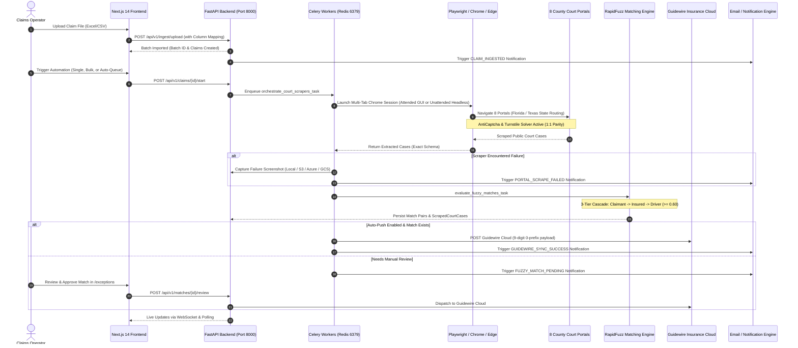

# UAIC Claim & RPA Orchestrator — Master Walkthrough & System Guide (Authoritative)

```text
========================================================================================
Document ID:     WT-2026-0911-MASTER-002
Project:         UAIC Claim & RPA Orchestrator
Module:          End-to-End User Experience, Workflows, APIs, and Architecture
Document Type:   Authoritative Master System Walkthrough & Operational Guide
Version:         v2.0 (Consolidated & Reconciled)
Created Date:    2026-09-11
Last Updated:    2026-09-11
Status:          AI Generated — Awaiting Human Verification
Governing Skill: .agents/skills/diagnose-plan-confirm-execute/SKILL.md
Working Area:    implementation_plan/ (Primary Project Documentation Root)
Source Audit:    Original Prompts (P1-P6) -> Historical Walkthroughs -> Current Codebase
Code Base Truth: Verified against live Next.js 14 App Router, Python 3.14.7 FastAPI & Celery
========================================================================================
```

---

## 1. System Overview & End-to-End Workflow

The **UAIC Claim & RPA Orchestrator** automates court-case discovery, litigation deduplication, and claims integration through a modern, full-viewport web application and Python automation engine:



---

## 2. Walkthrough 1: Local Development & Operations Console

The platform provides an enterprise interactive PowerShell orchestration suite:
- **Root Quick Launcher**: `setup.ps1`
- **Comprehensive Operations Console**: `setup_local.ps1`

### 2.1 Interactive Operations Menu (`Show-EnterpriseMenu`)
Executing `.\setup_local.ps1` opens a persistent console that **never closes automatically**, presenting 10 operational options:

```text
=======================================================================
             UAIC Claim & RPA Orchestrator — Operations Console
=======================================================================
 [1] Start All Services (Interactive Mode Selection)
 [2] Stop / Kill All Running Services & Infrastructure Containers
 [3] Clean Run History, Logs & Scraper Caches
 [4] Install / Update Dependencies (Python venv, Playwright, npm)
 [5] Purge / Delete All Dependency Folders (.venv, node_modules, .next)
 [6] Configure RPA Execution Mode (Attended GUI vs. Unattended Headless)
 [7] Run Full System Diagnostics & Automated Test Suite (270 Tests)
 [8] Docker Stack Deployment (Compose Up / Down / Restart)
 [9] Live Service Status Monitor (Real-time port listener)
 [0] Exit Console
=======================================================================
```

### 2.2 Execution Modes: Attended GUI vs. Unattended Headless (1:1 Parity)
- **Option [1] (Start All Services)** prompts the operator:
  - `[1] Attended Mode (Visible Browser GUI)`: Launches a visible Google Chrome window with AntiCaptcha extension v0.83 loaded. Operators can visually observe navigation, typing, and CAPTCHA resolution. Sets `PLAYWRIGHT_HEADLESS=false`.
  - `[2] Unattended Mode (Background Headless)`: Runs Chromium in headless mode via `--headless=new`, ensuring extension loading, identical DOM extraction, and zero reliance on active desktop sessions. Sets `PLAYWRIGHT_HEADLESS=true`.
- **E2E Parity Verification**: Verified through `scripts/verify_attended_unattended_parity_e2e.py` and `backend/tests/test_attended_unattended_parity.py` with 100% equivalence.
- **Live Status Monitor (Option [9])**: Displays real-time status of all 5 stack components with keyboard shortcuts:
  - `[R]`: Refresh port bindings immediately.
  - `[K]`: Stop all services and terminate Docker containers.
  - `[M]`: Return to the main menu.
  - `[Q]`: Cleanly exit PowerShell.

---

## 3. Walkthrough 2: File Ingestion & 5-Step Column Mapping Wizard (`/upload`)

Located at `/upload`, the ingestion engine handles raw claim files through a full 5-step wizard:

1. **Step 1: Upload**:
   - Drag-and-drop zone accepting `.xlsx`, `.xls`, and `.csv` files.
   - Provides downloadable sample templates (`GET /api/v1/ingest/sample/excel` and `/sample/csv`).
2. **Step 2: Column Mapping**:
   - Auto-detects and fuzzy-matches uploaded column headers against required internal fields (`ClaimNumber`, `PolicyState`, `LossLocationState`, `DateOfLoss`, `InsuredName`, `ClaimantName`, `DriverName`).
   - Displays dropdown selectors with confidence badges allowing operators to override mappings manually.
3. **Step 3: Validation & Preview**:
   - Displays the first 10 rows formatted with internal schema bindings.
   - Converts Excel serial dates (base 1899-12-30) to `MM/dd/yyyy`.
   - Flags validation errors (e.g. invalid state codes, unparseable dates).
   - Provides a direct "Export Invalid Rows as CSV" button to download rejected rows for correction.
4. **Step 4: Import Execution**:
   - Dispatches batch ingestion to FastAPI (`POST /api/v1/ingest/upload`).
   - Records an immutable audit log entry (`BATCH_IMPORTED`) with file metadata.
   - Emits a `CLAIM_INGESTED` notification event.
5. **Step 5: Summary**:
   - Displays total records imported, invalid rows skipped, batch ID chip, and direct buttons to "View Ingested Claims in Dashboard" or "Start Automation Immediately".

---

## 4. Walkthrough 3: Main Dashboard & Claims Operations (`/`)

The primary operations console at `/` provides global claim management:

- **Executive KPI Cards**: Real-time totals for *Total Claims*, *Pending Automation*, *In Progress*, *Needs Review*, *Completed*, and *Failed*.
- **County Bot Throughput Telemetry**: Dynamic throughput cards reporting per-county scraping speed and active tab states.
- **Filter Preset Manager (`<FilterPresetManager />`)**:
  - System Presets: *All Claims*, *Needs Review*, *Failed Portals*, *Florida Claims*, *Texas Claims*.
  - Custom Presets: Operators can filter by state, status, date range, or search keyword and click **Save Current Filter** to store named presets in `localStorage` (`uaic_filter_presets_v1`).
- **Bulk Action Toolbar**:
  - Multi-select claims with checkboxes.
  - Bulk triggers: `Start Automation`, `Retry Failed Portals Only`, `Change Status`, `Export Dataset (Async)`, and `Delete`.
- **Claims Data Table**:
  - Full-width layout with sticky header, responsive column virtualization, and click-to-view navigation (`/claims/[id]`).

---

## 5. Walkthrough 4: Claim Detail & Multi-Portal Orchestration (`/claims/[id]`)

The central operational hub for a single claim at `/claims/[id]`:

### 5.1 Claim Information & Entity Badges
- Header displaying Claim Number (with 9-digit format indicator), Status badge, Date of Loss (`MM/dd/yyyy`), and Policy/Loss State badges.
- Three entity cards: **Insured**, **Claimant**, and **Driver** with DualSearch/TripleSearch derivation indicator.

### 5.2 County Court Scraper Bots Grid
- Visual cards for all 8 county court portals with live status pills (`PENDING`, `IN_PROGRESS`, `COMPLETED`, `FAILED`, `SKIPPED`).
- Scraper latency metrics (elapsed duration in seconds).
- Individual "Run Targeted Bot" buttons allowing operators to trigger a specific county on demand.
- **Retry Failed Portals Only**: Prominent amber action button in the header and card grid that re-executes strictly the failed portals, preserving cases from already-successful portals.

### 5.3 Error Screenshots & Failure Diagnostics Panel
- Captures high-resolution visual context whenever a court portal fails.
- Card grid showing portal name, document title, page URL, timestamp, attempt number, and exception message.
- **Interactive Lightbox Modal**: Full-screen zoom and inspect modal with backdrop dismiss, pan/zoom controls, metadata breakdown, and direct "Retry Portal Bot" trigger.

### 5.4 Scraped Public Court Cases Section
- Displays all scraped litigation records grouped by portal link.
- Displays exact county fields: `CaseNumber`, `CaseStyle`, `FilingDate`, `CaseStatus`, and `CaseType` (strictly excluding `CaseType` for Harris JP and Harris County Clerk).
- Direct clickable links to public county docket pages.

### 5.5 RapidFuzz Match Results Review Panel
- Displays matched cases with partial ratio similarity score badges (e.g. `95% - High Confidence`).
- Highlights matched party cascade (Claimant, Insured, or Driver).
- Side-by-side manual review actions: **Approve Match** or **Reject Match**.

### 5.6 Guidewire Cloud Dispatch Panel
- Live preview of the generated Guidewire JSON payload (verifying 9-digit 0-prefix rule and `ExposureNumber: "001"`).
- Direct "Push to Guidewire Cloud" trigger with live response modal.

### 5.7 Claim Audit Trail & Provenance Timeline
- Chronological vertical timeline embedded at the base of the claim page.
- Lists every lifecycle event (`CLAIM_CREATED`, `AUTOMATION_STARTED`, `FAILED_PORTALS_RETRIED`, `MATCH_REVIEWED`, `GUIDEWIRE_PUSHED`).
- Expandable payload inspector verifying zero credential leakage.

---

## 6. Walkthrough 5: 8-Portal Execution Monitor (`/monitor`)

Located at `/monitor`, the Queue Monitor provides operational transparency into high-volume queue execution:

- **Queue Controls**: Start All, Pause Queue, Auto-Mode Toggle (Celery Beat periodic runner), and Retrigger Failed.
- **8-Portal Execution Matrix**:
  - Each claim row features an expandable drill-down accordion.
  - Expanding a claim reveals an 8-portal matrix: Broward, Hillsborough, Miami, Travis, Dallas, Harris JP, Harris Clerk, Harris District.
  - Displays real-time status pills, scraped case counts, elapsed timing, and individual "Run Bot" triggers per portal.
- **Bulk Failed Portal Retrigger**: Allows operators to re-run only failed portals across all selected queue items simultaneously.

---

## 7. Walkthrough 6: Dynamic Notification & Email Engine (`/notifications`)

Located at `/notifications`, this operational hub manages all automated notification flows, email templates, and event rules:

### 7.1 Notification Delivery History
- Comprehensive delivery log showing Event Type, Recipient, Subject, Delivery Status (`SENT`, `FAILED`, `PENDING`), Delivery Channel (`SMTP`, `MOCK`), and Latency (ms).
- Search, filter by event type, and date range selector.
- Clickable modal to view rendered HTML emails sent to operators or adjusters.

### 7.2 Dynamic HTML Template Manager & Preview
- In-memory and persisted email templates:
  1. `claim_ingested`: Batch and individual claim import receipt.
  2. `portal_scrape_failed`: Immediate alert with county, error code, and screenshot preview link.
  3. `fuzzy_match_pending`: Notification for matches requiring human review at `/exceptions`.
  4. `guidewire_sync_success`: Successful Guidewire Cloud claim file update receipt.
  5. `guidewire_sync_failed`: Urgent alert for Guidewire API failures.
  6. `system_daily_digest`: Daily summary of queue throughput, match rate, and exceptions.
- **Live Preview Tab**: Renders templates in real-time with sample claim variables without sending real emails.

### 7.3 Notification Rules & Routing Matrix
- Configurable rules per event type:
  - Toggle notifications on/off per event.
  - Configure target recipient roles (Admins, Adjusters, Lead Operators).
  - Select delivery dispatch mode: **Real-Time** (immediate) vs. **Batched Digest**.

---

## 8. Walkthrough 7: Fuzzy Match Exceptions Review (`/exceptions`)

Located at `/exceptions`, this dashboard manages borderline or pending match decisions:
- Filters claims flagged with status `NEEDS_REVIEW`.
- Displays party name comparison: Ingested Claimant/Insured/Driver vs. Public Court Case Style.
- Visual confidence slider reflecting the RapidFuzz `partial_ratio` score against the 0.60 threshold.
- One-click **Approve** (marks match verified and enables Guidewire push) or **Reject** (marks match rejected and logs review decision).

---

## 9. Walkthrough 8: RPA & Operational Health Console (`/health`)

Located at `/health`, this operational console provides live infrastructure observability:

- **8 Core Service Component Cards**: FastAPI API Server, PostgreSQL Database, Redis Queue Broker, Celery Worker, Celery Flower, Storage Service, RapidFuzz Engine, and Guidewire Client with live status badges.
- **8 County Court Portal Reachability Pings**: Live ping cards testing HTTP/HTTPS network reachability to all 8 county court websites with latency benchmarks in milliseconds.
- **RPA Browser Automation Health Panel**:
  - Detected Browser Engines: Google Chrome, Microsoft Edge, Playwright Chromium.
  - Executable path resolution.
  - AntiCaptcha Extension Status (`anticaptcha-plugin_v0.83/manifest.json`).
  - Interactive "Test Launch Attended GUI" and "Test Launch Headless" buttons to verify browser launch without running a full scraper.

---

## 10. Walkthrough 9: Enterprise Audit Trail Console (`/audit`)

Located at `/audit`, the Audit Console provides immutable compliance reporting:

- **6 Metric Summary Cards**: Total Audit Events, Today's Operations, Claim Modifications, Settings Updates, Match Reviews, and Failure Logs.
- **Multi-Dimensional Filter Toolbar**: Filter by Action (`CLAIM_CREATED`, `AUTOMATION_STARTED`, `FAILED_PORTALS_RETRIED`, `SETTINGS_UPDATED`, etc.), Entity Type, Status, Claim Number, and Search.
- **Audit Records Table**: Operator ID, client IP address with proxy resolution (`x-forwarded-for`), timestamp, colored action badges, entity chips with direct links to claims, and a "View Payload" inspector button.
- **Zero Credential Leakage Modal**: JSON payload viewer verifying that all sensitive keys (`password`, `token`, `secret`, `api_key`) are recursively masked with `[REDACTED]`.
- **Streaming Export**: Download complete compliance audit logs in CSV or JSON format.

---

## 11. Walkthrough 10: Solution-Wide Brand & Identity Console (`/branding`)

Located at `/branding`, this console manages solution-wide white-labeling:

- **Full-Width Layout**: Expands across 100% of the viewport with top `<Navbar />`.
- **Live Solution-Wide Brand Preview**: Real-time mock card demonstrating how the application title, subtitle, fallback monogram badge, and logo appear on the desktop sidebar and browser tab title.
- **Staged Custom Logo Upload**:
  - Drag-and-drop image upload dropzone.
  - Modifying or uploading a logo updates the preview and sidebar **instantly in memory** via `BrandingContext`.
  - Displays amber staging banner: changes are **not** committed to the database until the operator clicks **Save Configuration** or **Save Now**.
  - Uploaded assets are served via Next.js proxy at `/uploads/filename.png` (HTTP 200 OK).
- **Reset Brand Defaults**: Independent action restoring default UAIC branding (`UAIC Orchestrator` / `RPA & Match Engine` / `/icon.png` / `U`) without affecting robot automation settings.

---

## 12. Walkthrough 11: Automation & Robot Configuration (`/settings`)

Located at `/settings`, dedicated strictly to robot automation, integrations, and email communication across 6 clean tabs:

1. **General & RPA**: Browser execution mode (Attended vs. Headless), browser engine selection (Chrome, Edge, Chromium), user-agent string, AntiCaptcha API key, and CAPTCHA timeout thresholds.
2. **County Scrapers**: Individual toggles, custom portal URLs, request latency delays, and page timeout settings for each of the 8 county courts.
3. **Guidewire Cloud**: API Base URL, Client ID, Client Secret, Auth Method (OAuth2, Bearer Token, API Key, Basic), and live "Test Guidewire Connection" sandbox.
4. **Fuzzy Match Engine**: RapidFuzz threshold slider (default 0.60), minimum filing date picker (default 2010-01-01), and party priority cascade toggles.
5. **Storage & Error Screenshots**: Master failure screenshot toggle, storage provider selection (Local Disk, AWS S3, Azure Blob, Google Cloud Storage), credential inputs, and live "Test Storage Connection" sandbox.
6. **Email & Notifications**: SMTP Host, Port, Username, Password/API Key, Use TLS, From Address, Provider Type (`smtp`, `mock`, `sendgrid`), live "Test Connection" button, and interactive "Send Test Email" sandbox.

---

## 13. Automated Verification & Quality Assurance Baseline

Every feature documented in this walkthrough is validated by automated CI/CD checks:

```text
========================================================================
                      AUTOMATED VERIFICATION BASELINE
========================================================================
 1. Pytest Backend Suite:       270 / 270 PASSED across 27 suites (100%)
 2. Attended / Unattended E2E:  100% PARITY VERIFIED (scripts & pytest)
 3. Ruff Python Linter:         0 ERRORS (app & tests clean)
 4. TypeScript Compiler:        0 ERRORS (npx tsc --noEmit)
 5. Next.js Production Build:   All 12 routes pass build & SSR clean
 6. PowerShell AST Syntax:      0 ERRORS (setup.ps1 & setup_local.ps1)
 7. Git Protection:             Root, Backend, Frontend .gitignore Active
========================================================================
```

---

## 14. Verification & Governance Statement

This **Master Walkthrough** reflects the verified, live functionality of the UAIC Claim & RPA Orchestrator codebase. It serves as the primary operational guide for claims operators, RPA engineers, and future AI development sessions.

```text
Status: AI Generated — Awaiting Human Verification
Next Action: Production Ready — All System Flows Verified
```
