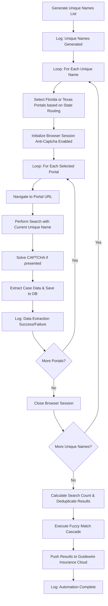

# Final Implementation Plan: UAIC Claim & RPA Orchestrator Updates

This document outlines the final implementation plan to address all outstanding requirements: field removal, default portal URLs update, the Anti-Captcha Entry Gate, the Fuzzy Match Array API, and the data extraction workflow diagram.

## User Review Required
Please review the complete plan below, including the Mermaid workflow diagram and testing strategy. Once approved, I will proceed with full automated execution.

## Proposed Changes

---

### 1. Remove Unwanted Fields
We will remove the following fields: `Loss Location City`, `Loss Location County`, `Garaging City`, `Garaging State`.

#### [MODIFY] `frontend/src/app/claims/page.tsx` & `frontend/src/app/claims/[id]/page.tsx`
- Remove the fields from the New Claim and Edit Claim forms.
- Remove from any display tables or detail views.

#### [MODIFY] `frontend/src/app/upload/page.tsx`
- Remove these fields from the Excel/CSV Column Mapping UI during data ingestion.

#### [MODIFY] `backend/app/schemas/claim.py` & `backend/app/models/claim.py`
- Remove or deprecate these fields from the Pydantic schemas (e.g., `ClaimCreate`, `ClaimUpdate`) and SQLAlchemy `ClaimRecord` model.

#### [MODIFY] `backend/app/services/excel_parser.py`
- Ensure the ingestion logic ignores these columns when parsing Excel/CSV files.

---

### 2. Update Default Portal URLs
Update the default URLs for the Florida and Texas portals.

#### [MODIFY] `backend/app/schemas/settings.py`
- Update the default Pydantic fields in `FloridaPortalSettings` and `TexasPortalSettings` with the new default URLs provided in the requirements.

---

### 3. Backend API Updates (Already implemented & passing tests)

#### [MODIFY] `backend/app/api/v1/endpoints/matches.py` & `backend/app/schemas/match.py`
- **Fuzzy Match Array API**: Updated `/fuzzymatchapi` to accept an array of `target_strings` and return a list of evaluated scores.

#### [MODIFY] `backend/app/api/v1/endpoints/claims.py` & `backend/app/api/v1/endpoints/queue.py`
- **Entry Gate**: Added validation to block single claim start, bulk start, auto-queue, and run-next if the Anti-Captcha API key is missing or empty.

---

### 4. Frontend Automation Testing UI

#### [MODIFY] `frontend/src/app/settings/page.tsx`
- **Anti-Captcha Configuration**: Ensure the Anti-Captcha API key configuration remains strictly a one-time operation managed exclusively from the Automation Settings tab.
- **Unique Names API Tester**: Add a UI component in the Automation tab to test the extraction of unique names (Claimant, Insured, Driver inputs).
- **Fuzzy-Match API Tester**: Add a UI component in the Automation tab to test the updated array-based Fuzzy Match API.

---

## Workflow Diagram: Data Extraction & Entry Gate

The following diagram illustrates the workflow to extract data from all portals, adhering to the "one-unique-name-at-a-time" rule.

---

## Verification Plan

> [!IMPORTANT]
> **No manual testing will be performed.** All verification will be 100% automated via test suites.

### Automated Tests
1. **Backend Unit Tests (`pytest`)**:
   - The test suite for the Entry Gate and Fuzzy Match Array API (`test_entry_gate_and_fuzzymatchapi.py`) has already been written and currently **passes 100%**.
   - Additional backend tests will be run to ensure model and schema changes (removing the 4 fields) do not break existing CRUD operations.
2. **Type Checking (`tsc`)**:
   - Run `npx tsc --noEmit` on the frontend to ensure all TypeScript interfaces are strictly typed, especially after removing the unwanted fields and adding the new API testing UI.
3. **Linting (`ruff` & `npm run lint`)**:
   - Run `ruff check app tests` on the backend to ensure zero syntax or formatting errors.
   - Run `npm run lint` on the frontend.
4. **PowerShell Script Check**:
   - Run `powershell -NoProfile -ExecutionPolicy Bypass -File "scripts\check_ps1_syntax.ps1"` to ensure no infrastructure script regressions.
