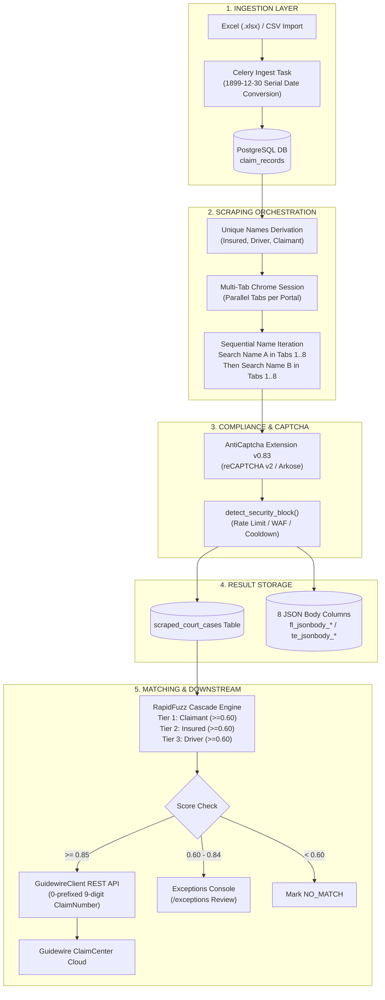
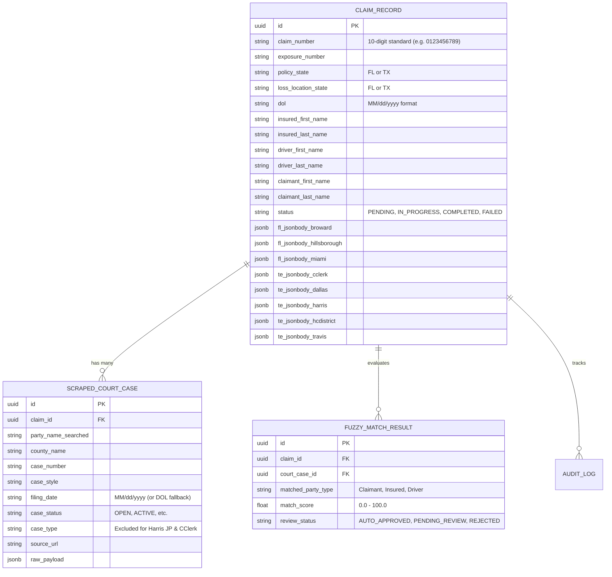

# UAIC Claim & RPA Orchestrator — 8-Bot Architecture, Functional Specification & Execution Guide

**Document ID:** `SPEC-2026-0916-001`  
**Version:** `1.0.0`  
**Date:** `2026-09-16`  
**Status:** `Ready for Human Review & Verification`  
**Related Documents:** [README.md](file:///c:/Users/priyer/.gemini/antigravity-ide/scratch/Bot_UAIC/README.md) | [AGENTS.md](file:///c:/Users/priyer/.gemini/antigravity-ide/scratch/Bot_UAIC/AGENTS.md)

---

## 1. Documentation Index & Governance

All functional specifications, architectural blueprints, entity-relationship diagrams (ERD), and pipeline flows are maintained across three authoritative levels:

| Document | File Path | Scope & Responsibilities |
|---|---|---|
| **Authoritative System Booklet** | [`README.md`](file:///c:/Users/priyer/.gemini/antigravity-ide/scratch/Bot_UAIC/README.md) | Comprehensive system architecture, Celery worker topologies, PostgreSQL schema, full REST API contracts, 8 county portal URL matrices, and operational setup guides. |
| **Business Rules & Governance** | [`AGENTS.md`](file:///c:/Users/priyer/.gemini/antigravity-ide/scratch/Bot_UAIC/AGENTS.md) | Protected system rules: 1899-12-30 DOL base, 9-digit ClaimNumber `'0'` prefix, strict county output schemas (strictly NO `CaseType` on Harris JP & Harris County Clerk), RapidFuzz cascade, and DB keys. |
| **Implementation Plans & Records** | [`implementation_plan/`](file:///c:/Users/priyer/.gemini/antigravity-ide/scratch/Bot_UAIC/implementation_plan/) | Versioned technical design specifications (`_plan_v1.md`), audit logs, and verification reports (`_implementation-record_v1.md`). |

---

## 2. End-to-End System Architecture



---

## 3. Database Schema & Storage Mappings



---

## 4. The 9 Operational Stages Detailed for All 8 County Bots

```
========================================================================================
Stage 1: Launch      -> System Chrome, AntiCaptcha Extension v0.83, pinned toolbar profile
Stage 2: Navigate    -> Parallel tab routing based on Policy & Loss Location State
Stage 3: Data Entry  -> Sequential party name entry + Date of Loss (DOL) filtering
Stage 4: CAPTCHA     -> Non-blocking detection, DOM token verification, rate limit catch
Stage 5: Submit      -> Form event dispatch, predicate polling wait for results grid
Stage 6: Retrieval   -> Dynamic pagination, row parsing, strict County output schema
Stage 7: DB Commit   -> Dual write to scraped_court_cases and fl_/te_jsonbody_*
Stage 8: RapidFuzz   -> 3-Tier cascade: Claimant -> Insured -> Driver (>= 0.60 threshold)
Stage 9: Guidewire   -> REST API push, 9-digit '0' prefix, CaseItems without CaseType
========================================================================================
```

---

### Detailed Portal Breakdown (1 through 8)

#### 1. Broward County Clerk (Florida)
* **Default URL:** `https://www.browardclerk.org/Web2` (Navigates to `Web2/CaseSearchECA/Index/`)
* **Data Entry Locators:**
  * Last Name: `input#lastName` (Biometric typing)
  * First Name: `input#firstName`
  * Date of Loss (DOL): `input#filingDateOnOrAfterP` (Formatted as `MM/dd/yyyy`)
* **CAPTCHA Mechanism:** Google reCAPTCHA v2. Handled via AntiCaptcha extension. Verifies `g-recaptcha-response` DOM token settlement before submitting.
* **Submit Action:** Clicks `#PersonSearchResults` (fallback to `#personSearchForm` submit).
* **Retrieval & Pagination:** Reads `table tbody tr`. Pagination via `.pagination .next a`.
* **Output Schema:** `{ CaseNumber, CaseStyle, FilingDate, CaseStatus, CaseType }`
* **DB Column:** `fl_jsonbody_broward`

#### 2. Hillsborough County Clerk (Florida)
* **Default URL:** `https://hover.hillsclerk.com/html/caseSearch.html` (Navigates to `#nav-Party-tab`)
* **Data Entry Locators:**
  * Last Name: `#spLastName`
  * First Name: `#spFirstName`
  * Date of Loss (DOL): `#spDateFiledAfter` (Injected into DOM and events dispatched: `input`, `change`)
* **CAPTCHA Mechanism:** reCAPTCHA v2 / Bot protection. Checks solver status.
* **Submit Action:** Clicks `#btnSubmitPartySearch`. Waits up to 50s for `#partyResultsTable` or `.dataTables_empty`.
* **Retrieval & Pagination:** Reads `#partyResultsTable tbody tr` (`td:eq(2)` CaseNumber, `td:eq(4)` CaseStyle, `td:eq(5)` CaseStatus, `td:eq(6)` FilingDate, `td:eq(7)` CaseType). Pagination via DataTables `.paginate_button.next`.
* **Output Schema:** `{ CaseNumber, CaseStyle, FilingDate, CaseStatus, CaseType }`
* **DB Column:** `fl_jsonbody_hillsborough`

#### 3. Miami-Dade County Clerk (Florida)
* **Default URL:** `https://onlineservices.miami-dadeclerk.com/civil/`
* **Authentication:** Checks for session login. If logged out, enters user credentials on User Management Portal and returns to OCS search.
* **Data Entry Locators:**
  * Radio Selection: `#rdoPerson` (Person's Name)
  * Last Name: `#txtLastName`
  * First Name: `#txtFirstName`
  * Date of Loss (DOL): `#txtFiledDateFrom` (Formatted as `MM-dd-yyyy`)
* **CAPTCHA Mechanism:** Standard site challenge checks.
* **Submit Action:** Clicks `#btnSearch`. Waits for `#gvSearchResults`.
* **Retrieval & Pagination:** Reads `#gvSearchResults tr` (`td:eq(1)` CaseNumber, `td:eq(2)` CaseStyle, `td:eq(3)` FilingDate, `td:eq(4)` CaseType, `td:eq(5)` CaseStatus).
* **Output Schema:** `{ CaseNumber, CaseStyle, FilingDate, CaseStatus, CaseType }`
* **DB Column:** `fl_jsonbody_miami`

#### 4. Dallas County Courts (Texas)
* **Default URL:** `https://courtsportal.dallascounty.org/DALLASPROD/` (Navigates to `Dashboard/29`)
* **Data Entry Locators:**
  * Search Criteria: `#caseCriteria_SearchCriteria`
  * Query Format: `LastName,FirstName`
  * DOL Usage: **NONE** (Odyssey Smart Search does not support direct DOL filtering)
* **CAPTCHA Mechanism:** Google reCAPTCHA v2 via Anti-Captcha plugin.
* **Submit Action:** Clicks `#btnSSSubmit`. Dynamic predicate polling waits for `.k-grid-content tbody tr` (25 intervals x 400ms).
* **Retrieval & Pagination:** Reads Kendo UI `.k-grid-content tbody tr` (`td:eq(0)` CaseNumber, `td:eq(1)` CaseStyle, `td:eq(2)` FilingDate, `td:eq(3)` CaseStatus, `td:eq(4)` CaseType). Pagination via `.k-pager-wrap a.k-i-arrow-end-right`.
* **Output Schema:** `{ CaseNumber, CaseStyle, FilingDate, CaseStatus, CaseType }`
* **DB Column:** `te_jsonbody_dallas`

#### 5. Travis County Odyssey (Texas)
* **Default URL:** `https://odysseypa.traviscountytx.gov/CourtDirectorySearch/` (Navigates to `Dashboard/29`)
* **Data Entry Locators:**
  * Search Criteria: `#caseCriteria_SearchCriteria`
  * Query Format: `LastName,FirstName`
  * DOL Usage: **NONE** (Odyssey Smart Search skips DOL)
* **CAPTCHA Mechanism:** Google reCAPTCHA v2 via Anti-Captcha plugin.
* **Submit Action:** Clicks `#btnSSSubmit`. Dynamic predicate polling waits for `.k-grid-content tbody tr`.
* **Retrieval & Pagination:** Reads Kendo UI `.k-grid-content tbody tr`. Paginates via Kendo pager links.
* **Output Schema:** `{ CaseNumber, CaseStyle, FilingDate, CaseStatus, CaseType }`
* **DB Column:** `te_jsonbody_travis`

#### 6. Harris County Justice of the Peace (JP) (Texas)
* **Default URL:** `https://jpwebsite.harriscountytx.gov/Public/CivilSearch.aspx`
* **Data Entry Locators:**
  * Search Criteria: `#caseCriteria_SearchCriteria`
  * Query Format: `LastName,FirstName`
  * DOL Usage: **NONE**
* **CAPTCHA Mechanism:** Google reCAPTCHA v2 with 4x8s wait policy matching V4.
* **Submit Action:** Clicks `#btnSSSubmit`. Dynamic predicate polling.
* **Retrieval & Pagination:** Reads Kendo UI grid (`td:eq(0)` CaseNumber, `td:eq(1)` CaseStyle, `td:eq(2)` FilingDate, `td:eq(3)` CaseStatus).
* **CRITICAL STRICT SCHEMA:**
  ```json
  {
    "CaseNumber": "2024-JP-12345",
    "CaseStyle": "DOE, JOHN vs SMITH, JANE",
    "CountyWebsite": "https://jpwebsite.harriscountytx.gov/Public/CivilSearch.aspx",
    "FilingDate": "05/12/2024",
    "CaseStatus": "ACTIVE"
  }
  ```
  *(Note: Strictly **NO CaseType** field is extracted or stored for Harris JP)*
* **DB Column:** `te_jsonbody_harris`

#### 7. Harris County Clerk (Texas)
* **Default URL:** `https://www.cclerk.hctx.net/applications/websearch/courtsearch.aspx?CaseType=Civil`
* **Data Entry Locators:**
  * Last Name: `#ctl00_ContentPlaceHolder1_txtLastName`
  * First Name: `#ctl00_ContentPlaceHolder1_txtFirstName`
  * Date of Loss (DOL): `#ctl00_ContentPlaceHolder1_txtDateFrom` (`MM/dd/yyyy`)
* **CAPTCHA Mechanism:** Cloudflare / challenge handling.
* **Submit Action:** Clicks `#ctl00_ContentPlaceHolder1_btnSearch`.
* **Retrieval & Pagination:** Reads WebSearch grid (`td:eq(0)` CaseNumber, `td:eq(1)` CaseStatus, `td:eq(2)` FilingDate, `td:eq(5)` CaseStyle).
* **CRITICAL STRICT SCHEMA:**
  ```json
  {
    "CaseNumber": "1234567",
    "CaseStyle": "DOE, JOHN vs SMITH, JANE",
    "CountyWebsite": "https://www.cclerk.hctx.net/applications/websearch/courtsearch.aspx?CaseType=Civil",
    "FilingDate": "03/18/2023",
    "CaseStatus": "FILED"
  }
  ```
  *(Note: Strictly **NO CaseType** field is extracted or stored for Harris County Clerk)*
* **DB Column:** `te_jsonbody_cclerk`

#### 8. Harris County District Clerk (Texas)
* **Default URL:** `https://www.hcdistrictclerk.com/edocs/public/CaseDetails.aspx` (Navigates to `Search.aspx`)
* **Data Entry Locators:**
  * Party Name: `#txtPartyName` (Formatted as `LastName, FirstName`)
  * Date of Loss (DOL): `input[id*='txtFiledDateFrom']` (`MM/dd/yyyy`)
* **CAPTCHA Mechanism:** Standard challenge check.
* **Submit Action:** Clicks `input[id*='btnPartySearch']`.
* **Retrieval & Pagination:** Reads `table[id*='dgSearchResults'] tr` (`td:eq(0)` CaseNumber, `td:eq(1)` CaseStyle, `td:eq(5)` FilingDate, `td:eq(6)` CaseType, CaseStatus defaults to `"ACTIVE"`).
* **Output Schema:** `{ CaseNumber, CaseStyle, FilingDate, CaseStatus, CaseType }`
* **DB Column:** `te_jsonbody_hcdistrict`

---

## 5. RapidFuzz 3-Tier Cascade & Guidewire Contract

### The 3-Tier Cascade Algorithm
1. **Pre-Filter:** Filing date must be `>= 2010-01-01` (Settings configurable).
2. **Noise Normalization:** Strips corporate suffixes (`LLC`, `INC`, `CORP`, `ET AL`, `A/A/O`, `D/B/A`).
3. **Cascade Sequence:**
   * **Tier 1:** Compare `Claimant Full Name` with `CaseStyle` using `fuzz.token_set_ratio` & `fuzz.partial_ratio`.
   * **Tier 2:** If Tier 1 < 0.60, compare `Insured Full Name` with `CaseStyle`.
   * **Tier 3:** If Tier 2 < 0.60, compare `Driver Full Name` with `CaseStyle`.
4. **Classification:**
   * **Score >= 0.85:** `AUTO_APPROVED` / `MATCH_FOUND` -> Dispatches Guidewire payload.
   * **0.60 <= Score < 0.85:** `PENDING_REVIEW` -> Forwarded to `/exceptions` review console.
   * **Score < 0.60:** `NO_MATCH`.

### Guidewire ClaimCenter Payload Contract
* **Rule 1:** 9-digit ClaimNumber automatically gets `'0'` prefix (e.g., `123456789` -> `0123456789`).
* **Rule 2:** `CaseItems` strictly excludes `CaseType`.
* **Rule 3:** If `FilingDate` is blank in scraped data, it falls back to `claim.dol`.

```json
{
  "ClaimNumber": "0123456789",
  "ExposureNumber": "1",
  "SourceSystem": "UAIC_ORCHESTRATOR",
  "TransactionId": "550e8400-e29b-41d4-a716-446655440000",
  "CaseItems": [
    {
      "CaseNumber": "2024-CA-009876",
      "CaseStyle": "JOHN DOE vs JANE SMITH",
      "CountyWebsite": "https://www.browardclerk.org/Web2",
      "SuitFiledDate": "04/15/2024"
    }
  ]
}
```

---

## 6. Error Capturing & Non-Blocking Security Policy
* The system never attempts to spoof or defeat CAPTCHA challenges.
* If a portal returns an IP/MAC block (HTTP 429, Cloudflare 403 / Ray ID WAF):
  1. Instantly captures full-page screenshot to `backend/screenshots/{claim_id}/{portal}/`.
  2. Appends event to `backend/logs/{claim_id}/{portal}/execution.log` and `backend/logs/security_blocks.log`.
  3. Sets portal cooldown based on `Retry-After` header or exponential backoff (default 300s).
  4. Continues without halting execution for the remaining county tabs.
