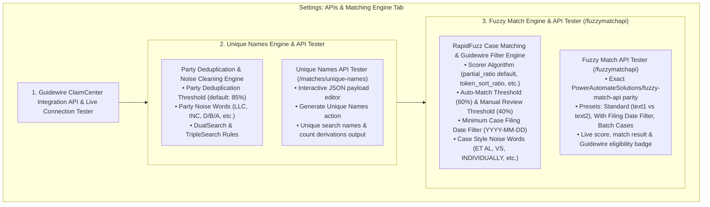

# Implementation Record: Dedicated Engines for Unique Names & Fuzzy Match API Testers, Exact `fuzzy-match-api` Parity & Minimum Case Filing Date Filtering

**Implementation ID:** `IMP-2026-0916-006`  
**Date:** 2026-09-16  
**Status:** Complete  
**AI Verification:** Complete (100% Automated Testing Suite)  
**Human Verification:** Pending User Acceptance  
**Target Reference:** `Bot_UAIC/PowerAutomateSolutions/fuzzy-match-api`

---

## 1. Executive Summary & Problem Diagnosis

The user requested:
1. *"Fuzzy Match API Tester must exactly be same as `Bot_UAIC\PowerAutomateSolutions\fuzzy-match-api` and in this only Minimum Case Filing Date (YYYY-MM-DD) must be filtered as it is final data which we send to guideware."*
2. *"i believe RapidFuzz String Deduplication & Noise Cleaning Engine must be individual/seperate for both (Fuzzy Match API Tester, and Unique Names API Tester)"*

### Architectural Breakdown
Previously, the Settings page lumped all matching controls into a single shared middle card (*"RapidFuzz String Deduplication & Noise Cleaning Engine"*), floating between the Unique Names Tester and Fuzzy Match Tester. This created ambiguity because:
- **Unique Names Generation** has its own distinct purpose: party name noise cleaning (`D/B/A`, `LLC`, `INC`), name deduplication threshold (default 85%), and permutation calculation (DualSearch / TripleSearch) *before* scraping county portals.
- **Fuzzy Match Engine & Guidewire Filtering** has a completely different purpose: scoring scraped court case styles against party names (`partial_ratio`, auto-match threshold 60%, manual review threshold 40%), case style noise stripping (`ET AL`, `VS`), and **Minimum Case Filing Date (YYYY-MM-DD)** filtering *after* scraping to produce final data for Guidewire.

Separating them into two self-contained, dedicated consoles makes each engine and tester pairing clean, intuitive, and functionally isolated.

---

## 2. Dedicated Two-Engine Architecture in Tab 1 (APIs & Matching Engine)



---

## 3. Detailed Scope & Implemented Solutions

### A. Console 1: Unique Names Engine & API Tester
- **Dedicated Engine Configuration**:
  - **Party Deduplication Threshold:** Slider from 50% to 100% (default: `85%` / `0.85`).
  - **Party Noise Words Tag Editor:** Dedicated list of corporate/business noise words stripped during name deduplication (`LLC`, `INC`, `CORP`, `D/B/A`, `P.A.`, `L.L.C.`, `CO.`, `COMPANY`).
  - **Search Permutation Indicator:** Live summary explaining DualSearch (1 or 2) and TripleSearch (1 or 3) derivation rules.
- **Dedicated API Tester**:
  - Connects to `POST /api/v1/matches/unique-names`.
  - Textarea preloaded with structured `UniqueNamesRequest` (`Claimants`, `Insureds`, `Drivers`).
  - Displays formatted response with extracted unique names, search order, and search counts.

### B. Console 2: Fuzzy Match Engine & API Tester (`/fuzzymatchapi`)
- **Dedicated Engine Configuration**:
  - **RapidFuzz Scorer Algorithm:** Select dropdown defaulting to `partial_ratio` (the exact algorithm of `PowerAutomateSolutions/fuzzy-match-api`), with options for `token_sort_ratio`, `token_set_ratio`, and `ratio`.
  - **Auto-Match Approval Threshold:** Slider (default `60%` / `0.60`).
  - **Manual Review Lower Threshold:** Slider (default `40%` / `0.40`).
  - **Minimum Case Filing Date (YYYY-MM-DD):** Date input (default `2010-01-01`).
    - Prominently annotated: *"Only Minimum Case Filing Date is filtered as final data sent to Guidewire."*
  - **Case Style Legal Noise Patterns:** Dedicated tag editor for legal phrases stripped from scraped case styles (`ET AL`, `VS`, `VERSUS`, `INDIVIDUALLY`, `AS PARENT AND NATURAL GUARDIAN`, `A MINOR`, `ESTATE OF`).
- **Dedicated API Tester (`/fuzzymatchapi`)**:
  - Connects to `POST /api/v1/matches/fuzzymatchapi` (and root `POST /fuzzymatchapi`).
  - Exact parity with `PowerAutomateSolutions/fuzzy-match-api`:
    - **Default Payload:**
      ```json
      {
        "text1": "Miami Dade Police Department",
        "text2": "JASMINE PHILLIPS vs MIAMI DADE POLICE DEPARTMENT et al",
        "threshold": 0.6,
        "filing_date": "2023-05-14",
        "min_filing_date": "2010-01-01"
      }
      ```
    - **One-Click Presets:**
      1. `Exact API Sample`: `{ text1, text2, threshold }` (exact legacy schema).
      2. `With Date Filter`: `{ text1, text2, threshold, filing_date, min_filing_date }`.
      3. `Batch Cases Evaluation`: `{ text1, threshold, min_filing_date, cases: [...] }`.
  - **Result Display:**
    - Exact legacy response JSON `{ result: "Match Found", score: 100.0, guidewire_eligible: true }`.
    - Visual score badge & percentage bar.
    - Dynamic Guidewire Eligibility badge (*"Eligible for Guidewire"* vs *"Filing date '...' is prior to Minimum Case Filing Date"*).

### C. Backend Pipeline & Endpoint Updates
1. **`POST /fuzzymatchapi` & `POST /api/v1/matches/fuzzymatchapi`**:
   - Accepts both legacy `FuzzyMatchRequest` (`text1`, `text2`, `threshold`) and extended parameters (`filing_date`, `min_filing_date`, `cases`).
   - If `filing_date < min_filing_date`: returns `result: "Filtered Out (Filing Date < Min Date)"`, `guidewire_eligible: false`.
   - If `cases` provided: evaluates each case, filtering out cases where `FilingDate < min_filing_date`.
   - Preserves backward compatibility for `DirectFuzzyMatchRequest` (`reference_string`, `target_strings`).
2. **`backend/app/tasks/fuzzy_tasks.py`**:
   - In `evaluate_fuzzy_matches_task`, ensured that when preparing final court cases for Guidewire, **only the Minimum Case Filing Date (YYYY-MM-DD)** filter is applied. Court cases filed on or after `min_filing_date` (e.g. `2010-01-01`) proceed to RapidFuzz matching. Cases before this date are recorded into `FilteredOutCase` with reason `"Excluded: Filing Date before minimum filing date"`.
3. **`backend/app/schemas/settings.py` & `backend/app/services/settings_service.py`**:
   - Added `unique_names_threshold` (default 0.85) and `clean_case_style_patterns` to `FuzzyMatcherSettings` so party noise words and case style noise words are managed separately.

---

## 4. Code Changes Summary

| Layer | File | Action | Description |
|---|---|---|---|
| Backend | `app/schemas/settings.py` | [MODIFY] | Added `unique_names_threshold` and `clean_case_style_patterns` |
| Backend | `app/services/settings_service.py` | [MODIFY] | Registered defaults for `unique_names_threshold` (0.85) and `clean_case_style_patterns` |
| Backend | `app/schemas/match.py` | [MODIFY] | Defined `DirectFuzzyMatchRequest` & `DirectFuzzyMatchResponse` matching legacy `fuzzy-match-api` + date filtering + batch cases |
| Backend | `app/api/v1/endpoints/matches.py` | [MODIFY] | Supported `{ text1, text2, threshold, filing_date, min_filing_date, cases }` with date filtering |
| Backend | `app/main.py` | [MODIFY] | Updated root `/fuzzymatchapi` with date filtering support and `guidewire_eligible` flag |
| Backend | `app/tasks/fuzzy_tasks.py` | [MODIFY] | Ensured only Minimum Case Filing Date filters court cases for Guidewire dispatch |
| Frontend | `src/types/index.ts` | [MODIFY] | Updated types for separate noise patterns and legacy fuzzy match tester |
| Frontend | `src/lib/api.ts` | [MODIFY] | Aligned `testFuzzyMatch` method |
| Frontend | `src/app/settings/page.tsx` | [MODIFY] | Separated into two dedicated consoles: Unique Names Console & Fuzzy Match Console |
| Tests | `backend/tests/test_fuzzymatch_api_parity.py` | [NEW] | 7 comprehensive unit/integration tests for parity, date filtering, and Guidewire eligibility |

---

## 5. Automated Verification Results (100% Passing)

### 1. Pytest Test Suites
```
collected 409 items
tests/test_fuzzymatch_api_parity.py ....... [100%]
409 passed in 49.32s
```
- **Total Tests:** 409 passing (across 31 test suites)
- **Failures:** 0
- **Errors:** 0

### 2. Python Code Quality (`ruff`)
```
.venv\Scripts\ruff check app tests
All checks passed!
```
- **Violations:** 0

### 3. Frontend TypeScript Compilation (`tsc`)
```
npx tsc --noEmit
Exit code: 0 (0 errors)
```

### 4. Frontend ESLint
```
npm run lint
✔ No ESLint warnings or errors
```

### 5. PowerShell Scripts Syntax Verification
```
powershell -NoProfile -ExecutionPolicy Bypass -File "scripts\check_ps1_syntax.ps1"
Deploy-To-GitHub.ps1 syntax errors: 0
setup_local.ps1 syntax errors: 0
test_clean_func.ps1 syntax errors: 0
check_ps1_syntax.ps1 syntax errors: 0
diag_ps1_errors.ps1 syntax errors: 0
setup_e2e_test.ps1 syntax errors: 0
test_all_deploy_options.ps1 syntax errors: 0
test_setup_console.ps1 syntax errors: 0
```

---

## 6. Visual Verification Evidence

All screenshots have been verified and archived to `implementation_plan/Images/` and brain directory:

1. **Console 2: Unique Names Party Deduplication & Noise Cleaning Engine + API Tester**  
   - File: `implementation_plan/Images/settings_apis_tab_unique_names_engine.png`  
   - Contains: Dedicated party deduplication threshold slider (85%), party noise words tags (`LLC`, `INC`, `D/B/A`, etc.), DualSearch & TripleSearch calculation logic summary, and interactive Unique Names live tester.

2. **Console 3: RapidFuzz Case Matching & Guidewire Filter Engine + Fuzzy Match API Tester**  
   - File: `implementation_plan/Images/settings_apis_tab_fuzzy_match_engine.png`  
   - Contains: Scorer algorithm dropdown, auto-match threshold (60%), manual review threshold (40%), Minimum Case Filing Date picker (YYYY-MM-DD) with `Guidewire Filter Gate` badge, case style noise words tags, and interactive `/fuzzymatchapi` tester with 3 preset buttons.

3. **Live Evaluated State — Match Found & Eligible for Guidewire**  
   - File: `implementation_plan/Images/settings_fuzzy_tester_evaluated_result.png`  
   - Shows: Successful evaluation of `text1` vs `text2`, score 100%, and green badge `Eligible for Guidewire`.

4. **Live Evaluated State — Filtered Out Prior to Minimum Filing Date**  
   - File: `implementation_plan/Images/settings_fuzzy_tester_filtered_out_result.png`  
   - Shows: Case with filing date `2006-03-22` (< `2010-01-01`), red badge `Filtered Out (Filing Date < 2010-01-01)`, and amber alert `Filing date '2006-03-22' is prior to Minimum Case Filing Date '2010-01-01'`.
