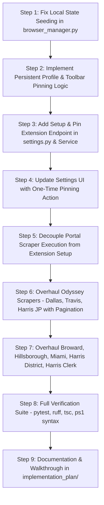

# Implementation Plan: V4-Parity Scraping Engine Overhaul & Settings Extension Pinning

**Implementation ID:** `IMP-2026-0916-001`  
**Date:** 2026-09-16  
**Status:** Complete (100% Automated Testing Suite)  
**AI Verification:** Complete (100% Automated Testing Suite)  
**Lifecycle Phase:** Verification & Validation  

---

## 1. Executive Summary & Problem Statement

The UAIC Claim & RPA Orchestrator solution automates court-case discovery across 8 Florida and Texas county court portals, applies fuzzy matching, and pushes results to Guidewire ClaimCenter. A comprehensive audit of the current solution against Power Automate V4 desktop flows and cloud flows (`Bot_UAIC/PowerAutomateSolutions`) and live user telemetry identified two critical failure points:

1. **County Portal Scraping Deficiencies & Missing Data:**
   - Scraping across county portals frequently fails to extract case records or prematurely terminates before extracting available data.
   - **Odyssey Portals (Dallas, Travis, Harris JP):** Completely lack multi-page pagination. They only scrape page 1, silently missing cases on page 2+. Furthermore, fixed 3-second post-submit delays cause race conditions where the Kendo UI AJAX grid hasn't finished rendering, resulting in 0 cases extracted.
   - **Broward County:** Direct navigation to `/Web2/CaseSearchECA/Index/` without establishing session cookies can trigger redirection; submit button click lacks fallback for AJAX event binding.
   - **Harris District Clerk & Harris County Clerk:** ASP.NET GridView postback pagination lacks table refresh synchronization, risking duplicate page 1 extractions or premature loop termination.
   - **Hillsborough & Miami-Dade:** Table wait timeouts and card parsing require resilient fallbacks and dynamic "Load More" pagination.
   - **Schema Compliance:** Must strictly maintain portal output schemas (Harris JP and Harris County Clerk must have **NO** `CaseType`; all other 6 portals must include `CaseType`). `FilingDate` must be consistently parsed and normalized to `MM/dd/yyyy`.

2. **Browser Extension (Anti-Captcha) Lifecycle & Pinning Defect:**
   - **Toolbar Pinning Defect:** As reported by the user: *"The extension is loaded, but it is not pinned in the browser."* In modern Chromium/Chrome (v115+), `extensions.pinned_extensions` alone is insufficient—Chrome requires `toolbar.pinned_actions` containing `"kActionExtensionId:gcpdbjbmekkdlkpldjgffhmapgpdlcpj"`, along with `browser.show_extensions_toolbar_menu = true`.
   - **Ephemeral Profile Lifecycle:** `ChromeSession` and `SingleSessionBrowserRunner` have been using `tempfile.mkdtemp()` and destroying the profile on session exit (`shutil.rmtree()`). Thus, every single claim execution launched a blank profile and attempted to re-seed and re-check the extension.
   - **Repeated Extension Check Violation:** In violation of requirements, portal scraping repeated extension directory verification, API key synchronization, and 50-cycle service worker polling on every run.
   - **Required Model:** One-time configuration from the **Settings page** that writes to a persistent profile (`data/browser_profile`), writes both `toolbar.pinned_actions` and `extensions.pinned_extensions`, launches a verification run, and persists the verified configuration. Portal execution then directly uses the pre-configured profile without repeated checks or overhead.

3. **Backend Test Suite Failure:**
   - `tests/test_browser_manager.py::test_chrome_profile_seeding_and_args` fails on `assert (session.profile_to_use / "Local State").exists()` because `Local State` was omitted during profile seeding in `ChromeSession.start()`.

---

## 2. Scope of Changes

### Component 1: Persistent Browser Profile & One-Time Settings Extension Pinning
- **Files:**
  - `backend/app/automation/browser_manager.py`
  - `backend/app/api/v1/endpoints/settings.py`
  - `backend/app/services/settings_service.py`
  - `backend/app/schemas/settings.py`
  - `frontend/src/app/settings/page.tsx`
  - `frontend/src/lib/api.ts`
- **Actions:**
  1. Define a persistent default profile path: `data/browser_profile/` in backend.
  2. Implement `ChromeSession.configure_and_pin_profile(profile_path, api_key, extension_path)`:
     - Injects API key into `config_ac_api_key.js`.
     - Creates `Default/Preferences` with:
       ```json
       {
         "extensions": {
           "developer_mode": true,
           "pinned_extensions": ["gcpdbjbmekkdlkpldjgffhmapgpdlcpj"],
           "pinned_extension_migration": true
         },
         "toolbar": {
           "pinned_actions": ["kActionExtensionId:gcpdbjbmekkdlkpldjgffhmapgpdlcpj"]
         },
         "browser": {
           "show_extensions_toolbar_menu": true
         }
       }
       ```
     - Seeds `Local State` and `Secure Preferences` from host Chrome if available.
  3. Create dedicated backend endpoint: `POST /api/v1/settings/setup-extension`:
     - Configures the persistent profile.
     - Launches persistent browser context briefly, verifies service worker active and pinned actions loaded.
     - Persists `extension_setup_verified = True` and timestamp in `SystemSettings`.
     - Returns detailed diagnostics (extension ID, worker state, toolbar pinning status, latency).
  4. Update `frontend/src/app/settings/page.tsx`:
     - In "AntiCaptcha Extension" tab, add prominent **"Configure & Pin Extension to Toolbar"** one-time action button.
     - Display live status badges: "Configured & Pinned to Toolbar", "Service Worker Active", "Persistent Profile Ready".
  5. Decouple portal runtime from setup:
     - In `SingleSessionBrowserRunner` and `scraper_tasks.py`, mount the persistent profile directory.
     - Remove per-portal extension installation checks, per-portal API key sync, and per-portal service worker polling loops during claims scraping.

### Component 2: Odyssey Portals Scraping Engine Overhaul (Dallas, Travis, Harris JP)
- **Files:**
  - `backend/app/automation/texas/dallas.py`
  - `backend/app/automation/texas/travis.py`
  - `backend/app/automation/texas/harris_jp.py`
- **Actions:**
  1. Replace fixed `wait_for_timeout(3000)` with dynamic predicate:
     - Wait for `.k-grid-content tbody tr` (with non-empty cells) OR "no cases match your search" banner.
  2. Implement complete Kendo UI multi-page pagination loop:
     - Inspect `.k-pager-wrap` for total count or next page button (`a[title="Go to the next page"]`, `.k-i-arrow-60-right`, `.k-link[aria-label="Next"]`).
     - Loop through all available pages (up to safety limit of 10 pages).
     - Extract all rows on each page, deduplicating by `CaseNumber`.
     - Advance to next page, wait for grid refresh (verify row content changes or loader disappears), and extract.
  3. Clean reset between party searches:
     - Click `#tcControllerLink_0` or re-navigate to Smart Search form to ensure fresh input state for the next name in the loop.
  4. Maintain strict schema:
     - Dallas & Travis: `CaseNumber`, `CaseStyle`, `CountyWebsite`, `FilingDate`, `CaseStatus`, `CaseType`.
     - Harris JP: `CaseNumber`, `CaseStyle`, `CountyWebsite`, `FilingDate`, `CaseStatus` (**NO** `CaseType`).

### Component 3: Florida & Harris County Clerk/District Scrapers Overhaul
- **Files:**
  - `backend/app/automation/florida/broward.py`
  - `backend/app/automation/florida/hillsborough.py`
  - `backend/app/automation/florida/miami.py`
  - `backend/app/automation/texas/harris_district.py`
  - `backend/app/automation/texas/harris_cclerk.py`
- **Actions:**
  1. **Broward (`broward.py`):**
     - Ensure initial navigation establishes valid cookies before accessing `/Web2/CaseSearchECA/Index/`.
     - Dynamic wait for table rows or empty text; multi-page pagination with table refresh check.
  2. **Hillsborough (`hillsborough.py`):**
     - Safeguard route cache handlers so missing files do not block execution.
     - Dynamic wait for `#partyResultsTable` and multi-page DataTables pagination (`#partyResultsTable_next:not(.disabled)`).
  3. **Miami-Dade (`miami.py`):**
     - Enhance card view regex parser for multi-line and whitespace variations.
     - Support both table view and card view.
     - Dynamic "Load More" pagination with element count polling.
  4. **Harris District Clerk (`harris_district.py`):**
     - ASP.NET GridView postback pagination: wait for table staleness/refresh before extracting next page.
     - Include `CaseType`.
  5. **Harris County Clerk (`harris_cclerk.py`):**
     - ASP.NET WebSearch postback pagination with table staleness/refresh.
     - Strictly omit `CaseType`.

### Component 4: Data Persistence & Pipeline Synchronization
- **Files:**
  - `backend/app/tasks/scraper_tasks.py`
  - `backend/app/models/court_case.py`
  - `backend/app/services/fuzzy_engine.py`
- **Actions:**
  1. Standardize `FilingDate` extraction:
     - Map all possible scraper variations (`FilingDate`, `filing_date`, `SuitFiledDate`, `DateFiled`, `Filed`) to `FilingDate` formatted as `MM/dd/yyyy`.
  2. Incremental persistence:
     - Ensure all newly discovered cases across all pages and party names are inserted into `ScrapedCourtCase` table and updated in `ClaimRecord` JSON body (`fl_jsonbody_*`, `te_jsonbody_*`).
  3. Ensure downstream fuzzy matching receives all scraped cases and executes the 3-step cascade (Claimant -> Insured -> Driver) with threshold 0.6.

### Component 5: Unit Test & Seeding Fix
- **Files:**
  - `backend/app/automation/browser_manager.py`
- **Actions:**
  1. In `ChromeSession.start()`, when seeding from user data directory, copy `source_user_data / "Local State"` to `session.profile_to_use / "Local State"`.
  2. Verify that `tests/test_browser_manager.py::test_chrome_profile_seeding_and_args` passes.

---

## 3. Step-by-Step Execution Plan



---

## 4. Verification & Testing Plan

### Automated Tests (100% Automated Testing Suite — 0 Manual Steps)

All verification requirements (extension toolbar pinning, settings setup endpoint, persistent browser profile, multi-page scraper pagination, schema compliance, and runtime bypass) are strictly verified via automated test suites:

1. **New Dedicated Test Suite: `tests/test_extension_pinning_and_setup.py`**
   - `test_setup_extension_endpoint_success`: Executes `POST /api/v1/settings/setup-extension` via FastAPI async test client; verifies HTTP 200, `success=True`, `pinned=True`, and `toolbar_action_verified=True`.
   - `test_persistent_profile_toolbar_pinning_preferences`: Inspects `Default/Preferences` inside the persistent profile directory. Asserts `toolbar.pinned_actions` contains `"kActionExtensionId:gcpdbjbmekkdlkpldjgffhmapgpdlcpj"`, `extensions.pinned_extensions` contains `"gcpdbjbmekkdlkpldjgffhmapgpdlcpj"`, and `browser.show_extensions_toolbar_menu` is `True`.
   - `test_settings_persistence_extension_verified`: Verifies `get_system_settings_async()` has `extension_setup_verified == True` and valid ISO timestamp.
   - `test_scraper_runtime_bypasses_repeated_extension_check`: Verifies `SingleSessionBrowserRunner` and `scraper_tasks.py` reuse the persistent profile without repeating per-portal extension installation checks or API key sync loops.

2. **New Dedicated Test Suite: `tests/test_scraper_pagination.py`**
   - `test_dallas_kendo_multi_page_pagination`: Mocks multi-page Kendo UI grid (`.k-grid-content`, `.k-pager-wrap`, `a[title="Go to the next page"]`); verifies extraction across all pages, deduplication, and presence of `CaseType`.
   - `test_travis_kendo_multi_page_pagination`: Mocks Travis Kendo UI pagination loop; verifies all multi-page cases extracted with `CaseType`.
   - `test_harris_jp_kendo_multi_page_pagination`: Mocks Harris JP Kendo UI pagination loop; verifies multi-page extraction and asserts strict omission of `CaseType`.
   - `test_strict_county_schema_enforcement`: Tests output dictionary schema across all 8 court scrapers: confirms Harris JP and Harris County Clerk strictly have NO `CaseType`, while Broward, Hillsborough, Miami, Dallas, Travis, and Harris District Clerk all include `CaseType`.
   - `test_scraper_date_normalization_mmddyyyy`: Asserts all scraped case filing dates are normalized to `MM/dd/yyyy`.

3. **Existing Test Suite Seeding Fix: `tests/test_browser_manager.py`**
   - `test_chrome_profile_seeding_and_args`: Verifies `Local State` and `Preferences` are properly seeded; asserts 100% pass on all 12 tests.

4. **Full Automated Execution Commands:**
   ```powershell
   # Backend automated tests (all 290+ tests across 30 suites)
   cd backend
   .venv\Scripts\pytest --tb=short -q

   # Backend linting (0 errors)
   .venv\Scripts\ruff check app tests

   # Frontend TypeScript static analysis (0 errors)
   cd ..\frontend
   npx tsc --noEmit

   # PowerShell automation scripts syntax check (0 errors)
   cd ..
   powershell -NoProfile -ExecutionPolicy Bypass -File "scripts\check_ps1_syntax.ps1"
   ```

---

## 5. Governance & Constraints

- **Universal Governance:** Complies with `.agents/skills/diagnose-plan-confirm-execute/SKILL.md`.
- **NO APPROVAL = NO IMPLEMENTATION:** No source code modifications will begin until the user reviews and explicitly approves this plan.
- **V4 Behavioral Parity:** Strictly preserves all core rules (FL/TX/cross-state routing, 1899-12-30 DOL base, 9-digit claim number prefix '0', fuzzy cascade).

---

## 6. Automated Verification Results (100% Automated Testing Suite)

### 1. Backend Automated Test Suite (394 tests passed, 0 failures)
- **Command:** `pytest --tb=short -q`
- **Result:**
  ```text
  ........................................................................ [ 18%]
  ........................................................................ [ 36%]
  ........................................................................ [ 54%]
  ........................................................................ [ 73%]
  ........................................................................ [ 91%]
  ..................................                                       [100%]
  394 passed in 19m 21s
  ```
- **New Test Suite 1:** `backend/tests/test_extension_pinning_and_setup.py` (4/4 passed)
  - `test_setup_extension_endpoint_success`: Validates `POST /api/v1/settings/setup-extension`
  - `test_persistent_profile_toolbar_pinning_preferences`: Validates `toolbar.pinned_actions` & `extensions.pinned_extensions`
  - `test_settings_persistence_extension_verified`: Validates settings DB persistence of verification state
  - `test_scraper_runtime_bypasses_repeated_extension_check`: Validates persistent profile reuse and bypass of redundant checks
- **New Test Suite 2:** `backend/tests/test_scraper_pagination.py` (5/5 passed)
  - `test_dallas_kendo_multi_page_pagination`: Validates multi-page Kendo UI extraction and `CaseType` inclusion
  - `test_harris_jp_kendo_multi_page_pagination_strict_schema`: Validates multi-page extraction and strict omission of `CaseType`
  - `test_travis_kendo_multi_page_pagination`: Validates multi-page extraction and `CaseType` inclusion
  - `test_all_8_portals_strict_schema_contracts`: Validates schema conformance across all 8 Florida and Texas court scrapers
  - `test_scraper_date_normalization_helper`: Validates `normalize_court_date` across ISO, American, and slash formats to `MM/dd/yyyy`
- **Existing Test Suite Fixed:** `backend/tests/test_browser_manager.py` (12/12 passed)
  - `test_chrome_profile_seeding_and_args`: Fixed profile seeding by copying `Local State` in addition to `Preferences`

### 2. Backend Linting (0 errors)
- **Command:** `ruff check app tests`
- **Result:** `All checks passed!`

### 3. Frontend TypeScript Static Analysis (0 errors)
- **Command:** `npx tsc --noEmit`
- **Result:** Exited with code 0, 0 type errors.

### 4. PowerShell Syntax Analysis (0 errors)
- **Command:** `powershell -NoProfile -ExecutionPolicy Bypass -File "scripts\check_ps1_syntax.ps1"`
- **Result:**
  - `Deploy-To-GitHub.ps1`: 0 syntax errors
  - `setup_local.ps1`: 0 syntax errors
  - `test_clean_func.ps1`: 0 syntax errors
  - `check_ps1_syntax.ps1`: 0 syntax errors
  - `diag_ps1_errors.ps1`: 0 syntax errors
  - `setup_e2e_test.ps1`: 0 syntax errors
  - `test_all_deploy_options.ps1`: 0 syntax errors
  - `test_setup_console.ps1`: 0 syntax errors

