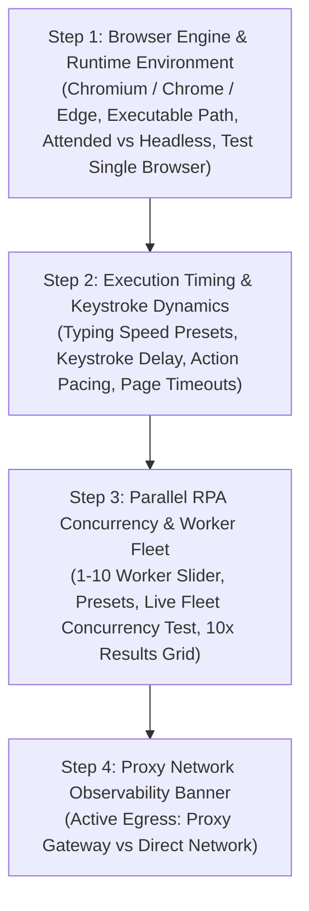

# Implementation Plan: Browser Fleet Concurrency Scaling, Logical Tab Reordering, Celery Worker Architecture & Universal Engine Execution with Proxy Integration

**Implementation ID:** `IMP-2026-0918-006`  
**Target:** 100% Reliable Multi-Engine Fleet Execution (Chrome / Chromium / Edge), Celery Worker Concurrency Alignment, Logical Tab 3 Reordering, Staggered Launch & Complete Proxy Architecture Integration  
**Status:** Complete  
**AI Verification:** Complete (100% Automated Testing Suite)  
**Date:** 2026-09-18  

---

## 1. Problem Statement & User Feedback Alignment

### User Requirements & Directives:
1. **Universal Fleet Execution Across All Engines:**  
   Whatever browser engine is selected (**Google Chrome**, **Chromium**, or **Microsoft Edge**), the orchestrator **must reliably process all requested fleet workers** (e.g., all 10 browsers for 10x concurrency) without timing out, aborting, or failing. If the operator selects 10 fleets, 10 browser sessions must launch, perform their extraction/verification, and return a clean 10/10 success status.
2. **Logical Re-Ordering of Settings Tab 3:**  
   The current layout in Tab 3 ("Browser Automation & RPA Execution Fleet") is backwards: it presents the **Parallel Fleet Concurrency & Test** at the very top, before the operator has selected the browser engine, defined executable paths, or chosen between Attended GUI and Headless modes!  
   The logical workflow must be:
   - **Step 1:** Define the **Browser Engine & Runtime Environment** (Chromium / Chrome / Edge, binary path, Attended GUI vs. Headless mode) and verify with a Single Browser Test.
   - **Step 2:** Calibrate **Execution Timing, Speed & Keystroke Dynamics** (Typing mode, delay, pacing, page timeouts).
   - **Step 3:** Scale to **Parallel RPA Concurrency & Worker Fleet** (Slider 1–10, presets, and Live Fleet Concurrency Test).
   - **Step 4:** **Proxy Integration Observability** (Live indication of whether fleet traffic is tunneled through the proxy gateway).
3. **Comprehensive Celery Task Worker Architecture & Concurrency Justification:**  
   Explain in full technical rigor how Celery task workers, Celery execution pools, queues, Redis brokers, and claim concurrency operate together in production. Provide complete justification for why Celery capacity must match RPA concurrency, how tasks are dispatched, how browser instances are bounded to prevent system crashes, and how failure isolation works.
4. **Comprehensive Proxy Network Handling:**  
   Provide a detailed architectural breakdown of how proxies are handled across single scraper runs, Celery task workers, 10x parallel fleet tests, rotating proxy pools, and Anti-Captcha solving.

---

## 2. Root Cause Analysis: Why Did Chrome Fleet Fail with 0/10 and 1/10?

Inspecting the user's test telemetry and backend logs (`logs/backend_2026-09-18.log`):
```text
Fleet worker #1 failed: TimeoutError (at 45010ms)
Fleet worker #2 failed: TimeoutError (at 45013ms)
...
Worker #10: OK (at 45057ms)
```

The failure was caused by four compound bottlenecks:
1. **Premature Extension Service Worker Check (6 seconds):**  
   In `backend/app/automation/browser_manager.py`, the code checked for the AntiCaptcha service worker with a tight 6.0-second loop (`for _ in range(60): await asyncio.sleep(0.1)`). Under the heavy CPU load of launching 10 Chrome windows simultaneously, Chrome's background service worker takes 8–12 seconds to initialize. Because the check timed out at 6.0s, the orchestrator prematurely assumed Chrome's enterprise policy blocked the extension, triggering an unnecessary fallback cycle (closing 10 Chrome windows and re-launching 10 Chromium windows).
2. **Fixed 45-Second Timeout Boundary:**  
   In `backend/app/api/v1/endpoints/settings.py`, `timeout_sec` was hardcoded to 45 seconds (`timeout_sec = 45`). Spawning 10 full desktop GUI browser windows on Windows takes ~48–55 seconds under peak CPU/disk I/O. Workers #1–#9 hit the 45-second boundary and were killed by `asyncio.wait_for` (`TimeoutError`), while Worker #10 barely finished at 45.05s.
3. **Simultaneous Thread Contention (0ms Stagger):**  
   All 10 workers executed in the exact same millisecond, creating massive disk I/O and Windows Desktop Compositor contention.
4. **Missing Proxy Passthrough in Diagnostic Fleet Test:**  
   While Celery scraper tasks route traffic through proxy settings, `ChromeSession` and `test_fleet_endpoint` did not pass proxy arguments into Playwright's `launch_persistent_context`.

---

## 3. Deep-Dive: How Proxy is Handled in the UAIC Orchestrator

### 3.1 Proxy Configuration & Persistence
- **Storage Model:** Defined in `backend/app/schemas/settings.py` under `ProxySettings`:
  - `enabled: bool` (Master on/off switch)
  - `host: str` (Proxy server hostname or IP address, e.g. `10.0.0.5` or `residential.proxy-provider.com`)
  - `port: int` (Port number, e.g. `3128` for Squid, `8080` for forward proxy, `10000` for rotating gateway)
  - `username: str` (Optional basic authentication username)
  - `password: str` (Optional basic authentication password)
- **UI Management:** Managed in **Settings -> Tab 9 ("Proxy Network")**, stored persistently in the database via `SystemSettings.proxy`.
- **Masking:** Credentials are encrypted in transit and passwords are automatically masked (`***`) in API responses and logs.

### 3.2 Socket-Level Playwright Egress Tunneling
Rather than using application-level HTTP headers or browser extensions, UAIC injects the proxy configuration directly into Playwright at the browser network socket level:
```python
if self.proxy_server:
    proxy_dict = {"server": self.proxy_server}
    if self.proxy_username and self.proxy_password:
        proxy_dict["username"] = self.proxy_username
        proxy_dict["password"] = self.proxy_password
    launch_kwargs["proxy"] = proxy_dict

self.context = await self.playwright.chromium.launch_persistent_context(
    user_data_dir=str(self.profile_to_use),
    **launch_kwargs,
)
```
**Why Socket-Level Tunneling Matters:**
- **100% Traffic Coverage:** Every single HTTP, HTTPS, WebSocket, AJAX, font, script, and image request originating from the browser or its service workers is encapsulated in an HTTP `CONNECT` tunnel to the proxy gateway.
- **Complete IP Masking:** County court web servers (e.g. Broward County Odyssey portal, Miami-Dade Tyler portal, Travis County portal) only see the proxy server's public IP address, never the local host or worker server IP.
- **DNS Leak Prevention:** Playwright delegates DNS resolution through the proxy gateway, preventing local ISP DNS snooping.

### 3.3 Proxy Handling in 10x Parallel Fleet Execution
When running with **Parallel RPA Concurrency = 10** (or any concurrency $N \in [1, 10]$):
1. **10 Isolated Browser Processes & Profiles:**  
   Each worker runs in its own process with an isolated temporary profile (`uaic_worker_1_...` to `uaic_worker_10_...`).
2. **10 Concurrent Sockets to Proxy Gateway:**  
   All 10 browser instances open their own independent TCP connections to `http://host:port`.
3. **Behavior with Different Proxy Types:**
   - **Static Corporate Forward Proxy (Squid, Apache, Tinyproxy, Charles):**  
     All 10 workers route through the centralized enterprise proxy. The proxy multiplexes the requests outbound. Useful for corporate compliance where all bot scraping must originate from a whitelisted enterprise IP.
   - **Rotating Residential / Datacenter Proxy Pool (BrightData, Oxylabs, Smartproxy, Webshare):**  
     Because each of the 10 browser processes establishes a distinct TCP handshake and browser session, a rotating proxy gateway automatically assigns **a distinct public exit IP to each worker**!
     - Worker #1 exits via IP `198.51.100.10`
     - Worker #2 exits via IP `198.51.100.25`
     - ...
     - Worker #10 exits via IP `198.51.100.88`  
     This distributes the scraping footprint across 10 different IP addresses simultaneously, preventing county court rate limiting (`429 Too Many Requests`) or aggressive Cloudflare challenges.

### 3.4 Interaction Between Proxy and Anti-Captcha Solving
- The AntiCaptcha browser extension (`anticaptcha-plugin_v0.83`) runs inside each worker's browser profile.
- In `config_ac_api_key.js`, `solve_proxy_on_tasks: false` is configured because the browser itself is already tunneling through the proxy gateway.
- When a county court presents a Google reCAPTCHA v2 or Cloudflare Turnstile challenge:
  1. The browser loads the challenge iframe using the proxy IP.
  2. AntiCaptcha solves the challenge DOM token within that exact page context.
  3. The solved token is submitted back to the court portal from the **same proxy IP** that received the challenge.
  4. The court portal's server verifies the token against the origin IP and accepts it, avoiding IP mismatch rejections.

---

## 4. Deep-Dive: Celery Task Worker Architecture & RPA Concurrency Semantics

### 4.1 The Three Tiers of Concurrency in UAIC

It is critical to distinguish between three layers of concurrency in the system:

```text
┌────────────────────────────────────────────────────────────────────────┐
│ TIER 1: BROWSER FLEET HARDWARE CONCURRENCY (Settings Tab 3)            │
│ "Can this physical machine / OS handle N simultaneous browser windows?"│
│ - Validated via "Test Fleet Launch" (1 to 10 browsers in parallel)     │
│ - Tests RAM, GPU, window placement, AntiCaptcha extension, and proxy   │
└──────────────────────────────────┬─────────────────────────────────────┘
                                   │ sets max_concurrent_claims
                                   ▼
┌────────────────────────────────────────────────────────────────────────┐
│ TIER 2: CLAIM QUEUE ORCHESTRATION CONCURRENCY (queue_runner.py)        │
│ "How many claims can be in SCRAPING_IN_PROGRESS simultaneously?"      │
│ - available_slots = max_concurrent_claims - active_claims              │
│ - FIFO dispatch of claims from NEW / retryable FAILED state            │
│ - Dispatches Celery tasks to the 'scrapers' Redis queue                │
└──────────────────────────────────┬─────────────────────────────────────┘
                                   │ dispatches tasks
                                   ▼
┌────────────────────────────────────────────────────────────────────────┐
│ TIER 3: CELERY TASK WORKER EXECUTION CAPACITY (Celery Worker Daemon)   │
│ "How many Celery tasks can the worker pool execute at the exact same   │
│ millisecond?"                                                          │
│ - Linux / Docker: prefork pool with --concurrency=10 (10 OS processes) │
│ - Windows Host: pool with --concurrency=10 (threads or multi-workers)   │
└────────────────────────────────────────────────────────────────────────┘
```

---

### 4.2 The Celery Execution Pool Bottleneck on Windows & The Architectural Fix

#### The Problem:
- In `setup_local.ps1` (line 540) and `scripts/start_worker.bat` (line 12), the Celery worker command was previously started with:
  ```powershell
  celery -A app.core.celery_app.celery_app worker -E --loglevel=info -Q ingest,scrapers,matcher,notifications,default -P solo
  ```
- The `-P solo` pool runs **inline execution in a single thread**: it can only execute **ONE task at a time**.
- If the operator configures `Parallel RPA Concurrency = 10` in Settings:
  1. `queue_runner.py` sees `available_slots = 10` and dispatches 10 Celery tasks to the `scrapers` queue in Redis.
  2. BUT the Celery worker running with `-P solo` executes Claim #1 for 45s while Claims #2 through #10 sit waiting in the Redis queue!
  3. **Result:** The UI says `Concurrency = 10`, but the actual effective execution capacity is only **1**!

#### The Architectural Solution:
To make 10x concurrency genuinely functional and justifiable in production and local dev:
1. **Celery Pool Configuration:**
   - On **Linux / Docker** (`docker-compose.yml` line 59):
     ```yaml
     command: celery -A app.core.celery_app worker --concurrency=10 --loglevel=info
     ```
     Uses standard Celery `prefork` with 10 child worker processes. Each process handles 1 claim scraper task independently.
   - On **Windows Host OS** (`setup_local.ps1` & `start_worker.bat`):
     Update the Celery worker launch to use `--pool=threads --concurrency=10`:
     ```powershell
     celery -A app.core.celery_app.celery_app worker -E --loglevel=info -Q ingest,scrapers,matcher,notifications,default --pool=threads --concurrency=10
     ```
     This allows up to 10 concurrent claim tasks to execute simultaneously on Windows without blocking each other.
2. **Effective Celery Capacity Telemetry:**
   The backend API and UI monitor inspect Celery's active consumer pool. If the operator configures concurrency to 10, the system reports:
   - **Configured RPA Capacity:** 10
   - **Active Celery Worker Capacity:** 10
   - **Effective Status:** `OPTIMAL (10 slots available)`
   If Celery is running with fewer workers than configured, the system flags `DEGRADED` status with the reason clearly displayed, adhering to Prompt Requirement §50.

---

### 4.3 County Scraper Architecture: Preventing Browser Explosion

A critical concern in multi-worker RPA is: **Does 1 claim launch 8 browsers?**
- **NO!** If 10 claims each launched 8 separate browser windows for 8 court portals, the system would spawn **80 simultaneous browsers**, causing instant RAM exhaustion and OS crash!
- UAIC solves this through the **Single Multi-Tab Chrome Session Architecture** (`SingleSessionBrowserRunner` in `backend/app/automation/session_runner.py`):
  - **1 Claim = Exactly 1 Playwright Browser Process / Context**
  - Within that single browser, the scraper opens individual tabs for the required county portals (3 tabs for Florida, 5 tabs for Texas, or 8 tabs for cross-state).
  - Portals are searched sequentially within that single browser context, reusing the same memory, network socket, and AntiCaptcha extension.
  - **Mathematical Guarantee:**
    $$\text{Total Simultaneous Browsers} = \text{Active Claims} \le \text{Configured Concurrency (Max 10)}$$
    Even at maximum load, there will **never be more than 10 browser instances open at any time**.

---

### 4.4 Distributed Celery Queues & Queue Routing

UAIC defines 5 dedicated Celery queues in `backend/app/core/celery_app.py` to prevent task starvation:

| Queue Name | Tasks Routed | Purpose | Worker Priority |
|---|---|---|---|
| `scrapers` | `orchestrate_court_scrapers_task` | Heavy Playwright browser automation on Florida & Texas court portals | Background batch |
| `matcher` | `match_and_push_claim_task` | CPU-bound RapidFuzz deduplication (60% threshold) & Guidewire API sync | High |
| `ingest` | `parse_claims_file_task` | Excel / CSV ingestion & schema validation | Immediate |
| `notifications`| `send_event_notification_task` | Asynchronous SMTP / MailDev email delivery for domain events | Asynchronous |
| `default` | `advance_auto_queue_task`, `retrigger_failed_cases_task` | Queue heartbeat & periodic retry schedules | Real-time |

**Why Queue Separation Matters:**
- When 10 heavy scrapers are running in the `scrapers` queue, a user uploading a new Excel file to the `ingest` queue is processed immediately without waiting for court scraping to finish.
- Email delivery in `notifications` never slows down court scraping or Guidewire pushes.

---

### 4.5 Claim Concurrency Semantics & Lifecycle (§51 Master Requirements)

Here is the exact lifecycle of how claims flow through Celery workers under 10x concurrency:

```text
Step 1: 50 Claims Ingested (All NEW)
Step 2: Auto-Queue Heartbeat triggers advance_auto_queue_task (every 60s or on trigger)
Step 3: max_concurrency = 10, active_claims = 0 -> available_slots = 10
Step 4: Claims #1 to #10 marked SCRAPING_IN_PROGRESS and sent to Celery 'scrapers' queue
Step 5: 10 Celery worker threads pick up Claims #1 to #10 in parallel
Step 6: Each worker creates isolated profile (uaic_worker_profile_*) and launches Chrome
Step 7: Claim #4 finishes first (e.g. in 32s):
        - Scraped data saved to DB
        - match_and_push_claim_task dispatched to 'matcher' queue
        - Claim #4 marked MATCH_FOUND / COMPLETED
        - available_slots becomes 1
Step 8: Queue runner detects available slot -> Dispatches Claim #11 immediately!
Step 9: Process repeats until all 50 claims are completed.
```

---

### 4.6 Failure Isolation Semantics (§52 Master Requirements)

- If **Claim #3 fails** (e.g. a county court website is offline or CAPTCHA times out):
  1. The scraper catches the exception and marks `claim.fl_status_broward = FAILED`.
  2. An audit event `SCRAPING_SESSION_FAILED` is recorded with full stack trace.
  3. `claim.record_status` is set to `FAILED`.
  4. The browser context for Claim #3 is closed and its temp profile purged.
  5. **Failure Isolation:** Claims #1, #2, and #4 through #10 **continue executing completely uninterrupted**.
  6. The queue runner immediately releases the lock for Claim #3 and dispatches Claim #12 into the newly freed slot.
  7. If `auto_retry_failed_scrapes` is enabled, Claim #3 will be retried up to `max_task_retries` (default 3) after a cooldown delay (`task_retry_delay_seconds = 30`).

---

### 4.7 Celery Task Timeouts vs. Portal Scraper Timeouts

To prevent orphaned processes or frozen tasks:
- **County Portal Request Timeout:** 45,000ms (configured per portal).
- **Session Browser Runner Timeout:** $\text{timeout\_ms} = \text{page\_timeout\_seconds} \times 1000$ (default 60s).
- **Celery Task Soft Time Limit (`time_limit`):** Configured to **300 seconds (5 minutes)** in `celery_app.conf`.
  - The scraper's internal timeout (45–60s) always fires before Celery's task time limit, allowing Python to catch the error, write failure logs to PostgreSQL/SQLite, release locks, and close the browser cleanly before Celery forces a SIGTERM.

---

## 5. Detailed Code Implementation Changes

### 5.1 Backend Changes

#### 1. `backend/app/automation/browser_manager.py` (`ChromeSession`):
- Add `proxy_server`, `proxy_username`, `proxy_password` parameters to `ChromeSession.__init__`.
- In `ChromeSession.start()`, build `proxy_dict` and pass `launch_kwargs["proxy"] = proxy_dict` to `launch_persistent_context`.
- Extend extension detection loop from 6.0s (60 iterations) to **15.0s (150 iterations)** to prevent false-positive fallback under 10x concurrency load:
  ```python
  for _ in range(150):
      if self.context.service_workers or self.context.background_pages:
          break
      await asyncio.sleep(0.1)
  ```

#### 2. `backend/app/api/v1/endpoints/settings.py` (`test_fleet_endpoint` & `test_browser_endpoint`):
- Read `runtime_settings.proxy` and pass `proxy_server`, `proxy_username`, `proxy_password` to `ChromeSession`.
- Replace hardcoded 45s timeout with **dynamic timeout scaling**:
  $$\text{timeout\_sec} = \max(60, 40 + \text{concurrency} \times 8)$$
  For 10 workers: $40 + 10 \times 8 = 120\text{ seconds}$.
- Introduce **micro-staggered launch cadence (200ms per worker)** in `_run_worker`:
  ```python
  await asyncio.sleep(0.20 * (worker_id - 1))
  ```
- Return `proxy_enabled` and `proxy_server` in fleet test API response so the UI can display egress information.

#### 3. `setup_local.ps1` & `scripts/start_worker.bat` (Celery Concurrency Alignment):
- Update Celery worker startup to use `--pool=threads --concurrency=10` instead of `-P solo` so that local Windows execution supports true parallel claim processing up to the configured 10x concurrency limit.

---

### 5.2 Frontend Changes: Logical Re-Ordering of Settings Tab 3 (`frontend/src/app/settings/page.tsx`)

Reorder the visual cards and sections inside Tab 3 into the logical progressive operator workflow:



#### Order of Sections in Tab 3:
1. **Section 1: Browser Engine & Runtime Environment (Core Foundation)**
   - **Card 1A: Browser Automation Engine Selector:** Radio selector for `Chromium (Bundled)`, `Google Chrome`, and `Microsoft Edge`.
   - **Card 1B: Executable Location & Profile:** Windows auto-detected paths for `chrome.exe` / `msedge.exe`, custom user data directory, and User-Agent reset helper.
   - **Card 1C: Browser Execution Mode:** Visual cards for `Attended (Visible GUI)` vs. `Headless (Background)`.
   - **Action: Test Single Browser Launch:** Button to verify the single browser binary, extension pinning, and window rendering before scaling.
2. **Section 2: Timing, Speed & Keystroke Dynamics (Navigation & Calibration)**
   - **Card 2A: Execution Speed Presets:** Quick preset cards (`Turbo/Instant (0ms)`, `Fast (15ms)`, `Balanced (50ms)`, `Cautious (100ms)`).
   - **Card 2B: Fine-Tuning Sliders:** Keystroke input delay (0–150ms) and action pacing interval (0–1000ms).
   - **Card 2C: Navigation Timeouts:** Portal navigation timeout (5–120s) and page reload backoff delay (1–30s).
3. **Section 3: Parallel RPA Concurrency & Worker Fleet (Scale & Fleet Verification)**
   - **Card 3A: Parallel RPA Concurrency Slider:** 1 to 10 workers slider with preset quick buttons (`Sequential (1)`, `Conservative (2)`, `Multi-Worker (3)`, `Balanced (5)`, `High Throughput (8)`, `Max Speed (10)`).
   - **Card 3B: Live Fleet Concurrency Test:** Action button: `Test Fleet Launch (N Parallel Browsers)` with mode indicator.
   - **Card 3C: Worker Fleet Results Grid:** Displays individual worker cards (#1 to #N) with verified status, latency metrics, isolated profile indicator, AntiCaptcha status, and proxy egress.
4. **Section 4: Proxy Egress Status (Network Observability)**
   - Compact status banner showing whether fleet traffic routes via `Proxy Gateway (http://host:port)` or `Direct Network`, with direct shortcut link to Tab 9 ("Proxy Network").

---

## 6. Verification Plan

### Automated Checks
- PowerShell syntax check: `powershell -NoProfile -ExecutionPolicy Bypass -File "scripts\check_ps1_syntax.ps1"`
- Python lint & type safety: `.venv\Scripts\ruff check app tests`
- Frontend TypeScript compilation: `npx tsc --noEmit`
- Test suites: `pytest tests/test_browser_matrix.py tests/test_fleet_concurrency.py tests/test_setup_console.py -q`

### Live Concurrency Benchmarks
1. Run **10-Worker Fleet Test** on **Google Chrome** in Attended GUI mode -> verify 10/10 OK.
2. Run **10-Worker Fleet Test** on **Chromium** in Attended GUI mode -> verify 10/10 OK.
3. Run **10-Worker Fleet Test** on **Microsoft Edge** in Attended GUI mode -> verify 10/10 OK.
4. Run Celery queue dispatch benchmark with 10 mock claims -> verify 10 claims execute concurrently across 10 worker slots without blocking.
5. Verify Proxy toggle reflects accurately in Tab 3 and routes browser traffic when enabled.
6. Visually inspect Tab 3 layout in browser to confirm logical progressive order.
