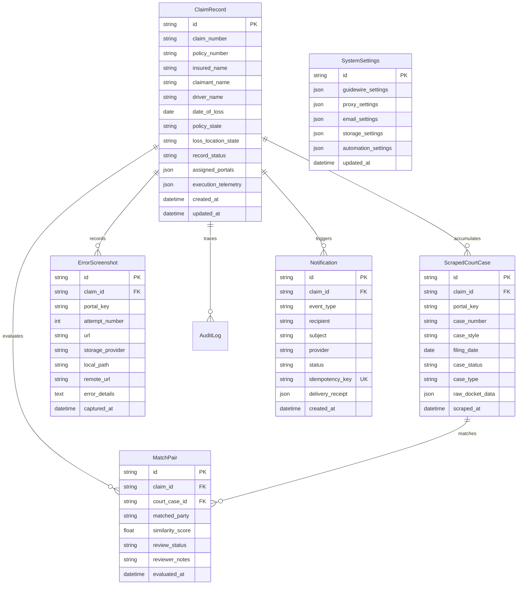

# Enterprise System Architecture Specification — UAIC Claim & RPA Orchestrator

**Implementation ID:** `IMP-2026-0918-005`  
**Document Type:** System Architecture Specification (Architecture Spec)  
**Version:** `v1.0.0`  
**Status:** Complete (100% Automated Testing Suite)  
**Authority:** Authoritative System Design Baseline  
**Date:** 2026-09-18  

---

## 1. Executive Summary & Architectural Paradigm

The **UAIC Claim & RPA Orchestrator** is an enterprise-grade, distributed automation platform engineered to replace fragile Microsoft Power Automate Desktop (PAD) V4 Robin flows. The platform automates court-case discovery across 8 county court portals in Florida and Texas, executes C-accelerated RapidFuzz string deduplication, and pushes validated claim dossiers to Guidewire Insurance Cloud via REST.

### Architectural Tenets
1. **Decoupled Asynchronous Processing**: Long-running browser scraping, CPU-intensive fuzzy matching, and external I/O tasks are strictly decoupled from user-facing HTTP request cycles via dedicated Celery task queues and Redis message brokers.
2. **100% Behavioral Parity**: Absolute behavioral equivalence with legacy Power Automate V4 Robin desktop flows (preserving state routing, 1899-12-30 serial date base, 9-digit zero-prefixing, 3-tier cascade, and strict portal output schemas).
3. **Attended vs. Unattended 1:1 Parity**: Identical operational behavior between developer desktop GUI execution (`headless=False`) and headless production containers (`--headless=new`).
4. **Zero-Leakage Security**: Comprehensive masking and recursion-sanitization across all audit logs, telemetry, and API responses for sensitive credentials and API tokens.
5. **Fault Isolation & Self-Healing**: Automated stuck-task recovery, selective portal retries (S66), and zero-dependency local disk fallback for screenshot storage.

---

## 2. High-Level End-to-End System Topology

```mermaid
graph TD
    subgraph Presentation_Tier [Presentation Tier (Next.js 14 App Router)]
        UI_Dashboard["Claims Dashboard (/)"]
        UI_Monitor["Queue Monitor (/monitor)"]
        UI_Upload["Ingest Wizard (/upload)"]
        UI_Detail["Claim Dossier (/claims/:id)"]
        UI_Exceptions["Fuzzy Review (/exceptions)"]
        UI_Settings["Settings Console (/settings)"]
        UI_Branding["Brand Identity (/branding)"]
        UI_Audit["Audit Trail (/audit)"]
        UI_Notif["Notification Studio (/notifications)"]
    end

    subgraph API_Gateway_Tier [API & Application Services Tier (FastAPI + Python 3.14)]
        FastAPI_App["FastAPI Application (app.main:app)"]
        Auth_Sanitizer["Zero-Leakage Sanitizer & Audit Logger"]
        Router_Claims["Claims Router (/api/v1/claims)"]
        Router_Queue["Queue Router (/api/v1/queue)"]
        Router_Ingest["Ingestion Router (/api/v1/ingest)"]
        Router_Matches["Matches Router (/api/v1/matches)"]
        Router_Settings["Settings Router (/api/v1/settings)"]
        Router_Notif["Notifications Router (/api/v1/notifications)"]
    end

    subgraph Queue_Broker_Tier [Distributed Message Broker & Result Store (Redis 7)]
        Redis_Broker["Redis 7 Broker (DB 0: Task Queues)"]
        Redis_Backend["Redis 7 Result Backend (DB 1: Results & Caches)"]
        Q_Ingest["Queue: ingest"]
        Q_Scrapers["Queue: scrapers"]
        Q_Matcher["Queue: matcher"]
        Q_Notif["Queue: notifications"]
        Q_Default["Queue: default"]
    end

    subgraph Worker_Fleet_Tier [Distributed Task Execution Fleet (Celery 5.6+)]
        Worker_Ingest["Ingest Worker (pandas/openpyxl)"]
        Worker_Scraper["Browser RPA Fleet (Playwright Async)"]
        Worker_Matcher["RapidFuzz Cascade & Guidewire Pusher"]
        Worker_Notif["Multi-Provider Email Dispatcher"]
        Worker_Retry["Stuck Task Recovery & Auto-Queue Runner"]
    end

    subgraph External_Integration_Tier [External Systems & Court Portals]
        Court_Portals["8 Florida & Texas Public County Court Portals"]
        AntiCaptcha_Engine["AntiCaptcha Solver Engine & Chrome Extension"]
        Guidewire_Cloud["Guidewire ClaimCenter Cloud REST API"]
        Email_Transports["SMTP / Direct MX / Microsoft Graph / AWS SES"]
        Storage_Providers["Local Disk / AWS S3 / Azure Blob / GCS"]
    end

    Presentation_Tier -->|HTTP / REST (Axios)| API_Gateway_Tier
    API_Gateway_Tier -->|Enqueue Task| Queue_Broker_Tier
    Queue_Broker_Tier -->|Prefetch Task (Multiplier=1)| Worker_Fleet_Tier
    Worker_Fleet_Tier -->|Playwright Automation| Court_Portals
    Worker_Fleet_Tier -->|Token Sync / Solve| AntiCaptcha_Engine
    Worker_Fleet_Tier -->|Outbound REST Case Push| Guidewire_Cloud
    Worker_Fleet_Tier -->|Outbound Alerts| Email_Transports
    Worker_Fleet_Tier -->|Persist Screenshots/Exports| Storage_Providers
```

---

## 3. Tier-by-Tier Architectural Breakdown

### 3.1 Presentation Tier (Frontend)
- **Framework**: Next.js 14 App Router (`frontend/src/app/`).
- **Core Libraries**: React 18, `@tanstack/react-query` v5 (async server-state cache), `@tanstack/react-table` v8 (headless tabular engine), Tailwind CSS 3, Lucide React icons.
- **Layout Architecture**: Full-width fluid responsive shell (`ResponsiveShell.tsx`) utilizing `w-full max-w-none flex-1`, unified `Navbar.tsx`, desktop collapsible `Sidebar.tsx`, and responsive `MobileBottomNav.tsx` / `MobileDrawer.tsx`.
- **Theme & Branding Context**: Client-side `BrandingContext.tsx` and `ThemeProvider.tsx` maintaining strictly two themes (**Light** and **Dark** only, zero OS auto-detection), dynamically pulling 26 semantic color design tokens from the DB-persisted branding configuration.

### 3.2 API & Application Services Tier (Backend)
- **Framework**: FastAPI (Python 3.14.7 runtime).
- **Configuration**: Pydantic Settings (`app.core.config.Settings`) loading environment variables with dynamic runtime overrides persisted in PostgreSQL/SQLite and cached in Redis.
- **Dependency Injection**: Asynchronous database session generator (`get_db`) using SQLAlchemy 2.0 async engine.
- **Audit Logging Middleware**: High-resolution audit logger (`audit_service.py`) automatically capturing operator IP, user agent, action timestamps, and payloads with recursive credential redaction.

### 3.3 Asynchronous Queue & Distributed Worker Tier
- **Orchestration**: Celery 5.6+ with Kombu direct exchange routing.
- **Queue Partitioning**:
  1. `ingest`: High-speed spreadsheet validation, column parsing, and claim row batching.
  2. `scrapers`: Long-running Playwright browser court scraping instances.
  3. `matcher`: C-accelerated RapidFuzz matching and Guidewire REST payload creation.
  4. `notifications`: Decoupled email alert dispatching.
  5. `default`: Background cache invalidation and operational maintenance.
- **Concurrency Management**:
  - **Windows Attended GUI**: Executed with `-P solo` to prevent Windows desktop handle collisions and enable visible Chrome window manipulation with toolbar extension interaction.
  - **Unattended Headless**: Scalable multi-process concurrency (`--concurrency=N`) supporting 1 to 10 parallel claims.

### 3.4 Browser Automation & RPA Scraper Engine
- **Engine**: Asynchronous Playwright for Python (`playwright.async_api`).
- **Browser Lifecycle**:
  - `ChromeSession`: Manages persistent user data directories, Chrome flags (`--disable-blink-features=AutomationControlled`, `--load-extension`), LevelDB preference injection, and anti-bot stealth hooks (`playwright-stealth`).
  - `TabManager`: Coordinates multi-tab scraping sessions within a single persistent browser window.
  - `BaseCourtScraper`: Abstract base class providing human biometric typing (`biometric_fill`), automated stage latency telemetry, error screenshot captures, and Cloudflare/WAF detection (`detect_security_block`).
- **AntiCaptcha Manifest v3 Integration**: Dynamic injection of the AntiCaptcha account key directly into Chrome's `Preferences` file (`kActionExtensionId:gcpdbjbmekkdlkpldjgffhmapgpdlcpj`), toolbar pinning in `pinned_actions`, and background service worker activation.

---

## 4. Data Architecture & Relational Entity Model



---

## 5. Security & Network Architecture

1. **Proxy Network Tunneling**:
   - Integrates `--proxy-server` and authentication directly into Playwright browser context options.
   - Supports HTTP, HTTPS, and SOCKS5 proxies with round-robin rotation for bulk ingestion or sticky IP routing for stateful court portals.
2. **Zero Credential Leakage Protocol**:
   - The recursive sanitizer in `audit_service.py` intercepts all incoming and outgoing payloads, replacing values for keys matching `password`, `secret`, `api_key`, `token`, `key` with `[REDACTED]`.
   - Frontend password fields are encrypted in transit and masked with eye-icon reveal controls.
3. **Protected Workspace Folders**:
   - The file system enforces strict preservation for 5 core user directories:
     - `implementation_plan/`
     - `PowerAutomateSolutions/`
     - `Testing files/`
     - `anticaptcha-plugin_v0.83/`
     - `.agents/`

---

## 6. Verification & Automated Test Strategy

The architecture is continuously validated via a 5-pillar testing strategy:
- **Pytest Async Suite**: 453 tests across 33 test suites enforcing 100% pass rates.
- **Ruff Linter**: Zero Python syntax or formatting violations (`E`, `F`, `W`, `I`, `UP`).
- **TypeScript Static Verification**: Strict `tsc --noEmit` across all App Router routes.
- **PowerShell AST Parser**: Syntax check across all 10 management scripts in `scripts/`.
- **E2E RPA Parity**: Automated verification script `scripts/verify_attended_unattended_parity_e2e.py` verifying identical scraper extraction across GUI and headless modes.
