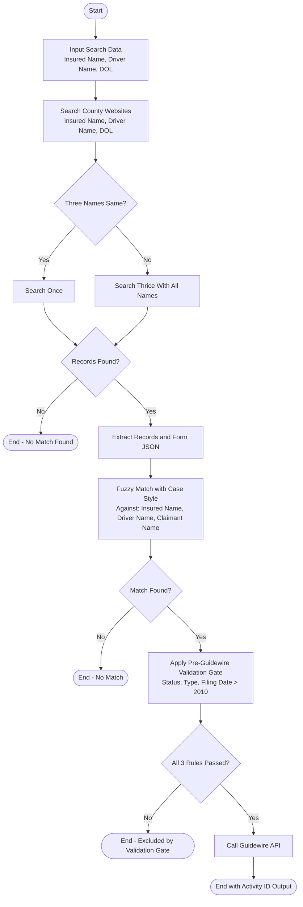

# County Court Portals — V4 Automation Standard Operating Procedures (SOP)

## 1. Global Operational & Error-Handling Standards

All portal workflows must strictly adhere to the following global rules:
1. **Starting Point:** Every portal automation MUST begin from its **Required Default Home URL**. Do not start from deep links or direct search endpoints.
2. **Tab Pre-Loading:** For each claim record, open all applicable county portal tabs in parallel within the same browser instance.
3. **Strict Unique-Name Processing Order:** Process **one unique name across all open tabs sequentially** (Search → Extract → Match → Store) before advancing to the next unique name.
4. **CAPTCHA & Security Challenges:**
   - Detect CAPTCHA/Turnstile/security challenges.
   - If Anti-Captcha does not initiate solving automatically, click the challenge checkbox.
   - Wait up to **120 seconds** (`CAPTCHA Resolution Wait`) for resolution.
   - If verification fails or times out, perform a hard refresh and retry up to **2 times** (`Max Retry & Refresh Attempts`).
   - **Non-Circumvention Rule:** Never attempt to bypass or spoof security mechanisms.
5. **Session Timeout Warnings:** If a "Session timeout warning" pop-up appears on any Odyssey/Smart Search portal, immediately click **"Continue session/Continue/Refresh the page"** to prevent redirection to the home page.
6. **Error Capture & Non-Blocking Execution:**
   - If a page, button, or search input fails to load or an IP/MAC block occurs, capture a full-page along with show console screenshot where error is cooming to `.\backend\screenshots` and write detailed execution logs to `.\backend\logs` using a shared correlation ID.
   - Mark the portal for that specific item as `Failed` or `Blocked`.
   - **Do not crash or stop the orchestrator:** Seamlessly proceed to the remaining open portal tabs and queue items.
7. **State Verification & Navigational Recovery:** If a required control, component, or search box or any actionalble item(s) is not visible or fails to load on the active page, the automation must behave like a human operator by evaluating its current navigational state. Before declaring a failure, the system must verify the current URL, determine which logical step or page the missing control actually belongs to, and dynamically navigate back to the correct entry point (e.g., the portal's Home URL or main Search Page) to resume the workflow.

---

## 2. Florida County Court Portals (3 Sites)

### 2.1 Broward County Clerk of Courts
* **Default Starting URL:** `https://www.browardclerk.org/`
* **Workflow Steps:**
  1. Navigate to the Broward County Clerk homepage.
  2. Locate and click on **"Case Search"**.
  3. Verify the Case Search page loads and ensure the **"Party Name"** tab is active (click it if not selected).
  4. Fill in the required search fields:
     - **Last Name:** Current Unique Last Name
     - **First Name:** Current Unique First Name
     - **Date From (Filing Date On/After):** Date of Loss (DOL) in `MM/DD/YYYY` format
  5. Handle CAPTCHA: Click checkbox if needed, wait for Anti-Captcha verification (max 120s, max 2 retries on timeout/failure).
  6. Click **"Search"** immediately upon verified CAPTCHA completion.
  7. Wait for results to render. If no records are found, record `No Match Found`.
  8. Extract all case fields across all paginated pages:
     - `CaseNumber` (Local Case Number / State Case Number)
     - `CaseStyle`  (Captured accurately from top of record)
     - `FilingDate` (Captured accurately from top of record)
     - `CaseStatus` (Captured accurately from top of record)
     - `CaseType` (Captured accurately from top of record)
     - `AccessLevel` (if available)
     - `Citation`  (if available)
     - `Others` (if any feild is missing here to mention and available there) 
  9. Click "Case Search" to reset the page, keep the tab open, and move to Hillsborough.

---

### 2.2 Hillsborough County Clerk of Court
* **Default Starting URL:** `https://hover.hillsclerk.com/`
* **Workflow Steps:**
  1. Navigate to the Hillsborough HOVER homepage.
  2. Select **"Party or Business Name"** search.
  3. Verify that the **"Search by Party or Business Name"** tab is active.
  4. Fill in the required search fields:
     - **First Name:** Current Unique First Name
     - **Last Name:** Current Unique Last Name
     - **On or After:** Date of Loss (DOL) in `MM/DD/YYYY` format
  5. Click **"Search"**.
  6. Wait for result rendering.
     - *Exception Handling:* If the modal **"YOUR SEARCH CRITERIA"** or **"No Results Found"** pop-up appears, click the **Close/Cross (X)** button.
  7. Extract all case fields across all paginated pages:
     - `CaseNumber` (Local Case Number / State Case Number)
     - `CaseStyle`  (Captured accurately from top of record)
     - `FilingDate` (Captured accurately from top of record & Mapped from "Filled")
     - `CaseStatus` (Captured accurately from top of record)
     - `CaseType` (Captured accurately from top of record)
     - `AccessLevel` (if available)
     - `Citation`  (if available)
     - `Others` (if any feild is missing here to mention and available there) 
  8. Reset to the party search view, keep the tab open, and move to Miami-Dade.

---

### 2.3 Miami-Dade County Clerk of Courts
* **Default Starting URL:** `https://www2.miamidadeclerk.gov/ocs`
* **Workflow Steps:**
  1. Navigate to the Miami-Dade Online Court Services (OCS) entry page.
  2. **Login Verification:**
     - Check if already logged in. If not, click **"Register/Login"**.
     - Input `User ID / Email` and `Password` retrieved securely from Automation Settings.
     - Click **"LOGIN"** and wait for page load.
     - Close any browser-level "Save your password" prompts if they appear.
  3. Ensure redirection to `https://www2.miamidadeclerk.gov/ocs`.
  4. Click **"Party Name"**, then click **"Refresh"**.
  5. Fill in the required search fields:
     - **First Name:** Current Unique First Name
     - **Last Name:** Current Unique Last Name
     - **Filing Date Range From:** Date of Loss (DOL) in `MM-DD-YYYY` format
  6. Click **"Search"**.
  7. On the results page, verify that **"Table View"** is enabled (enable it if not active) but make sure case that `CaseStyle` (Captured accurately from top of record).
  8. Close "YOUR SEARCH CRITERIA" pop-up if displayed.
  9. Extract all case fields across all paginated pages:
     - `CaseNumber` (Local Case Number / State Case Number)
     - `CaseStyle`  (Captured accurately from top of record)
     - `FilingDate` (Captured accurately from top of record)
     - `CaseStatus` (Captured accurately from top of record)
     - `CaseType` (Captured accurately from top of record)
     - `AccessLevel` (if available)
     - `Citation`  (if available)
     - `Others` (if any feild is missing here to mention and available there) 
  10. Reset to the search screen, keep the tab open, or complete the Florida batch.

---

## 3. Texas County Court Portals (5 Sites)

### 3.1 Travis County Odyssey Portal
* **Default Starting URL:** `https://odysseyweb.traviscountytx.gov/Portal/`
* **Workflow Steps:**
  1. Navigate to Travis County Portal homepage.
  2. Click on **"Smart Search"**.
  3. Enter Search Details:
     - **Search Input Text Box:** `LastName,FirstName` (e.g., `Smith,John`)
     - *Note:* Travis Smart Search does **NOT** use Date of Loss (DOL).
  4. Handle CAPTCHA: Click checkbox if not auto-started; wait for Anti-Captcha verification (max 120s, max 2 retries).
  5. Click **"Submit"**.
  6. On the results page, iterate through all case rows across all pagination pages:
     - Open the case detail in a new tab.
     - Extract:
     - `CaseNumber` (Local Case Number / State Case Number)
     - `CaseStyle`  (Captured accurately from top of record)
     - `FilingDate` (Captured accurately from top of record)
     - `CaseStatus` (Captured accurately from top of record)
     - `CaseType` (Captured accurately from top of record)
     - `AccessLevel` (if available)
     - `Citation`  (if available)
     - `Others` (if any feild is missing here to mention and available there) 
     - Close the case detail tab and return to results.
  7. Return to Smart Search entry point, keep tab open, and proceed to Dallas.

---

### 3.2 Dallas County Courts Portal
* **Default Starting URL:** `https://courtsportal.dallascounty.org/DALLASPROD/Home/`
* **Workflow Steps:**
  1. Navigate to Dallas County Portal homepage.
  2. Click on **"Smart Search"**.
  3. Enter Search Details:
     - **Search Input Text Box:** `LastName,FirstName`
     - *Note:* Dallas Smart Search does **NOT** use Date of Loss (DOL).
  4. Handle CAPTCHA: Click checkbox if required; wait for verification (max 120s, max 2 retries).
  5. Click **"Submit"**.
  6. On the results page, iterate through all case rows across all pagination pages:
     - Open the case detail record in a new tab.
     - Extract and sanitize fields:
     - `CaseNumber` (Local Case Number / State Case Number)
     - `CaseStyle`  (Captured accurately from top of record & **Sanitize by removing `/`, `-`, `\`, and `|` characters**)
     - `FilingDate` (Captured accurately from top of record)
     - `CaseStatus` (Captured accurately from top of record)
     - `CaseType` (Captured accurately from top of record)
     - `AccessLevel` (if available)
     - `Citation`  (if available)
     - `Others` (if any feild is missing here to mention and available there) 
     - Close the case detail tab and return to results.
  7. Return to Smart Search entry point, keep tab open, and proceed to Harris JP.

---

### 3.3 Harris County Justice of the Peace (Harris JP)
* **Default Starting URL:** `https://jpodysseyportal.harriscountytx.gov/OdysseyPortalJP/Home/`
* **Workflow Steps:**
  1. Navigate to Harris County JP Portal homepage.
  2. Click on **"Smart Search"**.
  3. Enter Search Details:
     - **Search Input Text Box:** `LastName,FirstName`
     - *Note:* Does **NOT** use Date of Loss (DOL).
  4. Handle CAPTCHA: Click checkbox if required; wait for Anti-Captcha verification (max 120s, max 2 retries).
  5. Click **"Submit"**.
  6. On the results page, open each case record in a new tab across all pagination pages:
     - Extract:
     - `CaseNumber` (Local Case Number / State Case Number)
     - `CaseStyle`  (Captured accurately from top of record)
     - `FilingDate` (Captured accurately from top of record)
     - `CaseStatus` (Captured accurately from top of record)
     - `CaseType` (Captured accurately from top of record)
     - `AccessLevel` (if available)
     - `Citation`  (if available)
     - `Others` (if any feild is missing here to mention and available there) 
     - **CRITICAL V4 RULE:** Harris JP output does **NOT** contain `CaseType`. **Do NOT invent or fabricate `CaseType`**.
     - Close case detail tab and return to results.
  7. Return to Smart Search entry point, keep tab open, and proceed to CClerk.

---

### 3.4 Harris County Clerk (CClerk)
* **Default Starting URL:** `https://www.cclerk.hctx.net/Applications/WebSearch/`
* **Workflow Steps:**
  1. Navigate to Harris County Clerk WebSearch homepage.
  2. In top navigation, hover over **"COURTS"** and click **"County Civil"**.
  3. Verify the County Civil Search page loads.
  4. Enter Search Details into form fields:
     - **Last Name:** Current Unique Last Name
     - **First Name:** Current Unique First Name
     - **File Date (From):** Date of Loss (DOL) in `MM/DD/YYYY` format
  5. Click **"Search"**.
  6. Wait for results table to load.
     - Close "YOUR SEARCH CRITERIA" pop-up if it appears.
  7. Extract all case fields across all pagination pages:
     - `CaseNumber` (Local Case Number / State Case Number)
     - `CaseStyle`  (Captured accurately from top of record)
     - `FilingDate` (Captured accurately from top of record & Mapped from "Filled")
     - `CaseStatus` (Captured accurately from top of record)
     - `CaseType` (Captured accurately from top of record)
     - `AccessLevel` (if available)
     - `Citation`  (if available)
     - `Others` (if any feild is missing here to mention and available there) 
     - **CRITICAL V4 RULE:** Harris County Clerk output does **NOT** contain `CaseType`. **Do NOT invent or fabricate `CaseType`**.
  8. Reset to search entry point, keep tab open, and proceed to HCDistrict.

---

### 3.5 Harris County District Clerk (HCDistrict)
* **Default Starting URL:** `https://www.hcdistrictclerk.com/`
* **Workflow Steps:**
  1. Navigate to Harris District Clerk homepage.
  2. Click on **"Search Our Records"** (or Party Inquiry).
  3. Verify that the search form loads.
  4. Enter Search Details:
     - **Last Name:** Current Unique Last Name
     - **First Name:** Current Unique First Name
     - **File Date (From) / Filed Date Range:** Date of Loss (DOL) in `MM/DD/YYYY` format
  5. Click **"Search"**.
  6. Wait for results table to render.
     - Close "YOUR SEARCH CRITERIA" pop-up if displayed.
  7. Extract all case fields across all pagination pages:
     - `CaseNumber` (Local Case Number / State Case Number)
     - `CaseStyle`  (Captured accurately from top of record)
     - `FilingDate` (Captured accurately from top of record)
     - `CaseStatus` (Captured accurately from top of record & Cleaned from status text column)
     - `CaseType` (Captured accurately from top of record)
     - `AccessLevel` (if available)
     - `Citation`  (if available)
     - `Others` (if any feild is missing here to mention and available there) 
  8. Close tabs/browser cleanly upon completing the Texas batch.

---

## 4. Output Data Schema & Normalization

The extracted data must be stored in portal-specific JSON attributes matching legacy database models:
- `fl_jsonbody_broward`
- `fl_jsonbody_hillsborough`
- `fl_jsonbody_miami`
- `te_jsonbody_travis`
- `te_jsonbody_dallas`
- `te_jsonbody_harris` (Harris JP)
- `te_jsonbody_cclerk`
- `te_jsonbody_hcdistrict`

Only after all unique names are searched across all applicable portals are the combined results passed to the **Power Automate Fuzzy Matcher** and mapped to the final **Guidewire CaseItems Payload**.

---

---

## 5. End-to-End Workflow Architecture, Filtering & Guidewire Integration

### 5.1 Workflow Architecture Diagram
The entire portal automation, matching, filtering, and API execution pipeline strictly adheres to the workflow below:



### 5.2 Three-Name Search & Deduping Rules
* **Name Comparison:** The system evaluates `Insured Name`, `Driver Name`, and `Claimant Name`.
* **Identical Names (`Yes`):** If all three names match identically, the automation executes searches across the open portal tabs **once**.
* **Distinct Names (`No`):** If any of the names differ, the system iterates and searches across all portal tabs **three times** (or once for each distinct unique name).

### 5.3 Fuzzy Matching Evaluation Rules
* Extracted `CaseStyle` strings from all court portals are evaluated against **all three entities**:
  1. Insured Name
  2. Driver Name
  3. Claimant Name
* A match is confirmed when the calculated RapidFuzz token match score satisfies the configured threshold (default: `>= 85.0%`).

### 5.4 Pre-Guidewire Case Filtering Requirements
Before any matched case information is packaged for Guidewire, the following three-rule validation gate must be executed:

#### 1. Case Status Filter
Only cases matching one of the following exact approved status strings are eligible:
* `ACTIVE`
* `REOPENED ACTIVE`
* `OPEN`
* `REOPEN`
* `EXTENDED`
* `HEARING SCHEDULED`
* `NONSUIT`
* `OPEN / MISSING FILE DOCUMENTS`
* `RE-OPENED`
* `RESTORED`
* `TRANSFERRED`
* `READY DOCKET`
* `ACTIVE – CIVIL`
* `IN TRIAL`
* `PC1: ACTIVE CASE ON DOCKET`

*Any case with a Case Status outside this approved list must be excluded.*

#### 2. Case Type Filter
Only cases matching one of the following exact approved case types are eligible:
* `CIVIL ACTION CENTRAL`
* `COUNTY CIVIL CENTRAL`
* `COUNTY CIVIL NORTH`
* `COUNTY CIVIL SOUTH`
* `COUNTY CIVIL WEST`
* `CIRCUIT CIVIL`
* `COUNTY CIVIL`
* `SMALL CLAIMS`
* `SUMMARY PROCEDURE`
* `COUNTY COURTS – CIVIL`
* `DISTRICT COURTS – CIVIL`
* `OTHER CIVIL`
* `BILL OF REVIEW`
* `BREACH OF CONTRACT`
* `CONSTRUCTION DAMAGES`
* `DAMAGES – AUTO`
* `DAMAGES – OTHER`
* `DECLARATORY JUDGMENT`
* `DTPA – DECEPTIVE TRADE PRACTICE`
* `INSURANCE`
* `INSURANCE POLICY`
* `INSURANCE POLICY – HURRICANE`
* `OTHER PROPERTY`
* `PERSONAL INJURY – AUTO`

*Any case with a Case Type outside this list must be excluded. If an unapproved Case Type is present in the extracted data, it must be removed before sending to Guidewire.*  
*(Note: As per Sections 3.3 and 3.4, Harris JP and Harris County Clerk do not provide CaseType. Do not invent a type for them.)*

#### 3. Filing Date Filter
* Only cases with a Filing Date strictly after the year 2010 (`Filing Date > 2010`) are eligible.
* Cases filed in 2010 or earlier must be excluded.
* This threshold year must be dynamically pulled from the Settings page (defaulting to `2010`).

#### 4. Final Rule Before Guidewire Transmission
A case can proceed to Guidewire **only when all three conditions are satisfied**:
* [x] Case Status is in the approved status list.
* [x] Case Type is in the approved case type list.
* [x] Filing Date is strictly after 2010.

*If any one of these conditions fails, the case must be filtered out and dropped prior to Guidewire payload generation.*

### 5.5 Guidewire Outbound Payload Contract
Cases passing all filtering conditions are formatted into the following standard payload:

```json
{
  "TransactionId": "f7b1e842-83b4-4e2a-bb39-16e792c349a1",
  "SourceSystem": "UAIC_ORCHESTRATOR",
  "ClaimNumber": "0123456789",
  "ExposureNumber": "001",
  "TotalMatchesFound": 1,
  "CaseItems": [
    {
      "CaseNumber": "2026-CA-001234-O",
      "CaseStyle": "JOHN DOE VS UAIC INSURANCE COMPANY",
      "CaseType": "Civil - Auto Negligence",
      "CountyWebsite": "https://www.browardclerk.org",
      "SuitFiledDate": "2026-08-14"
    }
  ]
}
```

* **`ClaimNumber`:** If 9 digits are provided, prepend `'0'` to produce a 10-character string (`claim_num.zfill(10)`).
* **`ExposureNumber`:** Standard 3-digit zero-padded string (`001`).
* **`SuitFiledDate`:** Strict ISO date format (`YYYY-MM-DD`).
* **`TransactionId`:** UUIDv4 generated per transmission attempt to guarantee idempotency.

### 5.6 Dynamic Settings Governance & Automated Filter Verification
All validation criteria defined in Section 5.4 must be dynamically configurable via the Admin Settings Page and persisted in the database:

* **Configurable Database Keys (`automation_settings` table):**
  * `gw_filter_filing_year_cutoff` (Integer, default: `2010`)
  * `gw_filter_approved_statuses` (JSON Array, default: 15 approved status strings)
  * `gw_filter_approved_types` (JSON Array, default: 24 approved type strings)
  * `fuzzy_match_threshold` (Float, default: `85.0`)
  * `guidewire_api_url` (String HTTPS URL)
  * `guidewire_api_token` (Encrypted String)
  * `guidewire_max_retries` (Integer, default: `3`)
* **Zero Hardcoding Enforcement:** The backend filtering service (`app.services.case_filter`) must load these values dynamically from the database or Redis cache per execution. Hardcoded status/type arrays in scraper or task code are strictly prohibited.
* **Automated Filter Unit Test:** Every modification from the Settings Page must pass an automated validation suite (`tests/test_case_filter.py`) testing boundary cases (status on/off list, type on/off list, filing date at 2010 vs 2011) to assert correct filtering before deployment.