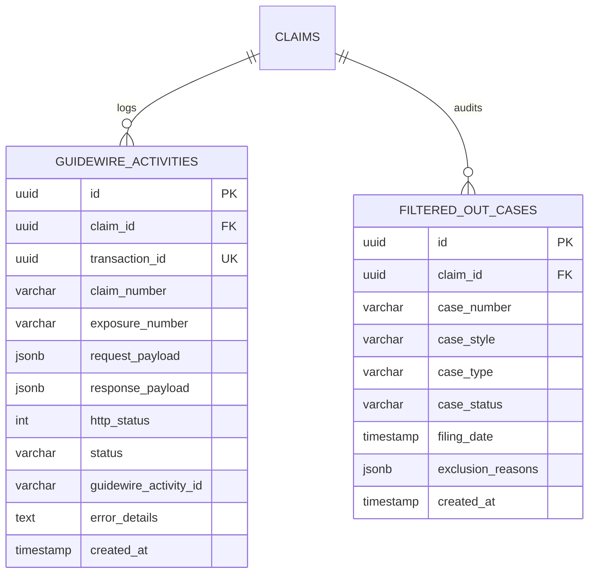

# Security, Compliance, Resilience & Exception Handling Architecture Q&A

This document serves as the authoritative operational and compliance reference for the **UAIC Claim & RPA Orchestrator**. It details how the automation engine handles missing elements, rate limits, CAPTCHAs, error logging, browser crashes, session state recoveries, and human-like traffic emulation while adhering strictly to website terms, security mechanisms, and non-circumvention rules.

---

## 1. Missing Controls & Element Failures

### Q1: What happens if a page element, button, or search input fails to load or is unclickable?
* **State Verification & Navigational Recovery:** If a required control is not visible, the automation must behave like a human operator by evaluating its current navigational state. Before declaring a failure, the system must verify the current URL, determine which logical step or page the missing control actually belongs to, and dynamically navigate back to the correct entry point to resume the workflow.
* **Structured Exception Hierarchy:** If the control still cannot be reached after navigational recovery and the timeout expires, the scraper raises a structured exception (e.g., `PortalNavigationError`, `PortalSearchError`).
* **Full-Page Screenshot Capture:** The system captures an immediate full-page screenshot of the active browser viewport. The screenshot is saved to `.\backend\screenshots` under a structured hierarchy.
* **Detailed Error Logging:** Detailed runtime logs (DOM state, URL, attempt count, exception traceback) are saved to `.\backend\logs`.
* **Traceable Correlation ID:** The screenshot and log share an identical correlation ID, allowing developers to cross-examine what the browser rendered at the exact moment of failure.
* **Non-Blocking Execution:** The system records the error, marks the portal run as `Failed`, and immediately proceeds to the next open tab or queue item without halting the orchestrator.

---

## 2. Infinite Loops, Refreshes & Timeouts

### Q2: How does the system manage page reloads without causing infinite loops?
* **Strict Refresh Ceiling:** The system is bound by the configured parameter `Max Retry & Refresh Attempts = 2`. The bot will only perform a maximum of 2 hard refreshes on any given portal tab.
* **Bounded Wait Timeouts:** The maximum time the automation will wait for CAPTCHA resolution is governed by `CAPTCHA Resolution Wait = 120 seconds`. 
* **Page Reload Backoff Delay:** The system enforces a configurable backoff delay between reload attempts to avoid aggressive request bursts.

### Q3: Why do court portal home pages sometimes refresh repeatedly, and how is this fixed?
* **Odyssey "Session Timeout Warning" Pop-up:** Portals like Travis, Dallas, and Broward trigger idle session warnings while waiting for CAPTCHAs. The automation actively monitors the DOM for this and immediately clicks `Continue session` to prevent the site from forcing a redirect back to the home page.
* **Stuck CAPTCHA Loops:** The hard ceiling of 2 retries stops the extension from looping endlessly if it fails to solve a challenge.

---

## 3. Browser Crashes & Worker Failures

### Q4: What happens if the entire Google Chrome browser crashes mid-search?
* **Browser Failure Recovery:** The system is designed to detect a browser crash (which is distinct from a single portal failure).
* **State Resumption:** It captures the state, restarts Chrome, reloads the required tabs, and resumes the failed portal without automatically restarting already-completed portal work.

### Q5: If a Celery worker restarts or fails, will it create duplicate claims in Guidewire?
* **Idempotency Keys:** The system uses idempotency keys (e.g., `record_id` + `execution_id`) to ensure a job is safe to retry. Before creating a new Guidewire activity, it checks if one already exists for that execution to prevent accidental duplicates.

---

## 3.1 Guidewire Integration Contracts, Database Auditing & Resilience

### Q5a: What does Guidewire ClaimCenter return in response to a claim transmission?
Guidewire provides a synchronous JSON response indicating acceptance or business validation failure:

* **Success Response (HTTP 200 / 201 Created):**
```json
{
  "TransactionId": "f7b1e842-83b4-4e2a-bb39-16e792c349a1",
  "Status": "ACKNOWLEDGED",
  "GuidewireClaimId": "cc:109482",
  "GuidewireActivityId": "act:8472910",
  "Message": "Litigation case items successfully attached to exposure 001",
  "ProcessedAt": "2026-09-10T20:17:02.145Z",
  "Errors": []
}
```

* **Validation / Exposure Closed Response (HTTP 400 / 422 Unprocessable Entity):**
```json
{
  "TransactionId": "f7b1e842-83b4-4e2a-bb39-16e792c349a1",
  "Status": "REJECTED",
  "GuidewireClaimId": null,
  "GuidewireActivityId": null,
  "Message": "Validation failure: Exposure 001 is closed or does not exist on Claim 0123456789.",
  "ProcessedAt": "2026-09-10T20:17:02.890Z",
  "Errors": [
    {
      "ErrorCode": "GW-EXP-404",
      "Field": "ExposureNumber",
      "Description": "Exposure status is CLOSED"
    }
  ]
}
```

### Q5b: How and where is the Guidewire transmission and response persisted in the database?
Every outbound payload and inbound response is audited in PostgreSQL inside the `guidewire_activities` table linked to the parent `claims` record:



* **HTTP 200/201 Success Lifecycle:**
  1. Record is inserted with `status = 'SUCCESS'` and the parsed `guidewire_activity_id`.
  2. The parent claim status is updated: `claims.status = 'GUIDEWIRE_NOTIFIED'`.
* **HTTP 400/422 Validation Failure Lifecycle:**
  1. Record is inserted with `status = 'REJECTED'` and the error array stored in `error_details`.
  2. The parent claim status is updated: `claims.status = 'GUIDEWIRE_REJECTED'`.
* **HTTP 5xx / Network Timeout Lifecycle:**
  1. Record is inserted with `status = 'FAILED_RETRYABLE'`.
  2. Celery initiates an exponential backoff retry: `self.retry(countdown=60 * (2 ** retry_count), max_retries=3)`.
  3. If retries are exhausted: `claims.status = 'GUIDEWIRE_FAILED'`.

### Q5c: How are cases excluded by pre-Guidewire filtering tracked?
Cases that produced a valid fuzzy match but were excluded by Case Status, Case Type, or Filing Date criteria are saved into the `filtered_out_cases` table with an `exclusion_reasons` array (e.g., `["INVALID_STATUS", "FILED_BEFORE_2011"]`). This ensures a full audit trail without sending unapproved data to Guidewire.

### Q5d: How are dynamic case filter rules and Guidewire credentials secured and validated?
* **Encrypted Storage:** Guidewire credentials, tokens, and endpoint secrets are encrypted at rest using AES-256 (Fernet) in PostgreSQL and masked (`********`) on the frontend Settings UI.
* **Audit Logging on Configuration Change:** Any modification to the approved Case Statuses, Case Types, or Filing Cutoff Year creates an audit log entry in `settings_audit_log` recording the user ID, timestamp, old value, and new value.
* **Fail-Safe Fallback:** If the database cache for approved types or statuses is unreachable, the system defaults to the safe strict baseline defined in SOP Section 5.4 to prevent unapproved records from leaking into Guidewire.
* **Automated Integration Simulation:** The Settings UI provides a "Test Guidewire Connection" button that runs an automated diagnostic ping validating token authenticity, payload serialization, and endpoint latency without mutating real claims data.
---

## 4. Business Rules vs. Technical Failures

### Q6: How does the system handle "No Results Found" or pop-ups blocking the screen?
* **Popup Handling:** If a modal like "YOUR SEARCH CRITERIA" or "No Results Found" appears (e.g., on Hillsborough or Miami-Dade), the system actively clicks the Close/Cross (X) button and proceeds normally.
* **Business vs. Technical Status:** The system strictly distinguishes between `No Match Found` (the portal worked perfectly, but there are no court cases) and `Failed` (the automation crashed or was blocked). It never mixes these statuses.

### Q7: What if a CAPTCHA simply doesn't appear on a portal today?
* **No False Failures:** An absence of a CAPTCHA challenge is handled gracefully. "No CAPTCHA" must never be treated as a "CAPTCHA failure" by the orchestrator.

---

## 5. Security Blocks & CAPTCHA Compliance

### Q8: Does the automation bypass, spoof, or circumvent CAPTCHAs or security systems?
* **Strict Non-Circumvention Policy:** The automation NEVER attempts to bypass, defeat, spoof, or conceal automation from security systems like Cloudflare, Arkose Labs, or reCAPTCHA.
* **Legitimate Workflow Operation:** The solution interacts with the challenge checkbox through legitimate browser events and pauses automation to allow verification. It proceeds only after a legitimate verified status is granted.

### Q9: What happens if an IP, MAC, rate limit, or site-specific block occurs?
* **Isolated Impact:** A block on one county site will NEVER abort the entire claim. The affected portal is marked as `Blocked` or `Failed`, evidence is captured, and the orchestrator seamlessly continues processing remaining tabs.
* **Automated Cooldown:** The system inspects HTTP response headers (e.g., `Retry-After`) to determine legitimate cooldown periods and automatically re-queues the blocked item for retry later.

---

## 6. Credential Security & Data Privacy

### Q10: How are credentials and API keys safeguarded, especially during error screenshots?
* **Masked Configuration:** Portal credentials (e.g., Miami-Dade login) and Anti-Captcha keys are managed via Admin Settings and are never hardcoded. 
* **Zero Secret Logging:** Passwords, API tokens, and session cookies are scrubbed from all logs and error messages.
* **Screenshot Sanitization:** The system ensures credentials are not exposed in plaintext if a screenshot is captured during a login failure.

---

## 7. Human-Like Execution & Anti-Detection Strategies

### Q11: How do we guarantee the automation operates like a human to minimize IP/MAC blocks?
To prevent triggering bot-detection systems, the orchestrator is strictly engineered to mimic organic user workflows rather than acting like a traditional web scraper.
* **Real System Chrome:** The automation is explicitly forbidden from using stealth-patched or headless Chromium packages that are easily flagged by WAFs. It launches the actual, standard Google Chrome browser installed on the host OS, ensuring authentic browser fingerprints, headers, and rendering behaviors.
* **Organic Navigation Paths:** The orchestrator never targets deep, unauthenticated search API endpoints. It strictly starts from the public Home URL of each portal (e.g., `https://www.browardclerk.org/`) and legitimately navigates through the site menu to reach the search page.
* **Pacing and Jitter:** The system relies on human-like delays, jitter, and appropriate header management. Instead of spamming requests instantly, it uses a configurable `Page Reload Backoff Delay` to simulate human reaction times.
* **Tab-Based Session Management:** Rather than violently opening and closing 8 separate browser instances per claim (which triggers rate limits), the automation maintains a single Chrome session and switches between tabs, exactly as a human claims adjuster would.
* **Respecting Site Infrastructure:** The automation strictly complies with applicable site terms, stated rate limits, and security requirements to minimize unnecessary triggering of WAF protections.