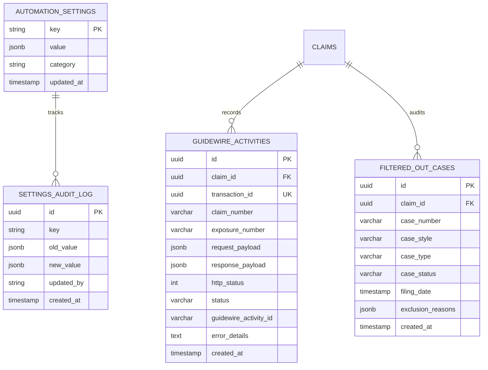

# 01 - FOUNDATION: PYTHON 3.14.7, ENVIRONMENT & STRICT DEVELOPMENT TASK COMPLETION RULES

## 1. PYTHON RUNTIME & ENVIRONMENT
You must update the existing implementation to officially target Python 3.14.7.
- Verify `python --version` returns 3.14.7.
- Audit and modernize all dependencies (FastAPI, Uvicorn, Pydantic, SQLAlchemy, Celery, Redis, Playwright, RapidFuzz) to versions compatible with 3.14.7.
- Do NOT blindly upgrade packages if it breaks existing functionality.
- Implement asynchronous architecture where suitable (e.g., `async def`, connection pooling) for APIs and DB queries, but **do NOT** force/make browser automation artificially asynchronous if it destabilizes the Anti-Captcha extension.

## 2. MANDATORY TASK COMPLETION RULES
- Never consider a task complete just because code was written. 
- **No Error Left Behind:** Before reporting completion, you MUST check the browser Developer Console and the Terminal for errors (unhandled promises, React errors, build failures, API errors). Fix the root causes.
- **Interruption Recovery:** If execution crashes, times out, or is interrupted, you must perform a gap analysis and resume from the last successful point. Never silently skip tasks.
- Check the browser Developer Console and Terminal for errors (CORS, unhandled promises, build errors). Fix them before reporting completion.
- **Definition of Done:** Implemented → Tested → Verified → Errors Fixed → Documentation Updated → Requirements Rechecked.

## 3. TECHNOLOGY STACK DOCUMENTATION
- Maintain a dedicated "Technology Stack & Documentation" section in the `README.md` .
- Document the Frontend, Backend, Testing, Build, Infrastructure, and Integrations used, including links to official documentation (e.g., official React, FastAPI, Docker docs)

## DEPLOYMENT ARCHITECTURE, CI/CD & HOSTING STANDARDS

The application must be strictly maintained as a cloud-agnostic, microservices architecture to support independent deployments across ANY standard cloud provider or CI/CD pipeline. The AI must never tightly couple the frontend and backend in a way that prevents independent hosting.

### 1. Universal CI/CD & Deployment Tool Compatibility
* **Agnostic Design:** The codebase must remain perfectly compatible with all major CI/CD pipelines, deployment automation, and container orchestration platforms, including but not limited to:
  * **CI/CD Automation:** GitHub Actions, GitLab CI/CD, Bitbucket Pipelines, Jenkins, CircleCI.
  * **Container Orchestration:** Docker Compose, Docker Swarm, Kubernetes (K8s).
  * **Cloud Providers:** AWS (EC2/ECS/EKS/Elastic Beanstalk), Azure (App Service/AKS), Google Cloud (Cloud Run/GKE), DigitalOcean, Linode, and raw Linux VPS environments.
* **Core Rule:** No cloud-specific vendor lock-in scripts or proprietary APIs unless explicitly requested. Configurations must rely on standard Dockerfiles, `.env` variables, and standard shell scripts.

### 2. Frontend Hosting (Vercel, Netlify, Cloudflare, etc.)
* **Framework:** Next.js / React.
* **Environment:** Fully deployable to Serverless/Edge platforms (like **Vercel** or Netlify) or as a container.
* **Rules:** 
  * API calls must use dynamic environment variables (e.g., `NEXT_PUBLIC_API_BASE_URL`) to easily switch between localhost and live production backend URLs.
  * A standalone `frontend/Dockerfile` and `frontend/docker-compose.yml` must be maintained for isolated testing and containerized deployment.

### 3. Backend Hosting (Render, Heroku, App Services, VPS)
* **Framework:** FastAPI, Celery, Python 3.14.7.
* **Environment:** Fully deployable to containerized PaaS platforms (like **Render**, Heroku) or traditional VPS setups.
* **Rules:** 
  * The backend must expose its port dynamically via the `PORT` environment variable (e.g., `0.0.0.0:$PORT`) to satisfy external host routing requirements.
  * A standalone `backend/Dockerfile` and `backend/docker-compose.yml` must be maintained. 
  * Dependencies must be strictly isolated to `backend/requirements.txt`.

### 4. Infrastructure & VPS (Root Orchestration)
* **Environment:** PostgreSQL, Redis, and MailDev (for email interception) hosted via Docker.
* **Unified Orchestrator:** The `root/docker-compose.yml` acts as the master orchestrator for bare-metal VPS deployment and unified local development. It bridges the individual frontend and backend containers together alongside the database and cache.

### 5. Zero Coupling Rule
* Do not write scripts or architecture that assumes the frontend and backend share the same physical server, volume, or file system in production. They must communicate exclusively via HTTP/REST APIs.

---

## Guidewire Integration & Case Filtering Database Entities

The persistence layer must implement models to audit Guidewire transmissions, filter exclusions, and configuration changes:



### SQLAlchemy Model Implementations (`backend/app/models/guidewire.py`)

```python
import uuid
from datetime import datetime
from sqlalchemy import Column, String, Integer, DateTime, ForeignKey, Text, Float
from sqlalchemy.dialects.postgresql import UUID, JSONB
from sqlalchemy.orm import relationship
from app.core.database import Base

class GuidewireActivity(Base):
    """Audits all outbound payloads and inbound responses for Guidewire ClaimCenter."""
    __tablename__ = "guidewire_activities"

    id = Column(UUID(as_uuid=True), primary_key=True, default=uuid.uuid4)
    claim_id = Column(UUID(as_uuid=True), ForeignKey("claims.id", ondelete="CASCADE"), nullable=False, index=True)
    transaction_id = Column(UUID(as_uuid=True), nullable=False, unique=True, index=True)
    claim_number = Column(String(20), nullable=False, index=True)
    exposure_number = Column(String(10), nullable=False, default="001")

    request_payload = Column(JSONB, nullable=False)
    response_payload = Column(JSONB, nullable=True)
    http_status = Column(Integer, nullable=True)

    status = Column(String(30), nullable=False, default="PENDING", index=True)
    guidewire_claim_id = Column(String(50), nullable=True)
    guidewire_activity_id = Column(String(50), nullable=True, index=True)
    error_details = Column(Text, nullable=True)

    created_at = Column(DateTime(timezone=True), default=datetime.utcnow, nullable=False)
    updated_at = Column(DateTime(timezone=True), default=datetime.utcnow, onupdate=datetime.utcnow, nullable=False)

    claim = relationship("Claim", back_populates="guidewire_activities")


class FilteredOutCase(Base):
    """Captures cases matched by Fuzzy Logic but excluded prior to Guidewire."""
    __tablename__ = "filtered_out_cases"

    id = Column(UUID(as_uuid=True), primary_key=True, default=uuid.uuid4)
    claim_id = Column(UUID(as_uuid=True), ForeignKey("claims.id", ondelete="CASCADE"), nullable=False, index=True)
    case_number = Column(String(100), nullable=False)
    case_style = Column(String(500), nullable=False)
    case_type = Column(String(100), nullable=True)
    case_status = Column(String(100), nullable=True)
    filing_date = Column(DateTime, nullable=True)
    fuzzy_score = Column(Float, nullable=False)
    exclusion_reasons = Column(JSONB, nullable=False)

    created_at = Column(DateTime(timezone=True), default=datetime.utcnow, nullable=False)

    claim = relationship("Claim", back_populates="filtered_cases")
```

Supporting Docs you can ref:
    1) PYTHON 3.14.7 — RUNTIME, LIBRARY, PERFORMANCE & MODERNIZATION UPDATE.md
    2) Mandatory Task Completion, Error Resolution, Skills & Technology Documentation Requirements.md

**Note:**

1. Most of the requirements are already implemented. **Test and verify the existing functionality before making any changes.**
2. Always focus on **upgrading, enhancing, and fixing** the existing implementation. **Do not delete or remove any existing functionality** if it is already working. If any existing functionality is not working correctly, **fix it and make it fully functional** rather than removing or replacing it unnecessarily.
