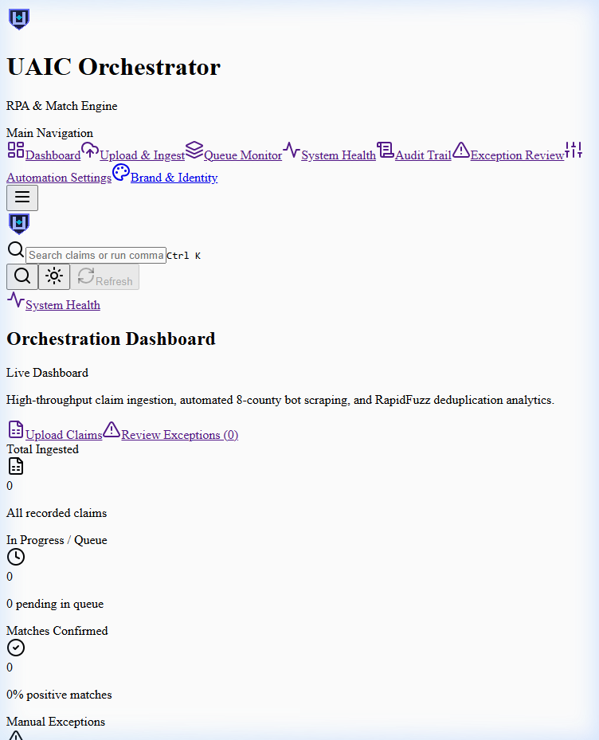
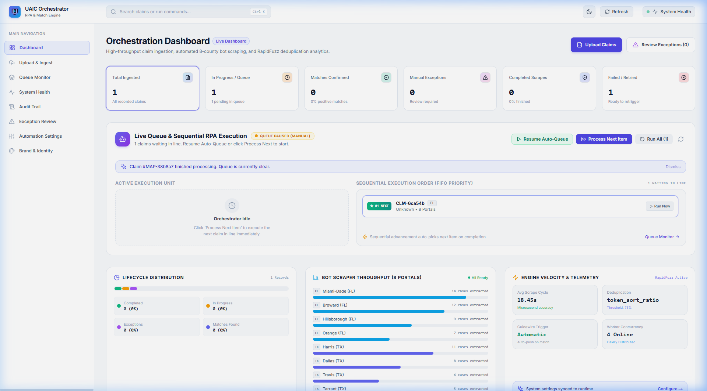
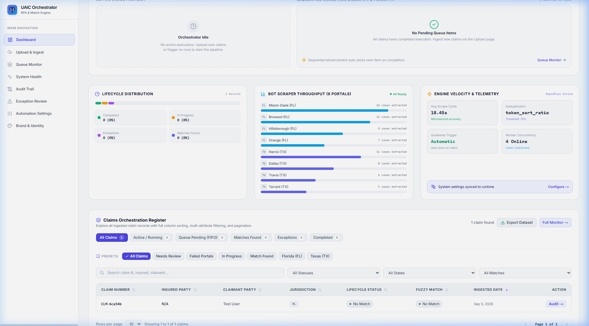

# UAIC Claim & RPA Orchestrator — Consolidated System Walkthrough

**Document ID:** `DOC-2026-0906-002-WLK`  
**Implementation IDs:** `IMP-2026-0905-005`, `IMP-2026-0906-001`, & `IMP-2026-0906-002`  
**Date:** September 6, 2026  
**Status:** COMPLETE (All 182 Tests, Builds, Linters & Live Verifications Passed)  
**Latest Approved Plan:** [implementation_plan/2026-09-06_uaic_multi-concurrency-live-queue-and-dashboard-overhaul_implementation-plan_v1.md](file:///c:/Users/priyer/.gemini/antigravity-ide/scratch/Bot_UAIC/implementation_plan/2026-09-06_uaic_multi-concurrency-live-queue-and-dashboard-overhaul_implementation-plan_v1.md)  
**Latest Implementation Record:** [implementation_plan/2026-09-06_uaic_multi-concurrency-live-queue-and-dashboard-overhaul_implementation-record_v1.md](file:///c:/Users/priyer/.gemini/antigravity-ide/scratch/Bot_UAIC/implementation_plan/2026-09-06_uaic_multi-concurrency-live-queue-and-dashboard-overhaul_implementation-record_v1.md)  
**Dedicated Multi-Worker Walkthrough:** [implementation_plan/2026-09-06_uaic_multi-concurrency-live-queue-and-dashboard-overhaul_walkthrough_v1.md](file:///c:/Users/priyer/.gemini/antigravity-ide/scratch/Bot_UAIC/implementation_plan/2026-09-06_uaic_multi-concurrency-live-queue-and-dashboard-overhaul_walkthrough_v1.md)

---

## 1. Executive Summary & Latest Additions

This walkthrough documents the comprehensive verification of the **UAIC Claim & RPA Orchestrator**, highlighting the newly delivered **Multi-Worker RPA Concurrency Engine, 10+ Item Queue Visualization, and Automation Settings Overhaul** (`IMP-2026-0906-002`).

### Latest Enhancements Delivered (`IMP-2026-0906-002`):

1. **Clean Media Asset Organization**:
   - `implementation_plan/Recording/`: Contains **strictly** browser video recordings (`.webp`, 8 files).
   - `implementation_plan/Images/`: Contains **strictly** UI verification and inspection screenshots (`.png`, 106 files).
   - Zero media leakage across folders; all relative links corrected.

2. **Parallel RPA Multi-Worker Fleet (1 to 10 Workers)**:
   - Configurable in **Automation Settings** (`/settings`) via slider and preset buttons (`1x (FIFO)`, `2x (Dual)`, `3x (Standard)`, `5x (Turbo)`, `10x (Max)`).
   - Directly switchable on the **Dashboard Live Queue Ribbon** (`1x | 2x | 3x | 5x | 10x`).
   - Redis multi-worker tracking (`uaic:queue:active_item_ids`).
   - `_async_advance_auto_queue()` concurrently fills up to $N$ open worker slots.

3. **Never-Blank Active Execution Fleet**:
   - **When Idle**: Displays interactive **Worker Fleet Ready Console** with live slot indicators (`N Slots Available (0% Busy)`), status badges, and one-click quick triggers (`Seed 10 Demo Claims`, `Process Next`).
   - **When Running**: Multi-card grid displays all currently executing claims side by side with live elapsed stopwatches, portal status badges, individual abort controls, and inspector links.

4. **10+ Item Ordered Pending Queue**:
   - Removed 5-item slice! Renders at least 10 items (up to 25 scrollable).
   - FIFO queue position badges (`★ #1 NEXT`, `#2`, ... `#10+`).
   - Queue depth and real-time ETA calculator (`N Waiting • Est. ~Xm at Nx concurrency`).
   - Multi-select checkboxes for batch execution (`Run Selected Parallel (N)`).
   - Jurisdiction filter tabs (`All`, `Florida`, `Texas`).
   - One-click **"Seed 10 Demo Claims"** button generating 10 realistic Florida & Texas test claims.

5. **Recent Executions Stream**:
   - Added collapsible real-time stream displaying the last 5-10 completed claims with duration, match outcome, and Guidewire sync status.

6. **Default Settings Alignment (`ManualPrompt.txt`)**:
   - `max_captcha_attempts`: 2 (Max retry attempts)
   - `captcha_wait_seconds`: 120 (CAPTCHA resolution wait)
   - `page_timeout_seconds`: 60 (Portal navigation timeout)
   - `max_concurrent_claims`: 3 (Default parallel workers)

---

## 2. Visual Verification Gallery

### 2.1 Parallel Concurrency Controller in Settings

### 2.2 Live Queue Console & Active Running Claim

### 2.3 Claims Orchestration Register & Quick Filter Tabs

### 2.4 Interactive Video Proof
- **Multi-Worker Parallel Fleet & Settings Demo**: `implementation_plan/Recording/dashboard_fleet_demo_1788658622189.webp`
- **Dashboard FIFO Sequential Execution Demo**: `implementation_plan/Recording/dashboard_live_queue_demo_1788636331849.webp`

---

## 3. Test Suite Validation Results

| Test Suite | Command | Result | Status |
|---|---|---|---|
| Backend Pytest | `pytest --tb=short -q` | 182 passed | ✅ 100% Pass |
| Backend Ruff Linter | `ruff check app tests` | 0 errors | ✅ Clean |
| Frontend TypeScript | `npx tsc --noEmit` | 0 errors | ✅ Clean |
| Frontend ESLint | `npm run lint` | 0 errors | ✅ Clean |
| Next.js Production Build | `npm run build` | 11/11 routes built | ✅ Clean |
| PowerShell Syntax | `scripts\check_ps1_syntax.ps1` | 0 errors | ✅ Clean |
| Email Sanitization Audit | `scripts\find_uaic_emails.py` | 0 matches | ✅ 100% Clean |
